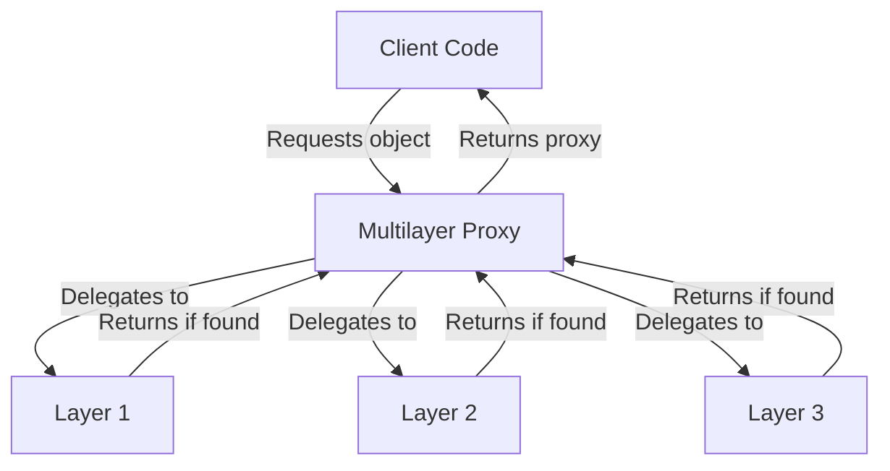
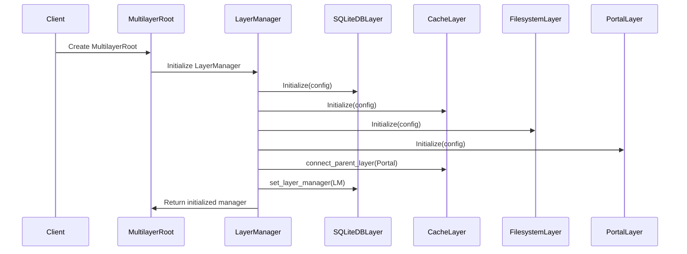
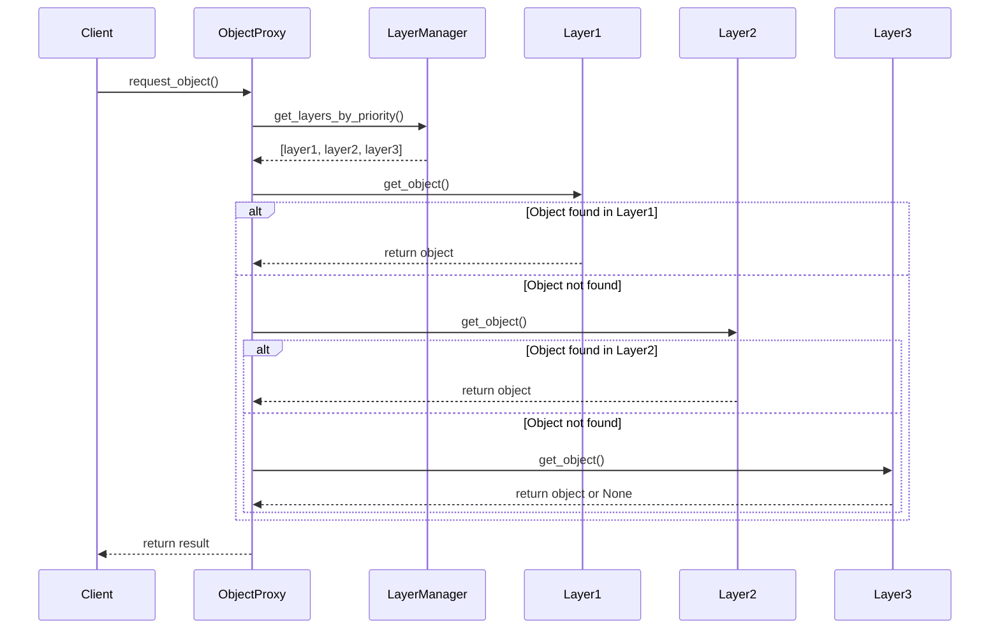
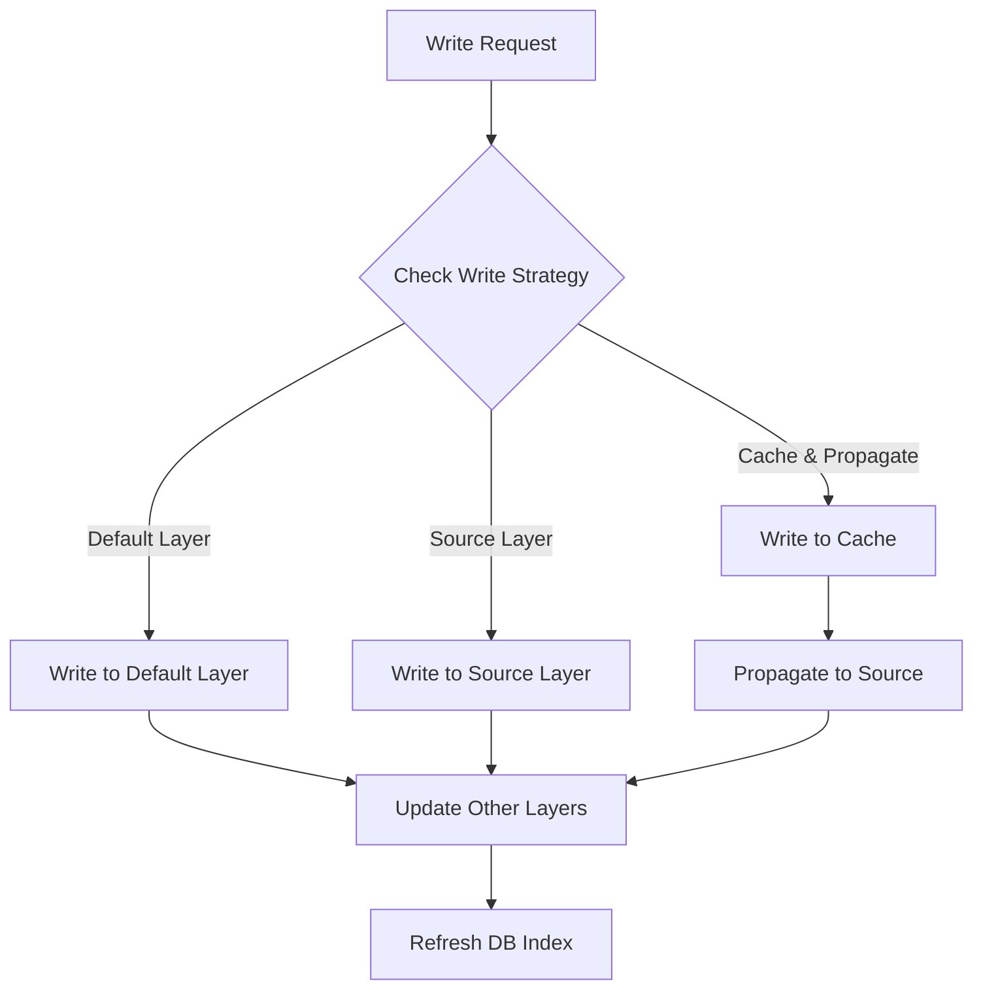
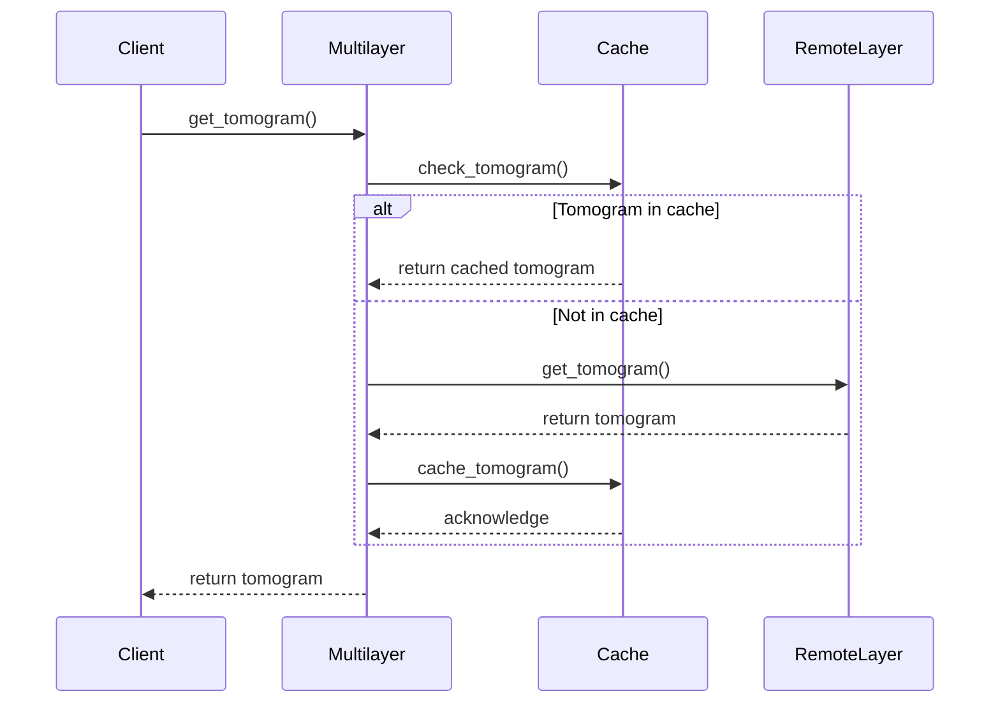
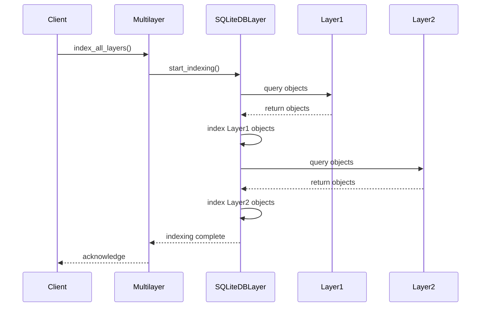
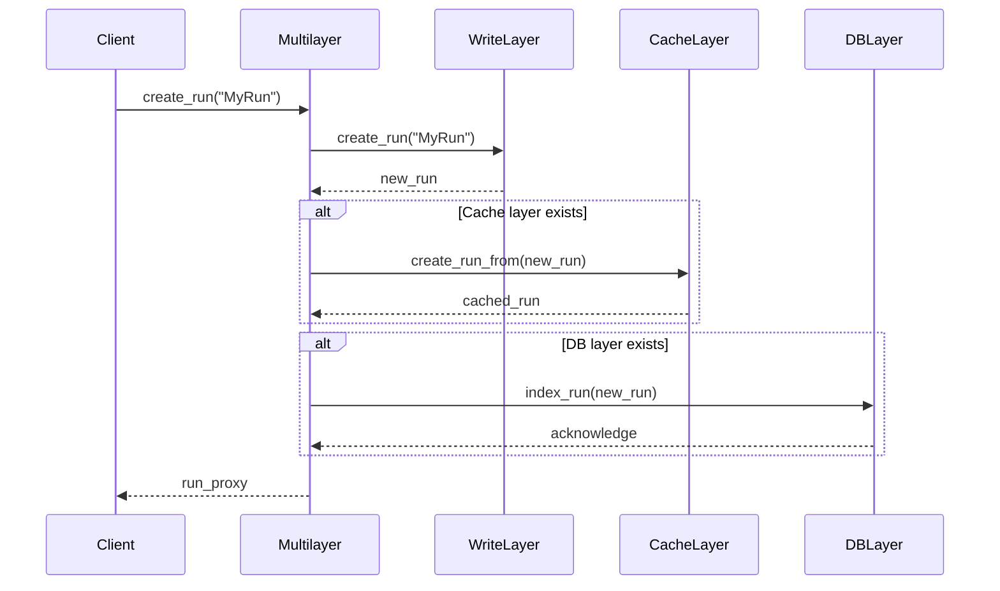
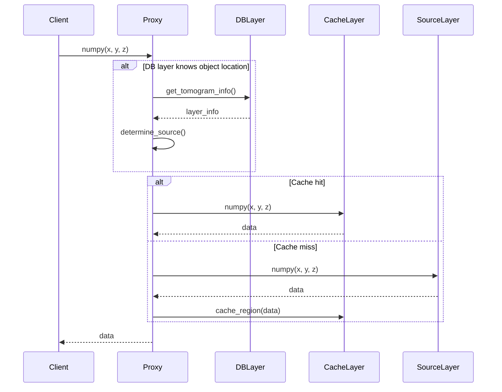
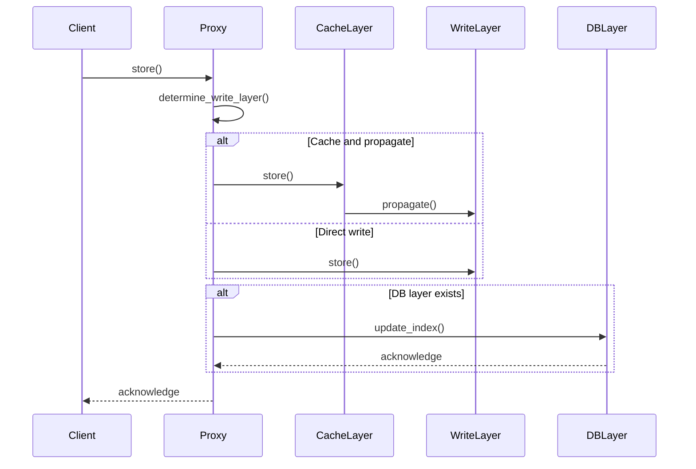
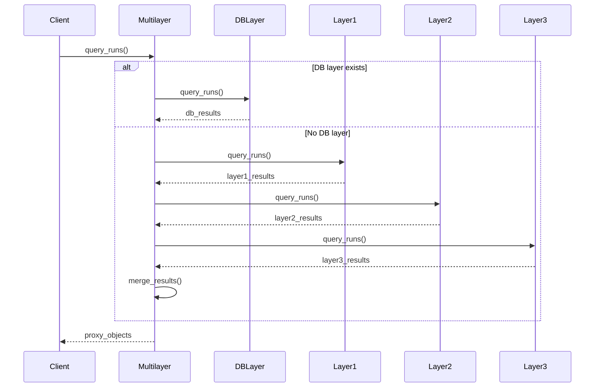

# CoPick Multilayer Technical Specification

## 1. Overview

The Multilayer system provides a unified implementation of the CoPick abstract API defined in `models.py`, combining multiple specialized layers into a single cohesive stack. This architecture enables CoPick to simultaneously access data from various sources (filesystem, CryoET data portal, etc.) while providing transparent caching, indexing, and optimization.

This implementation is designed to:
- Present a unified view of data from multiple layers
- Prioritize access based on layer configuration
- Propagate writes to appropriate layers
- Optimize performance through intelligent caching
- Enable sophisticated cross-layer searching and indexing

## 2. Core Concepts

### 2.1 Layer Management

The multilayer system organizes different layer implementations (Filesystem, CryoET Portal, Cache, SQLite DB) into a prioritized stack. Each layer has a defined role and priority within the stack, determining the order in which layers are accessed for read and write operations.

```
┌─────────────────────────────────┐
│ SQLite DB Layer (Priority 1000) │ ← High Priority (First)
├─────────────────────────────────┤
│ Cache Layer (Priority 100)      │
├─────────────────────────────────┤
│ Filesystem Layer (Priority 50)  │
├─────────────────────────────────┤
│ CryoET Portal (Priority 10)     │ ← Low Priority (Last)
└─────────────────────────────────┘
```

### 2.2 Access Delegation

For read operations, the multilayer system attempts to fetch data from each layer in order of priority until it succeeds or exhausts all layers. For write operations, the system identifies appropriate writable layers and propagates changes.

### 2.3 Object Proxying

The multilayer system creates proxy objects that represent entities from underlying layers, transparently managing cross-layer interactions and caching:



### 2.4 Layer-Specific Features

The multilayer system exposes layer-specific features through specialized methods while maintaining the core API compatibility:

- **SQLite DB Layer**: Cross-layer searching and indexing
- **Cache Layer**: Control over caching policies and prefetching
- **Filesystem Layer**: Direct file access and manipulation
- **CryoET Portal Layer**: Remote data discovery and access

## 3. Key Classes

### 3.1 CopickConfigMultilayer

Extends `CopickConfig` with multilayer configuration options.

**Attributes:**
- `config_type`: Set to "multilayer"
- `layers`: List of layer configurations for the stack
- `layer_configs`: Dictionary mapping layer names to their configurations
- `default_write_layer`: Name of the default layer for write operations
- `cache_config`: Optional cache layer configuration
- `db_config`: Optional SQLite DB layer configuration

**Example:**

```python
class CopickConfigMultilayer(CopickConfig):
    config_type: str = "multilayer"
    layers: List[str]  # Ordered list of layer names
    layer_configs: Dict[str, CopickConfig]
    default_write_layer: str
    cache_config: Optional[CopickConfigCache] = None
    db_config: Optional[CopickConfigSQLiteDB] = None
```

### 3.2 LayerManager

Core class responsible for managing the layer stack and coordinating between layers.

**Attributes:**
- `layers`: Ordered dictionary of layer names to layer instances
- `configs`: Dictionary of layer names to configurations
- `default_write_layer`: Name of default write layer
- `cache_layer`: Optional cache layer instance
- `db_layer`: Optional DB layer instance

**Key Methods:**
- `get_layer()`: Get a layer by name
- `get_layers_by_priority()`: Get layers ordered by priority
- `connect_layers()`: Connect inter-layer dependencies
- `refresh_all()`: Refresh all layers

**Example Implementation:**

```python
class LayerManager:
    """Manager for the layer stack."""
    
    def __init__(self, config: CopickConfigMultilayer):
        self.configs = config.layer_configs
        self.default_write_layer = config.default_write_layer
        self.layers = OrderedDict()
        self.cache_layer = None
        self.db_layer = None
        
        # Initialize layers in priority order
        for layer_name in config.layers:
            layer_config = self.configs[layer_name]
            self.layers[layer_name] = self._create_layer(layer_name, layer_config)
        
        # Connect layers after all are initialized
        self.connect_layers()
    
    def get_layers_by_priority(self) -> List[CopickRoot]:
        """Get layers ordered by priority (highest first)."""
        return [layer for _, layer in 
                sorted(self.layers.items(), 
                       key=lambda x: self.configs[x[0]].priority,
                       reverse=True)]
```

### 3.3 CopickRootMultilayer

Implements `CopickRoot` for the multilayer stack.

**Attributes:**
- `config`: The multilayer configuration
- `layer_manager`: The layer manager instance

**Key Methods:**
- `query()`: Query available runs across all layers
- `get_run()`: Get a specific run from any layer
- `create_run()`: Create a new run in the default write layer
- `layer_specific()`: Access layer-specific features

**Example Implementation:**

```python
def query(self) -> List[CopickRun]:
    """Query available runs across all layers."""
    # Query the DB layer if available for fast results
    if self.layer_manager.db_layer:
        return self.layer_manager.db_layer.query()
    
    # Otherwise query each layer and merge results
    all_runs = {}
    
    for layer in self.layer_manager.get_layers_by_priority():
        for run in layer.query():
            # Use name as the key to avoid duplicates
            if run.name not in all_runs:
                run_proxy = self._create_run_proxy(run)
                all_runs[run.name] = run_proxy
    
    return list(all_runs.values())
```

### 3.4 CopickRunMultilayer

Proxy implementation of `CopickRun` that delegates to underlying layer objects.

**Attributes:**
- `root`: The parent CopickRootMultilayer instance
- `source_runs`: Dictionary mapping layer names to their run instances
- `primary_run`: The highest-priority run instance

**Key Methods:**
- `query_voxelspacings()`: Query voxel spacings across sources
- `get_voxel_spacing()`: Get a specific voxel spacing from any source
- `store()`: Store changes to appropriate writable layers

**Example Implementation:**

```python
def store(self) -> None:
    """Store run changes to writable layers."""
    # Identify the primary writable layer
    writable_layer_name = self.root.layer_manager.default_write_layer
    writable_layer = self.root.layer_manager.get_layer(writable_layer_name)
    
    if writable_layer_name not in self.source_runs:
        # Create the run in the writable layer if it doesn't exist
        write_run = writable_layer.create_run(name=self.name, description=self.description)
        self.source_runs[writable_layer_name] = write_run
    else:
        # Update the existing run
        write_run = self.source_runs[writable_layer_name]
        write_run.meta.description = self.meta.description
    
    # Store the changes
    write_run.store()
```

### 3.5 ProxyFactory

Factory class for creating proxy objects that represent entities from underlying layers.

**Key Methods:**
- `create_run_proxy()`: Create a run proxy from layer objects
- `create_tomogram_proxy()`: Create a tomogram proxy from layer objects
- `create_picks_proxy()`: Create a picks proxy from layer objects

**Example Implementation:**

```python
class ProxyFactory:
    """Factory for creating proxy objects."""
    
    @staticmethod
    def create_run_proxy(multilayer_root: CopickRootMultilayer, source_runs: Dict[str, CopickRun]) -> CopickRunMultilayer:
        """Create a run proxy object."""
        primary_run = next(iter(source_runs.values()))
        
        # Create the proxy
        proxy = CopickRunMultilayer(
            root=multilayer_root,
            source_runs=source_runs,
            primary_run=primary_run
        )
        
        # Initialize metadata from primary
        proxy.meta = deepcopy(primary_run.meta)
        
        return proxy
```

## 4. Access Mechanisms

### 4.1 Layer Discovery and Initialization

The multilayer system initializes each layer based on its configuration and connects inter-layer dependencies:



### 4.2 Object Access Flow

When accessing objects, the multilayer system follows a consistent delegation pattern:



### 4.3 Method Delegation

Methods on proxy objects delegate to the appropriate source layer:

```python
def numpy(self, **kwargs) -> np.ndarray:
    """Get numpy array representation, delegating to source layer."""
    # First try the cache layer if available
    if self.root.layer_manager.cache_layer and hasattr(self, 'cache_tomogram'):
        try:
            return self.cache_tomogram.numpy(**kwargs)
        except Exception as e:
            logging.warning(f"Cache access failed: {e}")
    
    # Fall back to the primary tomogram
    return self.primary_tomogram.numpy(**kwargs)
```

### 4.4 Object Merging

When objects from multiple layers need to be combined, the multilayer system applies merging rules:

```python
def query_picks(self) -> List[CopickPicks]:
    """Query picks across all source layers."""
    all_picks = {}
    
    # Query each source layer
    for layer_name, run in self.source_runs.items():
        layer_picks = run.query_picks()
        
        for pick in layer_picks:
            # Create a unique key from identifying properties
            key = f"{pick.user_id}:{pick.session_id}:{pick.pickable_object_name}"
            
            if key not in all_picks:
                # First occurrence of this pick
                all_picks[key] = {
                    "primary": pick,
                    "sources": {layer_name: pick}
                }
            else:
                # Additional source for existing pick
                all_picks[key]["sources"][layer_name] = pick
                
                # Update primary if from higher priority layer
                current_priority = self.root.layer_manager.configs[layer_name].priority
                existing_layer = next(iter(all_picks[key]["sources"].keys()))
                existing_priority = self.root.layer_manager.configs[existing_layer].priority
                
                if current_priority > existing_priority:
                    all_picks[key]["primary"] = pick
    
    # Create proxy objects
    result = []
    for pick_info in all_picks.values():
        proxy = self.root.proxy_factory.create_picks_proxy(
            self, pick_info["sources"], pick_info["primary"]
        )
        result.append(proxy)
    
    return result
```

## 5. Write Propagation

### 5.1 Write Strategies

The multilayer system supports different write strategies:

1. **Default Layer**: Write to the configured default write layer
2. **Source Layer**: Write back to the layer the object originated from
3. **Cache and Propagate**: Write to cache first, then propagate to source layer



### 5.2 Write Access Control

The multilayer system enforces write access rules based on layer configuration:

```python
def store(self) -> None:
    """Store segmentation data."""
    # Determine the target layer
    if self.source_segmentations:
        # Find first writable source layer
        for layer_name, seg in self.source_segmentations.items():
            layer = self.root.layer_manager.get_layer(layer_name)
            if not layer.config.read_only:
                try:
                    # Update and store in this layer
                    seg.meta = deepcopy(self.meta)
                    seg.store()
                    return
                except Exception as e:
                    logging.error(f"Error storing segmentation to {layer_name}: {e}")
    
    # If no viable source layer, use default write layer
    default_layer_name = self.root.layer_manager.default_write_layer
    default_layer = self.root.layer_manager.get_layer(default_layer_name)
    
    if default_layer.config.read_only:
        raise ValueError("Cannot write segmentation: default write layer is read-only")
    
    # Create new segmentation in default layer
    new_seg = default_layer.create_segmentation(
        run_name=self.run.name,
        voxel_size=self.voxel_size,
        name=self.name,
        user_id=self.user_id,
        session_id=self.session_id,
        is_multilabel=self.is_multilabel
    )
    
    # Copy data and store
    # For zarr data, this will copy chunks as they're accessed
    new_seg.meta = deepcopy(self.meta)
    new_seg.store()
    
    # Update our source segmentations
    self.source_segmentations[default_layer_name] = new_seg
```

### 5.3 Change Propagation

When objects are modified, changes can be propagated to other layers according to configured rules:

```python
def _propagate_changes(self, changed_layer_name: str) -> None:
    """Propagate changes from one layer to others."""
    changed_seg = self.source_segmentations[changed_layer_name]
    
    # Update cache layer if available
    if self.root.layer_manager.cache_layer:
        cache_layer_name = self.root.layer_manager.cache_layer.config.layer_name
        if cache_layer_name in self.source_segmentations:
            cache_seg = self.source_segmentations[cache_layer_name]
            cache_seg.meta = deepcopy(changed_seg.meta)
            cache_seg.store()
        else:
            # Create in cache
            self.root.layer_manager.cache_layer.create_segmentation_from(changed_seg)
    
    # Notify DB layer if available
    if self.root.layer_manager.db_layer:
        db_layer = self.root.layer_manager.db_layer
        db_layer.update_segmentation_index(changed_layer_name, changed_seg)
```

## 6. Caching Mechanisms

### 6.1 Integrated Cache Layer

The multilayer system integrates deeply with the Cache layer to optimize performance:



### 6.2 Smart Cache Management

The multilayer system manages caching based on access patterns:

```python
def numpy(
    self,
    zarr_group: str = "0",
    x: slice = slice(None, None),
    y: slice = slice(None, None),
    z: slice = slice(None, None),
) -> np.ndarray:
    """Get a region of the tomogram as a numpy array, using caching intelligently."""
    cache_layer = self.root.layer_manager.cache_layer
    
    if cache_layer:
        cache_tomo = None
        
        # Check if we have this tomogram in the cache layer
        if cache_layer.config.layer_name in self.source_tomograms:
            cache_tomo = self.source_tomograms[cache_layer.config.layer_name]
        
        # If cached, try to get directly from cache
        if cache_tomo:
            try:
                return cache_tomo.numpy(zarr_group, x, y, z)
            except KeyError:
                # Specific region may not be cached yet
                pass
        
        # Cache doesn't have it, get from primary and update cache
        result = self.primary_tomogram.numpy(zarr_group, x, y, z)
        
        # Cache the result in background
        threading.Thread(
            target=self._cache_region,
            args=(result, zarr_group, x, y, z),
            daemon=True
        ).start()
        
        return result
    else:
        # No cache layer, use primary directly
        return self.primary_tomogram.numpy(zarr_group, x, y, z)
```

### 6.3 Prefetching Strategies

The multilayer system implements intelligent prefetching based on access patterns:

```python
def _prefetch_nearby_regions(self, zarr_group: str, x: slice, y: slice, z: slice) -> None:
    """Prefetch regions near the requested region."""
    cache_layer = self.root.layer_manager.cache_layer
    if not cache_layer:
        return
    
    # Get dimensions to calculate nearby regions
    shape = self.primary_tomogram.get_shape()
    
    # Calculate adjacent regions to prefetch
    regions = []
    
    # Add adjacent z-slices
    z_start = z.start or 0
    z_stop = z.stop or shape[2]
    z_size = z_stop - z_start
    
    # Add region ahead in z
    if z_stop < shape[2]:
        regions.append((
            x, 
            y, 
            slice(z_stop, min(z_stop + z_size, shape[2]))
        ))
    
    # Add region behind in z
    if z_start > 0:
        regions.append((
            x, 
            y, 
            slice(max(0, z_start - z_size), z_start)
        ))
    
    # Start prefetching in background threads
    for region in regions:
        cache_tomo = self.source_tomograms.get(cache_layer.config.layer_name)
        if cache_tomo:
            threading.Thread(
                target=cache_tomo.prefetch_region,
                args=(zarr_group,) + region,
                daemon=True
            ).start()
```

## 7. Database Integration

### 7.1 Index Management

The multilayer system integrates with the SQLite DB layer to provide efficient indexing:



### 7.2 Cross-Layer Queries

The multilayer system leverages the SQLite DB layer for efficient cross-layer queries:

```python
def find_objects(self, **criteria) -> Dict[str, List[Any]]:
    """Find objects across all layers based on criteria."""
    db_layer = self.layer_manager.db_layer
    
    if db_layer:
        # Use DB layer's efficient querying
        return db_layer.search(**criteria)
    else:
        # Fall back to scanning across layers
        results = {
            "runs": [],
            "tomograms": [],
            "picks": [],
            "meshes": [],
            "segmentations": []
        }
        
        # Scan each layer
        for layer in self.layer_manager.get_layers_by_priority():
            self._find_in_layer(layer, criteria, results)
        
        return results
```

### 7.3 Search Integration

The multilayer system provides sophisticated search capabilities using the DB layer:

```python
def search(self, query: str, object_types: List[str] = None) -> Dict[str, List[Any]]:
    """Search for objects matching the text query."""
    db_layer = self.layer_manager.db_layer
    
    if db_layer:
        # Use the DB layer's full-text search
        return db_layer.search(query, object_types)
    else:
        # Basic search by scanning each layer
        results = {}
        
        if object_types is None:
            object_types = ["runs", "tomograms", "picks", "meshes", "segmentations", "objects"]
        
        for obj_type in object_types:
            results[obj_type] = []
        
        # Implement basic search across layers
        for layer in self.layer_manager.get_layers_by_priority():
            self._search_in_layer(layer, query, object_types, results)
        
        return results
```

## 8. Control Flow Examples

### 8.1 Object Creation Flow



### 8.2 Read Operation Flow



### 8.3 Write Operation Flow



### 8.4 Query Operation Flow



## 9. Configuration Examples

### 9.1 Basic Multilayer Configuration

```python
config = CopickConfigMultilayer(
    layers=["filesystem", "portal"],
    layer_configs={
        "filesystem": CopickConfigFS(
            root="/path/to/data",
            layer_name="filesystem",
            priority=50
        ),
        "portal": CopickConfigPortal(
            dataset_ids=[1, 2, 3],
            layer_name="portal",
            priority=10
        )
    },
    default_write_layer="filesystem"
)
```

### 9.2 Full Stack Configuration

```python
config = CopickConfigMultilayer(
    layers=["db", "cache", "filesystem", "portal"],
    layer_configs={
        "db": CopickConfigSQLiteDB(
            db_path="/path/to/index.db",
            layer_name="db",
            priority=1000,
            auto_index=True,
            index_interval=3600  # 1 hour
        ),
        "cache": CopickConfigCache(
            root="/path/to/cache",
            layer_name="cache",
            priority=100,
            max_size_bytes=10 * 1024 * 1024 * 1024,  # 10 GB
            parent_layer="portal"
        ),
        "filesystem": CopickConfigFS(
            root="/path/to/data",
            layer_name="filesystem",
            priority=50
        ),
        "portal": CopickConfigPortal(
            dataset_ids=[1, 2, 3],
            layer_name="portal",
            priority=10
        )
    },
    default_write_layer="filesystem"
)
```

## 10. Conclusion

The Multilayer system forms the backbone of the CoPick platform, providing a unified interface to diverse data sources while transparently managing caching, searching, and optimization. By organizing layers into a prioritized stack and delegating operations appropriately, the system offers:

- **Unified Data Access**: Access to data from multiple sources through a single consistent interface
- **Transparent Caching**: Automatic caching of remote data for improved performance
- **Intelligent Indexing**: Cross-layer searching and discovery through the DB layer
- **Write Propagation**: Controlled propagation of changes across writable layers
- **Extensibility**: Support for adding new layer types without changing the core API

This architecture enables CoPick to efficiently handle complex workflows involving local and remote data, providing a seamless experience regardless of where the underlying data resides. 