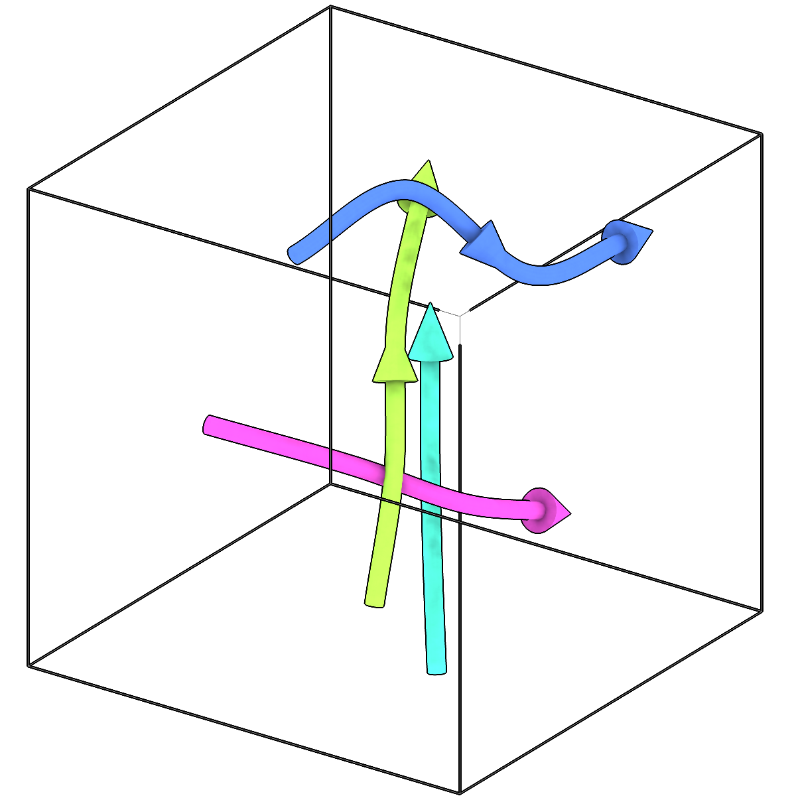
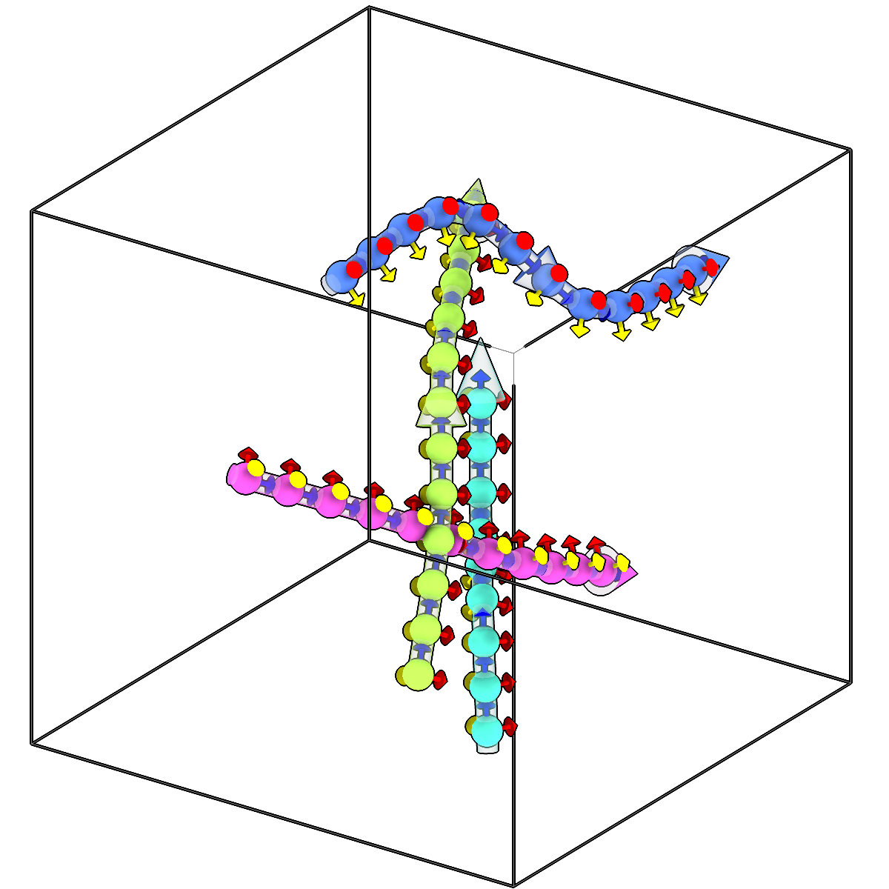

<!-- AUTOGENERATED by `make_cli_docs` (copick.cli.make_cli_docs). Do not edit by hand.
     Editorial additions go in the matching docs/cli_editorial/ partial. -->

# copick convert fil2picks

<span class="source-badge source-badge--utils" title="Provided by the copick-utils plugin">utils</span>

*Sample picks along filaments.*

??? info "Plugin command — copick-utils"
    This command is provided by the **[copick-utils](https://pypi.org/project/copick-utils/)** plugin, not copick core. Install it to make this command available:

    ```bash
    pip install copick-utils
    ```

    See the [plugin system](../index.md#plugin-system) guide for details.

<div class="before-after" markdown>

<figure class="before-after__fig" markdown="span">

<figcaption>Input</figcaption>
</figure>

<p class="before-after__arrow" aria-hidden="true">→</p>

<figure class="before-after__fig" markdown="span">

<figcaption>Output</figcaption>
</figure>

</div>

<p class="before-after__caption">Sample picks along filaments.</p>

## Usage

```bash
copick convert fil2picks [OPTIONS]
```

## Description

Places picks along each filament at a fixed `--spacing`, measured along the filament's
curve. Each pick's orientation has its +Z axis along the filament, in the filament's point
order, and its rotation about that axis follows `--roll`. Every pick carries its filament's
ID as its instance ID and the filament's score, and the picks are written filament by
filament, in order along each one. Exported to RELION with
`copick export picks --filament-columns on`, they carry RELION's filament conventions.

A filament's stored curve is used when it still matches the filament: the B-spline that
`copick convert seg2fil` fitted, or control points from an editor. A filament without one is
sampled along a smooth curve derived from its points. Sampling is cheap and does not change
the filaments, so different spacings can be tried without tracing again.

## URI Format

```text
Filaments: object_name:user_id/session_id
Picks: object_name:user_id/session_id
```

## Options

| Option | Type | Default | Description |
|--------|------|---------|-------------|
| `-c, --config` | path | — | Path to the configuration file. |
| `--run-names, -r` | text · multiple | — | Specific run names to process (default: all runs). Repeatable; pass -r once per run. |
| `--debug / --no-debug` | boolean flag | `False` | Enable debug logging. |

### Input Options

| Option | Type | Default | Description |
|--------|------|---------|-------------|
| `--input, -i` | COPICK_URI | **required** | Input filaments URI (format: object_name:user_id/session_id). Supports glob patterns. |

### Tool Options

| Option | Type | Default | Description |
|--------|------|---------|-------------|
| `--spacing` | float | **required** | Distance between picks along a filament (unit: --length-unit). Required: no spacing suits every filament. |
| `--anchor` | choice (center \| start) | `center` | 'center' splits the length left after the last full step evenly between both ends; 'start' places the first pick at the filament's start. |
| `--roll` | choice (parallel \| random) | `parallel` | Rotation of the picks about the filament axis: 'parallel' turns as little as possible along the filament (rotation-minimizing frames); 'random' is uniformly random per pick. |
| `--seed` | integer | — | Random seed for --roll random. |
| `--length-unit` | choice (angstrom \| voxel) | `angstrom` | Unit of --spacing ('voxel' needs the filaments' voxel spacing). |
| `--workers, -w` | integer | `8` | Number of worker processes. |

### Output Options

| Option | Type | Default | Description |
|--------|------|---------|-------------|
| `--output, -o` | COPICK_URI | **required** | Output picks URI. Supports smart defaults (e.g., "ribosome", "ribosome/my-session", or "/my-session"). Full format: object_name:user_id/session_id. |

## Examples

```bash
# Picks every 82 Å (one tubulin dimer), in the filaments' own session
copick convert fil2picks -i "microtubule:trace/1" -o "microtubule:trace/1" --spacing 82

# Every 4 nm with a random rotation about the axis
copick convert fil2picks -i "microtubule:trace/1" -o "microtubule:picks/4nm" --spacing 40 --roll random --seed 1
```

## See also

- [`copick convert seg2fil`](seg2fil.md) — trace filaments in a segmentation
- [`copick convert fil2seg`](fil2seg.md) — paint tubes around filaments into an instance segmentation
- [`copick export picks`](../export/picks.md) — export picks to RELION with --filament-columns
