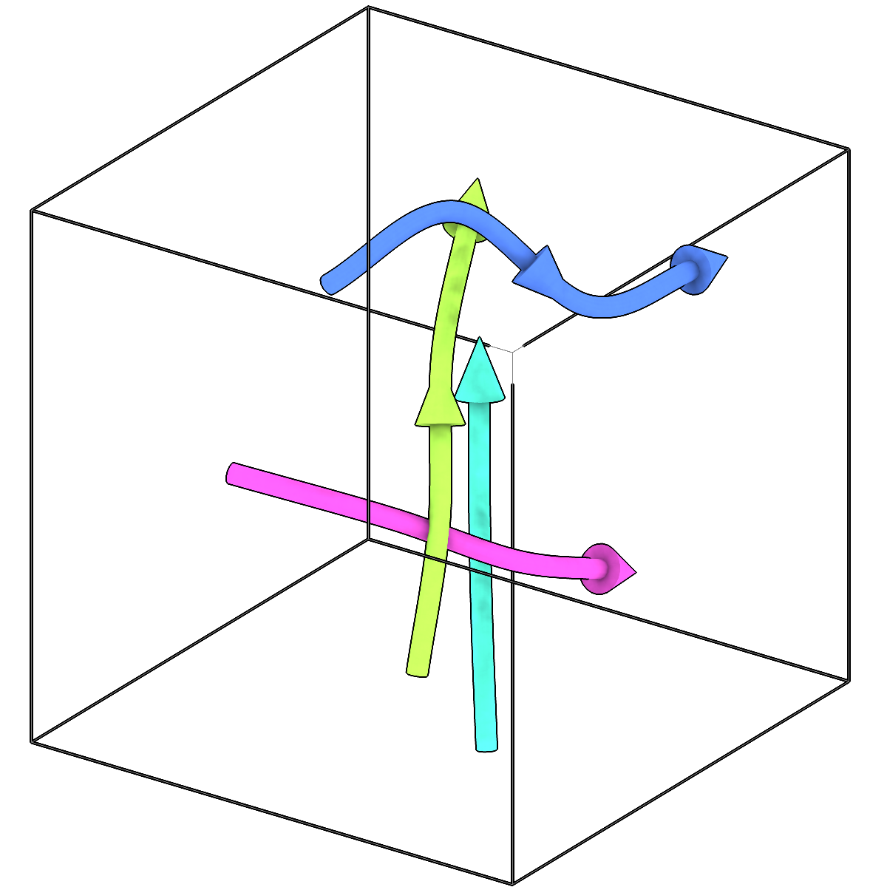
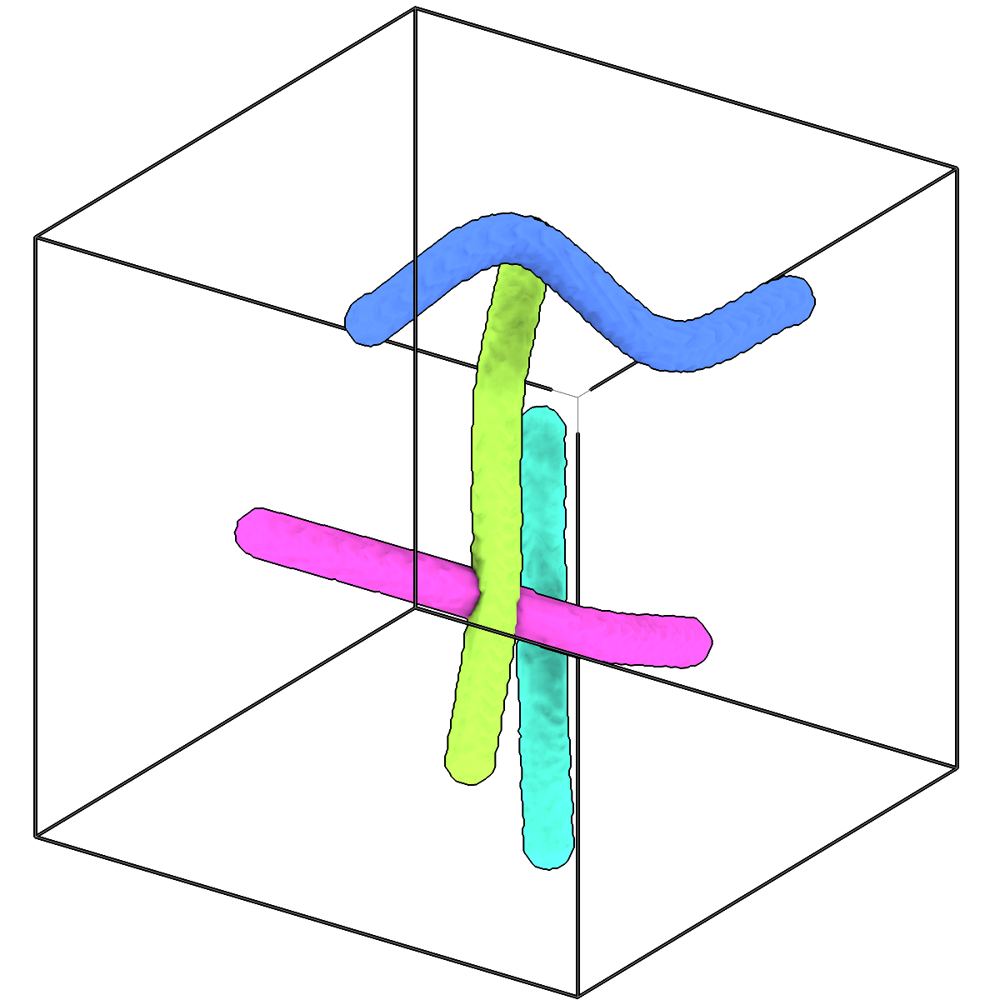

<!-- AUTOGENERATED by `make_cli_docs` (copick.cli.make_cli_docs). Do not edit by hand.
     Editorial additions go in the matching docs/cli_editorial/ partial. -->

# copick convert fil2seg

<span class="source-badge source-badge--utils" title="Provided by the copick-utils plugin">utils</span>

*Paint tubes around filaments into an instance segmentation.*

??? info "Plugin command — copick-utils"
    This command is provided by the **[copick-utils](https://pypi.org/project/copick-utils/)** plugin, not copick core. Install it to make this command available:

    ```bash
    pip install copick-utils
    ```

    See the [plugin system](../index.md#plugin-system) guide for details.

<div class="before-after" markdown>

<figure class="before-after__fig" markdown="span">

<figcaption>Input</figcaption>
</figure>

<p class="before-after__arrow" aria-hidden="true">→</p>

<figure class="before-after__fig" markdown="span">

<figcaption>Output</figcaption>
</figure>

</div>

<p class="before-after__caption">Paint tubes around filaments into an instance segmentation.</p>

## Usage

```bash
copick convert fil2seg [OPTIONS]
```

## Description

Each filament becomes a tube around its centreline, labelled with the filament's ID, so the
result is an instance segmentation with the same IDs as the filaments and their picks.
A filament's tube radius is its own radius (`copick convert seg2fil` records the radius of
the segmentation it traced), otherwise `--radius`, otherwise the object's radius. Where
tubes overlap, each voxel goes to the nearest centreline. The segmentation has the shape of
the run's `--tomo-type` tomogram at the voxel spacing given in the output URI.

Useful for filaments drawn or edited by hand, or imported, that have no segmentation yet:
for example as per-filament masks, or as input to `copick convert seg2fil`.

## URI Format

```text
Filaments: object_name:user_id/session_id
Segmentations: name:user_id/session_id@voxel_spacing?instance=true
```

## Options

| Option | Type | Default | Description |
|--------|------|---------|-------------|
| `-c, --config` | path | — | Path to the configuration file. |
| `--run-names, -r` | text · multiple | — | Specific run names to process (default: all runs). Repeatable; pass -r once per run. |
| `--debug / --no-debug` | boolean flag | `False` | Enable debug logging. |

### Input Options

| Option | Type | Default | Description |
|--------|------|---------|-------------|
| `--input, -i` | COPICK_URI | **required** | Input filaments URI (format: object_name:user_id/session_id). Supports glob patterns. |

### Tool Options

| Option | Type | Default | Description |
|--------|------|---------|-------------|
| `--radius` | float | — | Tube radius in angstroms for filaments without their own radius. Unset: the object's radius. |
| `--tomo-type, -tt` | text | `wbp` | Type of tomogram whose shape the segmentation takes. |
| `--workers, -w` | integer | `8` | Number of worker processes. |

### Output Options

| Option | Type | Default | Description |
|--------|------|---------|-------------|
| `--output, -o` | COPICK_URI | **required** | Output segmentation URI. Supports smart defaults (e.g., "membrane", "membrane/my-session", or "/my-session"). Full format: object_name:user_id/session_id@voxel_spacing. Append ?instance=true or ?panoptic=true to write those segmentation types. |

## Examples

```bash
# Tubes of each filament's own radius, at 10 Å
copick convert fil2seg -i "microtubule:manual/1" -o "microtubule:tubes/1@10.0?instance=true"

# 125 Å tubes against a denoised tomogram
copick convert fil2seg -i "microtubule:manual/1" -o "microtubule:tubes/1@10.0?instance=true" \
    --radius 125 --tomo-type denoised
```

## See also

- [`copick convert seg2fil`](seg2fil.md) — trace filaments in a segmentation
- [`copick convert fil2picks`](fil2picks.md) — sample picks along filaments
- [`copick convert picks2seg`](picks2seg.md) — paint spheres around picks
