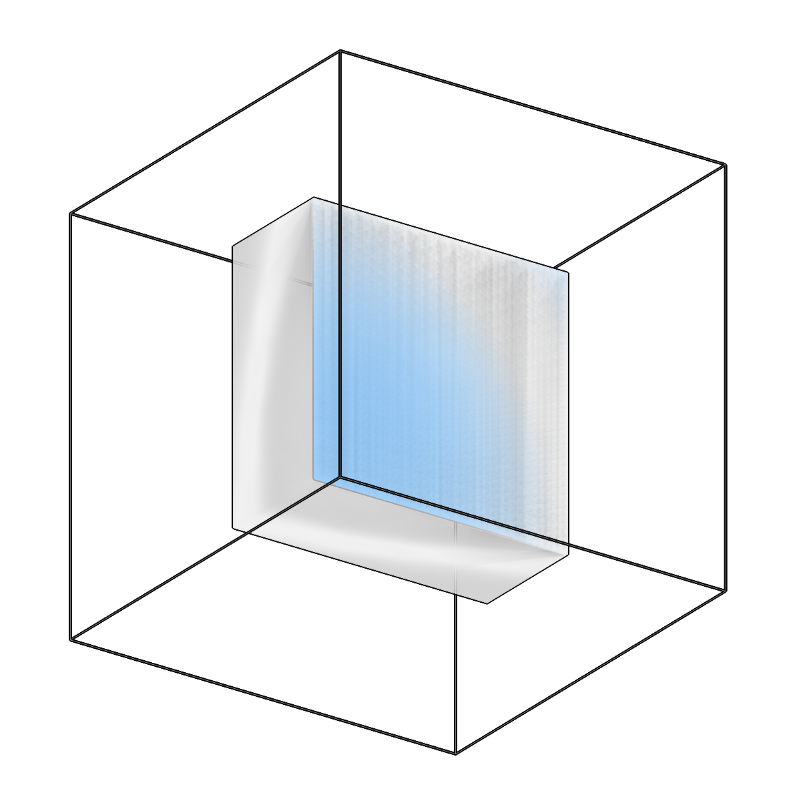
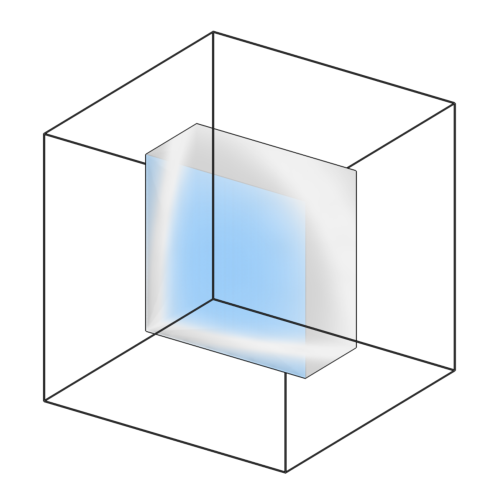

<!-- AUTOGENERATED by `make_cli_docs` (copick.cli.make_cli_docs). Do not edit by hand.
     Editorial additions go in the matching docs/cli_editorial/ partial. -->

# copick convert mesh2caps

<span class="source-badge source-badge--utils" title="Provided by the copick-utils plugin">utils</span>

*Extract the top/bottom surfaces (caps) of a slab box mesh.*

??? info "Plugin command — copick-utils"
    This command is provided by the **[copick-utils](https://pypi.org/project/copick-utils/)** plugin, not copick core. Install it to make this command available:

    ```bash
    pip install copick-utils
    ```

    See the [plugin system](../index.md#plugin-system) guide for details.

=== "Default"

    <div class="before-after" markdown>

    <figure class="before-after__fig" markdown="span">
    
    <figcaption>Input</figcaption>
    </figure>

    <p class="before-after__arrow" aria-hidden="true">→</p>

    <figure class="before-after__fig" markdown="span">
    
    <figcaption>Output</figcaption>
    </figure>

    </div>

    <p class="before-after__caption">Extract the top/bottom surfaces (caps) of a slab box mesh.</p>


=== "Top"

    <div class="before-after" markdown>

    <figure class="before-after__fig" markdown="span">
    
    <figcaption>Input</figcaption>
    </figure>

    <p class="before-after__arrow" aria-hidden="true">→</p>

    <figure class="before-after__fig" markdown="span">
    
    <figcaption>Output</figcaption>
    </figure>

    </div>

    <p class="before-after__caption">Extract the top/bottom surfaces (caps) of a slab box mesh.</p>


=== "Bottom"

    <div class="before-after" markdown>

    <figure class="before-after__fig" markdown="span">
    
    <figcaption>Input</figcaption>
    </figure>

    <p class="before-after__arrow" aria-hidden="true">→</p>

    <figure class="before-after__fig" markdown="span">
    
    <figcaption>Output</figcaption>
    </figure>

    </div>

    <p class="before-after__caption">Extract the top/bottom surfaces (caps) of a slab box mesh.</p>


## Usage

```bash
copick convert mesh2caps [OPTIONS]
```

## Description

Extract the top/bottom surfaces ("caps") of a closed slab box mesh as an open mesh.

A boundary slab (e.g. the ``valid-sample`` mesh) is a closed box: a top surface, a parallel
bottom surface, and 4 side walls. This command keeps only the near-horizontal cap faces and
drops the near-vertical side walls, classifying faces geometrically by their normal orientation
relative to the slab axis (so it works even on a re-triangulated boolean result).

The resulting open mesh feeds ``copick logical clippicks`` to select particles within a distance
of the top/bottom of the specimen WITHOUT the side walls contaminating the distance field.

## URI Format

```text
Meshes: object_name:user_id/session_id
```

## Options

| Option | Type | Default | Description |
|--------|------|---------|-------------|
| `-c, --config` | path | — | Path to the configuration file. |
| `--debug / --no-debug` | boolean flag | `False` | Enable debug logging. |

### Input Options

| Option | Type | Default | Description |
|--------|------|---------|-------------|
| `--run-names, -r` | text · multiple | — | Specific run names to process (default: all runs). |
| `--input, -i` | COPICK_URI | **required** | Input mesh URI (format: object_name:user_id/session_id). Supports glob patterns. |

### Tool Options

| Option | Type | Default | Description |
|--------|------|---------|-------------|
| `--axis` | choice (x \| y \| z) | `z` | Slab-normal axis in physical mesh coordinates (z = beam direction). |
| `--angle-threshold` | float | `45.0` | Max angle (degrees) between a face normal and the axis for a face to count as a cap (rather than a side wall). |
| `--surface` | choice (both \| top \| bottom) | `both` | Which cap surfaces to extract. |
| `--auto-axis / --no-auto-axis` | boolean flag | `False` | Infer the slab normal from the mesh's thinnest bounding-box extent instead of --axis (useful for strongly tilted slabs). |
| `--workers, -w` | integer | `8` | Number of worker processes. |

### Output Options

| Option | Type | Default | Description |
|--------|------|---------|-------------|
| `--output, -o` | COPICK_URI | **required** | Output mesh URI. Supports smart defaults (e.g., "membrane", "membrane/my-session", or "/my-session"). Full format: object_name:user_id/session_id. |

## Examples

```bash
# Extract both caps of the valid-sample slab
copick convert mesh2caps -i "valid-sample:meshop/0" -o "valid-sample-caps:mesh2caps/0"

# Extract only the top cap, with a tighter cap angle
copick convert mesh2caps --surface top --angle-threshold 30 \
    -i "valid-sample:meshop/0" -o "valid-sample-caps:mesh2caps/top-0"

# Strongly tilted slab: infer the slab normal automatically
copick convert mesh2caps --auto-axis -i "valid-sample:meshop/0" -o "valid-sample-caps:mesh2caps/0"
```

## See also

- [`copick logical clippicks`](../logical/clippicks.md) — select picks by distance to the extracted caps
- [`copick logical meshop`](../logical/meshop.md) — build the slab box the caps are extracted from
