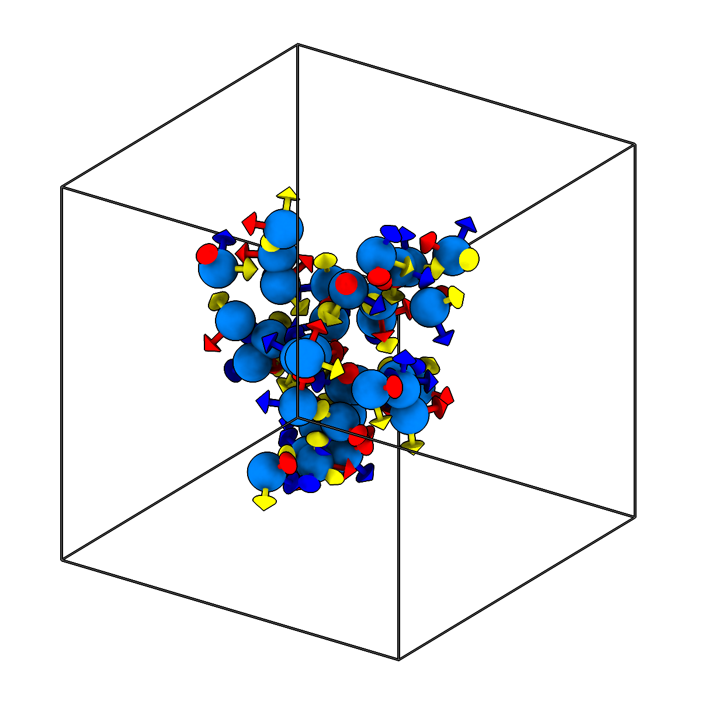
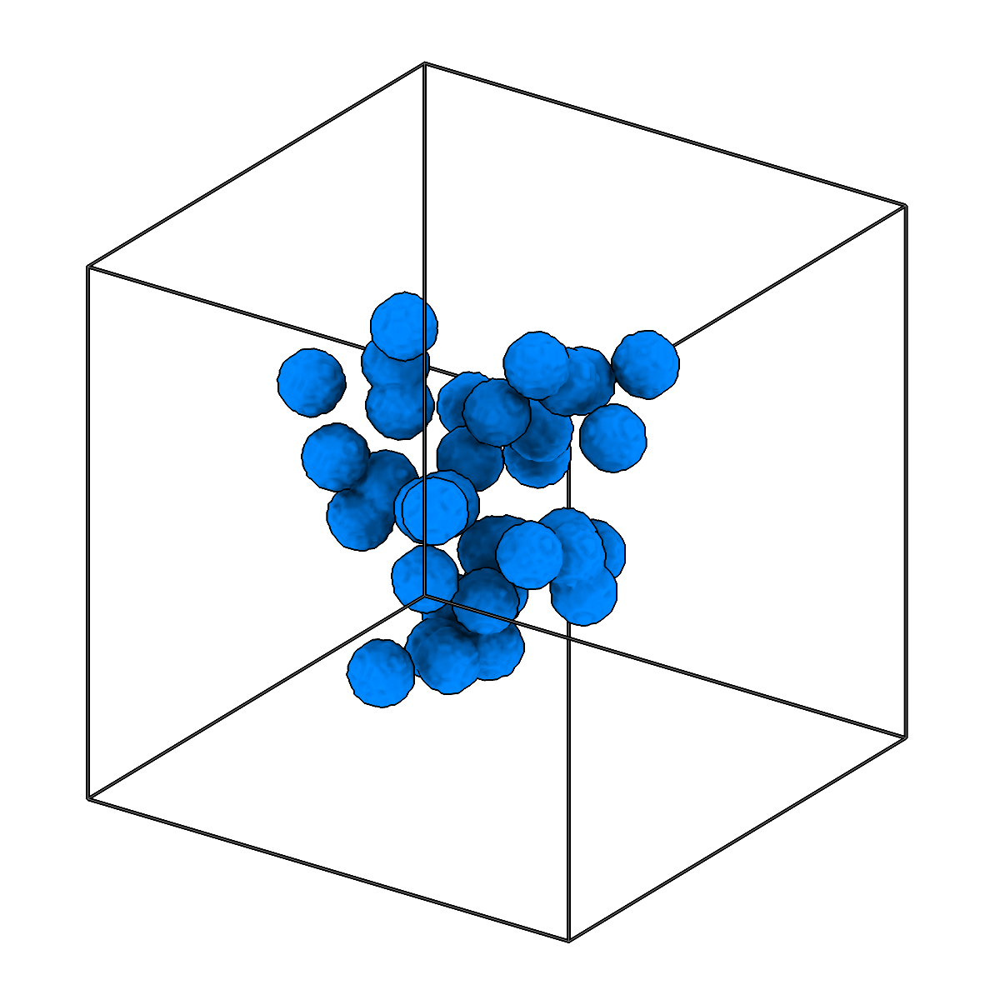

<!-- AUTOGENERATED by `make_cli_docs` (copick.cli.make_cli_docs). Do not edit by hand.
     Editorial additions go in the matching docs/cli_editorial/ partial. -->

# copick convert picks2seg

<span class="source-badge source-badge--utils" title="Provided by the copick-utils plugin">utils</span>

*Convert picks to segmentation volumes by painting spheres.*

??? info "Plugin command — copick-utils"
    This command is provided by the **[copick-utils](https://pypi.org/project/copick-utils/)** plugin, not copick core. Install it to make this command available:

    ```bash
    pip install copick-utils
    ```

    See the [plugin system](../index.md#plugin-system) guide for details.

<div class="before-after" markdown>

<figure class="before-after__fig" markdown="span">

<figcaption>Input</figcaption>
</figure>

<p class="before-after__arrow" aria-hidden="true">→</p>

<figure class="before-after__fig" markdown="span">

<figcaption>Output</figcaption>
</figure>

</div>

<p class="before-after__caption">Convert picks to segmentation volumes by painting spheres.</p>

## Usage

```bash
copick convert picks2seg [OPTIONS]
```

## Description

Paints a solid sphere of the given `--radius` (in physical units) at every pick location into a
label segmentation, producing a dense volume from sparse point annotations. The output is sized
and aligned to the reference tomogram (`--tomo-type`) at the voxel spacing given in the output URI.

Both input and output URIs accept regex patterns and `{input_*}` templating, so many pick sets can
be painted in one call; runs are discovered and processed in parallel via `--workers`.

## URI Format

```text
Picks: object_name:user_id/session_id
Segmentations: name:user_id/session_id@voxel_spacing
```

## Options

| Option | Type | Default | Description |
|--------|------|---------|-------------|
| `-c, --config` | path | — | Path to the configuration file. |
| `--debug / --no-debug` | boolean flag | `False` | Enable debug logging. |

### Input Options

| Option | Type | Default | Description |
|--------|------|---------|-------------|
| `--run-names, -r` | text · multiple | — | Specific run names to process (default: all runs). |
| `--input, -i` | COPICK_URI | **required** | Input picks URI (format: object_name:user_id/session_id). Supports glob patterns. |

### Tool Options

| Option | Type | Default | Description |
|--------|------|---------|-------------|
| `--radius` | float | `10.0` | Radius of spheres to paint at pick locations (in angstroms). |
| `--tomo-type, -tt` | text | `wbp` | Type of tomogram to use as reference. |
| `--workers, -w` | integer | `8` | Number of worker processes. |

### Output Options

| Option | Type | Default | Description |
|--------|------|---------|-------------|
| `--output, -o` | COPICK_URI | **required** | Output segmentation URI. Supports smart defaults (e.g., "membrane", "membrane/my-session", or "/my-session"). Full format: object_name:user_id/session_id@voxel_spacing. |

## Examples

```bash
# Convert a single pick set to a segmentation
copick convert picks2seg -i "ribosome:user1/manual-001" -o "ribosome:picks2seg/painted-001@10.0"

# Convert all manual picks using pattern matching, keeping the source session id
copick convert picks2seg -i "ribosome:user1/manual-.*" -o "ribosome:picks2seg/painted-{input_session_id}@10.0"

# Paint larger spheres against a denoised reference tomogram
copick convert picks2seg --radius 80 --tomo-type denoised \
    -i "ribosome:user1/manual-001" -o "ribosome:picks2seg/painted-001@10.0"
```

## See also

- [`copick convert seg2picks`](seg2picks.md) — the inverse — extract picks from a segmentation
- [`copick convert mesh2seg`](mesh2seg.md) — paint a segmentation from a mesh instead of picks
- [`copick convert picks2mesh`](picks2mesh.md) — build a mesh from picks instead of a segmentation
