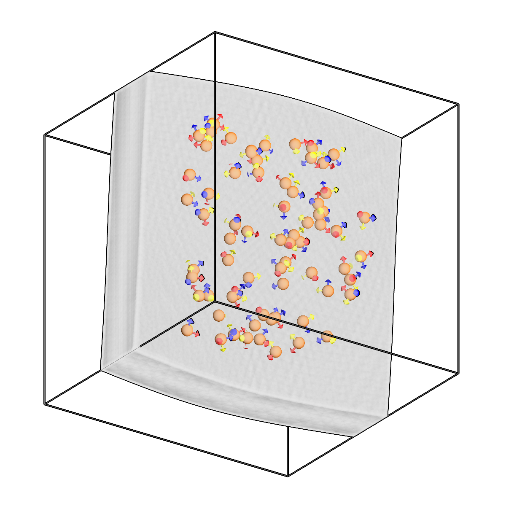
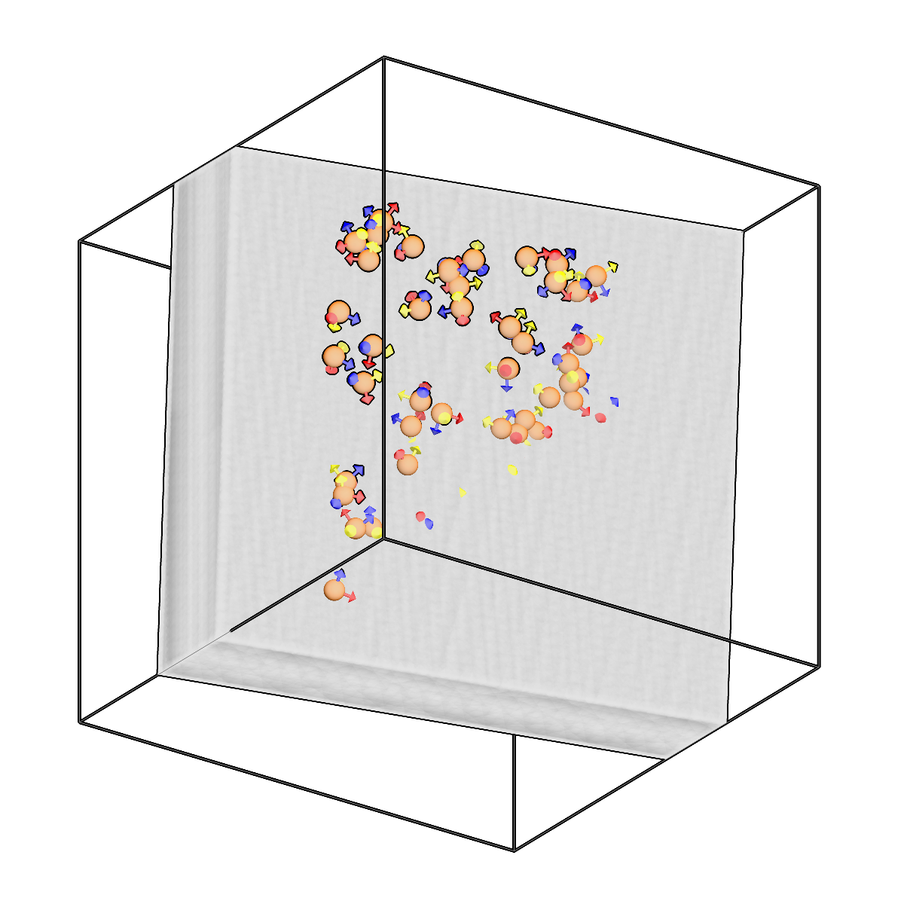

<!-- AUTOGENERATED by `make_cli_docs` (copick.cli.make_cli_docs). Do not edit by hand.
     Editorial additions go in the matching docs/cli_editorial/ partial. -->

# copick convert picks2slab

<span class="source-badge source-badge--torch" title="Provided by the copick-torch plugin">torch</span>

*Fit spline surfaces to two pick sets and create a slab mesh.*

??? info "Plugin command — copick-torch"
    This command is provided by the **[copick-torch](https://pypi.org/project/copick-torch/)** plugin, not copick core. Install it to make this command available:

    ```bash
    pip install copick-torch
    ```

    See the [plugin system](../index.md#plugin-system) guide for details.

=== "Default"

    <div class="before-after" markdown>

    <figure class="before-after__fig" markdown="span">
    
    <figcaption>Input</figcaption>
    </figure>

    <p class="before-after__arrow" aria-hidden="true">→</p>

    <figure class="before-after__fig" markdown="span">
    
    <figcaption>Output</figcaption>
    </figure>

    </div>

    <p class="before-after__caption">Fit spline surfaces to two pick sets and create a slab mesh.</p>


=== "Coupled"

    <div class="before-after" markdown>

    <figure class="before-after__fig" markdown="span">
    
    <figcaption>Input</figcaption>
    </figure>

    <p class="before-after__arrow" aria-hidden="true">→</p>

    <figure class="before-after__fig" markdown="span">
    
    <figcaption>Output</figcaption>
    </figure>

    </div>

    <p class="before-after__caption">Fit spline surfaces to two pick sets and create a slab mesh.</p>


=== "Parallel"

    <div class="before-after" markdown>

    <figure class="before-after__fig" markdown="span">
    
    <figcaption>Input</figcaption>
    </figure>

    <p class="before-after__arrow" aria-hidden="true">→</p>

    <figure class="before-after__fig" markdown="span">
    
    <figcaption>Output</figcaption>
    </figure>

    </div>

    <p class="before-after__caption">Fit spline surfaces to two pick sets and create a slab mesh.</p>


## Usage

```bash
copick convert picks2slab [OPTIONS]
```

## Description

Fit surfaces to two pick sets and create a closed slab mesh.

Takes two sets of picks (e.g. top-layer and bottom-layer boundary annotations)
and fits surfaces to each. Three methods are available:

- spline (default): Fits two independent cubic B-spline surfaces, one per pick
  set. Produces smooth, flexible surfaces that follow the curvature of the picks.
  The two surfaces are unconstrained relative to each other.
- coupled: Fits one shared curved B-spline surface plus two z-offsets, so both
  layers share a single curvature and stay exactly parallel (constant gap).
  A curved-but-parallel slab; the middle ground between spline and parallel.
- parallel: Fits two parallel planes with a shared normal vector and different
  offsets. Produces flat, rigid surfaces guaranteed to be parallel.

For the spline and coupled methods, --regularization adds a bending-energy
(curvature) penalty: higher values flatten the fitted surface(s), which is
useful to keep a deformed slab from over-curving.

The fitted surfaces are connected with side walls to form a closed, watertight
slab mesh.

## URI Format

```text
Picks: object_name:user_id/session_id
Meshes: object_name:user_id/session_id
Tomograms: tomo_type@voxel_spacing
```

## Options

| Option | Type | Default | Description |
|--------|------|---------|-------------|
| `-c, --config` | path | — | Path to the configuration file. |
| `--debug / --no-debug` | boolean flag | `False` | Enable debug logging. |

### Input Options

| Option | Type | Default | Description |
|--------|------|---------|-------------|
| `--run-names, -r` | text · multiple | — | Specific run names to process (default: all runs). |
| `--input1, -i1` | COPICK_URI | **required** | First input picks URI (format: object_name:user_id/session_id). Supports glob patterns. |
| `--input2, -i2` | COPICK_URI | **required** | Second input picks URI (format: object_name:user_id/session_id). Supports glob patterns. |

### Tool Options

| Option | Type | Default | Description |
|--------|------|---------|-------------|
| `--tomogram, -t` | COPICK_URI | **required** | Tomogram URI (format: tomo_type@voxel_spacing). Example: 'wbp@10.0' |
| `--method` | choice (spline \| parallel \| coupled) | `spline` | Surface fitting method: 'spline' fits two independent B-spline surfaces, 'coupled' fits one shared curved surface with two offsets (curved but exactly parallel slab), 'parallel' fits two flat parallel planes (shared normal, two offsets). |
| `--grid-resolution` | integer | `(5, 5)` | B-spline knot grid resolution (rows cols). Used with --method spline and coupled. |
| `--regularization` | float | `0.0` | Curvature (bending-energy) penalty weight for --method spline and coupled; higher = flatter. Ignored for --method parallel. |
| `--fit-resolution` | integer | `(50, 50)` | Output mesh grid resolution (rows cols). |
| `--num-iterations` | integer | `500` | Number of optimization iterations per surface. |
| `--learning-rate` | float | `0.1` | Learning rate for Adam optimizer. |
| `--workers, -w` | integer | `8` | Number of worker processes. |

### Output Options

| Option | Type | Default | Description |
|--------|------|---------|-------------|
| `--output, -o` | COPICK_URI | **required** | Output mesh URI. Supports smart defaults (e.g., "membrane", "membrane/my-session", or "/my-session"). Full format: object_name:user_id/session_id. |

## Examples

```bash
# Fit slab with flexible spline surfaces (default)
copick convert picks2slab -c config.json \
    -i1 "top-layer:bob/1" -i2 "bottom-layer:bob/1" \
    -t "wbp@7.84" \
    -o "sample:picks2slab/0"

# Fit a curved-but-parallel slab (shared surface), gently regularized
copick convert picks2slab -c config.json \
    -i1 "top-layer:bob/1" -i2 "bottom-layer:bob/1" \
    -t "wbp@7.84" --method coupled --regularization 5 \
    -o "sample:picks2slab/0"

# Fit slab with parallel planes
copick convert picks2slab -c config.json \
    -i1 "top-layer:bob/1" -i2 "bottom-layer:bob/1" \
    -t "wbp@7.84" --method parallel \
    -o "sample:picks2slab/0"

# With custom spline and mesh resolution
copick convert picks2slab -c config.json \
    -i1 "top-layer:user1/manual" -i2 "bottom-layer:user1/manual" \
    -t "wbp@10.0" \
    --grid-resolution 7 7 --fit-resolution 100 100 \
    -o "sample:picks2slab/fitted"
```
