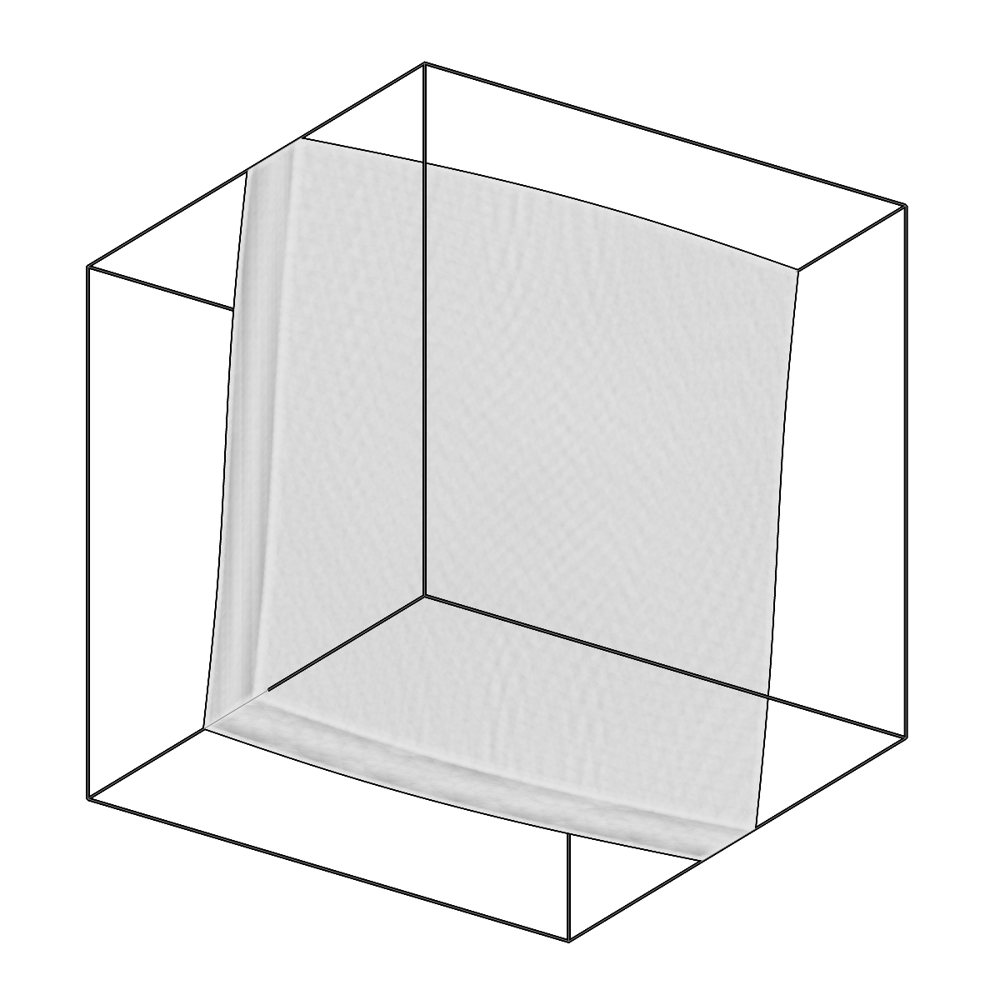
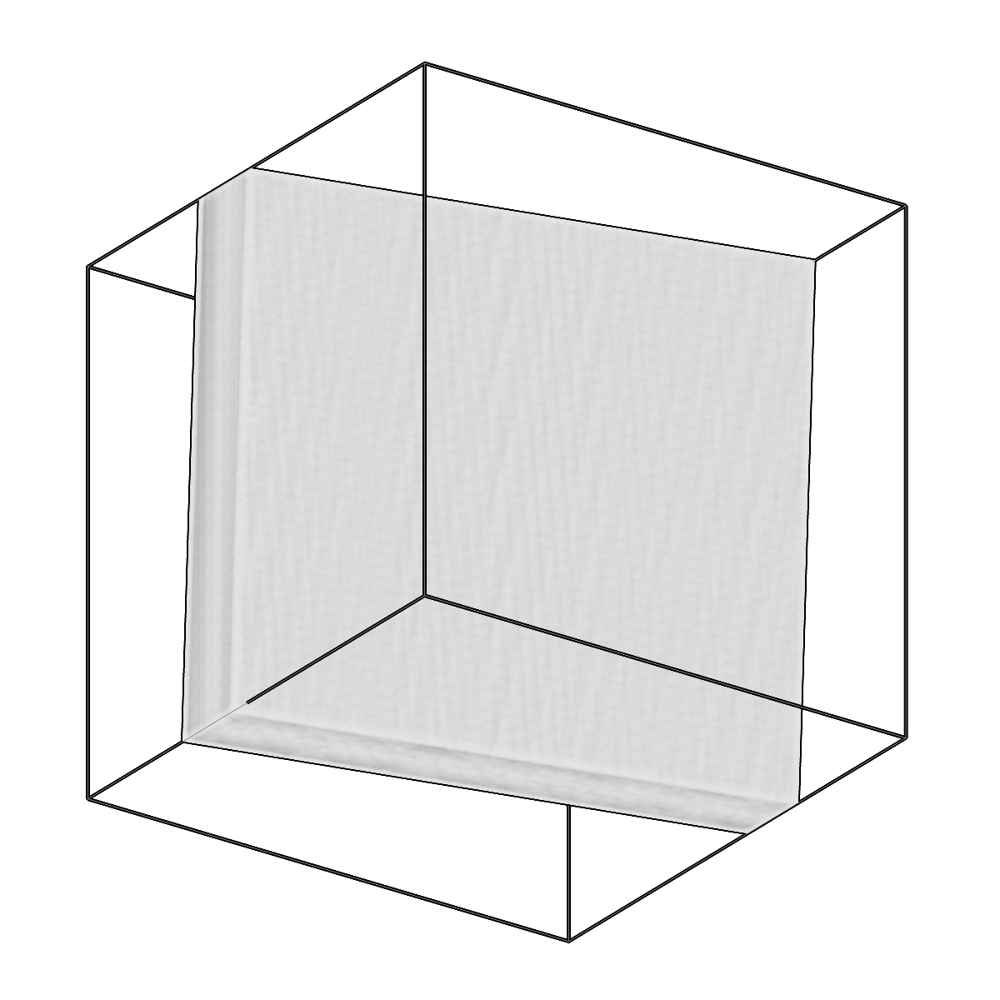
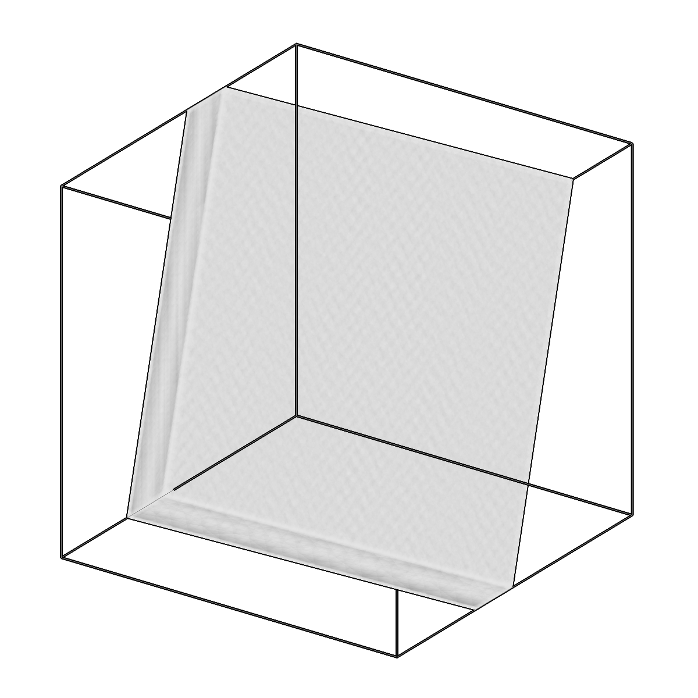

<!-- AUTOGENERATED by `make_cli_docs` (copick.cli.make_cli_docs). Do not edit by hand.
     Editorial additions go in the matching docs/cli_editorial/ partial. -->

# copick convert seg2slab

<span class="source-badge source-badge--torch" title="Provided by the copick-torch plugin">torch</span>

*Fit parallel planes to a segmentation and create a slab mesh.*

??? info "Plugin command — copick-torch"
    This command is provided by the **[copick-torch](https://pypi.org/project/copick-torch/)** plugin, not copick core. Install it to make this command available:

    ```bash
    pip install copick-torch
    ```

    See the [plugin system](../index.md#plugin-system) guide for details.

=== "Default"

    <div class="before-after" markdown>

    <figure class="before-after__fig" markdown="span">
    
    <figcaption>Input</figcaption>
    </figure>

    <p class="before-after__arrow" aria-hidden="true">→</p>

    <figure class="before-after__fig" markdown="span">
    
    <figcaption>Output</figcaption>
    </figure>

    </div>

    <p class="before-after__caption">Fit parallel planes to a segmentation and create a slab mesh.</p>


=== "Spline"

    <div class="before-after" markdown>

    <figure class="before-after__fig" markdown="span">
    
    <figcaption>Input</figcaption>
    </figure>

    <p class="before-after__arrow" aria-hidden="true">→</p>

    <figure class="before-after__fig" markdown="span">
    
    <figcaption>Output</figcaption>
    </figure>

    </div>

    <p class="before-after__caption">Fit parallel planes to a segmentation and create a slab mesh.</p>


=== "Parallel"

    <div class="before-after" markdown>

    <figure class="before-after__fig" markdown="span">
    
    <figcaption>Input</figcaption>
    </figure>

    <p class="before-after__arrow" aria-hidden="true">→</p>

    <figure class="before-after__fig" markdown="span">
    
    <figcaption>Output</figcaption>
    </figure>

    </div>

    <p class="before-after__caption">Fit parallel planes to a segmentation and create a slab mesh.</p>


=== "IoU"

    <div class="before-after" markdown>

    <figure class="before-after__fig" markdown="span">
    
    <figcaption>Input</figcaption>
    </figure>

    <p class="before-after__arrow" aria-hidden="true">→</p>

    <figure class="before-after__fig" markdown="span">
    
    <figcaption>Output</figcaption>
    </figure>

    </div>

    <p class="before-after__caption">Fit parallel planes to a segmentation and create a slab mesh.</p>


## Usage

```bash
copick convert seg2slab [OPTIONS]
```

## Description

Fit a slab to a segmentation volume and create a closed slab mesh.

Extracts a single label from the segmentation and finds the largest connected component.
For the 'spline'/'coupled'/'parallel' methods it then extracts top- and bottom-surface
point-clouds and fits a surface with the same machinery as ``picks2slab`` (B-spline grid
resolution, curvature regularization). The legacy 'iou' method instead fits two flat
parallel planes directly to the binary volume by maximizing intersection-over-union. The
two fitted surfaces are connected with side walls to form a closed, watertight box mesh.

## URI Format

```text
Segmentations: name:user_id/session_id@voxel_spacing
Meshes: object_name:user_id/session_id
```

## Options

| Option | Type | Default | Description |
|--------|------|---------|-------------|
| `-c, --config` | path | — | Path to the configuration file. |
| `--debug / --no-debug` | boolean flag | `False` | Enable debug logging. |

### Input Options

| Option | Type | Default | Description |
|--------|------|---------|-------------|
| `--run-names, -r` | text · multiple | — | Specific run names to process (default: all runs). |
| `--input, -i` | COPICK_URI | **required** | Input segmentation URI (format: name:user_id/session_id@voxel_spacing). Supports glob patterns. |

### Tool Options

| Option | Type | Default | Description |
|--------|------|---------|-------------|
| `--label, -l` | integer | **required** | Label index to extract from the segmentation. |
| `--method` | choice (spline \| coupled \| parallel \| iou) | `coupled` | Surface fitting method: 'coupled' fits one shared curved surface with two offsets (curved but exactly parallel slab); 'spline' fits two independent B-spline surfaces; 'parallel' fits two flat parallel planes to the extracted surface points; 'iou' fits two flat parallel planes directly to the binary volume via intersection-over-union (legacy). |
| `--grid-resolution` | integer | `(5, 5)` | B-spline knot grid resolution (rows cols). Used with --method spline and coupled. |
| `--regularization` | float | `0.0` | Curvature (bending-energy) penalty weight for --method spline and coupled; higher = flatter. Ignored for --method parallel and iou. |
| `--surface-stride` | integer | `1` | Column subsampling stride for surface-point extraction (>=1); bounds the point count on large volumes. Ignored for --method iou. |
| `--fit-resolution` | integer | `(50, 50)` | Output mesh grid resolution (rows cols). |
| `--num-iterations` | integer | `500` | Number of optimization iterations for surface fitting. |
| `--learning-rate` | float | `0.1` | Learning rate for Adam optimizer. |
| `--workers, -w` | integer | `8` | Number of worker processes. |

### Output Options

| Option | Type | Default | Description |
|--------|------|---------|-------------|
| `--output, -o` | COPICK_URI | **required** | Output mesh URI. Supports smart defaults (e.g., "membrane", "membrane/my-session", or "/my-session"). Full format: object_name:user_id/session_id. |

## Examples

```bash
# Fit a coupled (curved, parallel) slab from a segmentation
copick convert seg2slab -c config.json \
    -i "sample:postproc/largest@20.0" \
    --label 1 --method coupled --grid-resolution 5 5 --regularization 5 \
    -o "sample:seg2slab/0"

# Process specific runs with the legacy IoU flat-plane fit
copick convert seg2slab -c config.json \
    -r 14114 -r 14132 \
    -i "predictions:model/run-001@10.0" \
    --label 1 --method iou --fit-resolution 100 100 \
    -o "sample:seg2slab/fitted"
```
