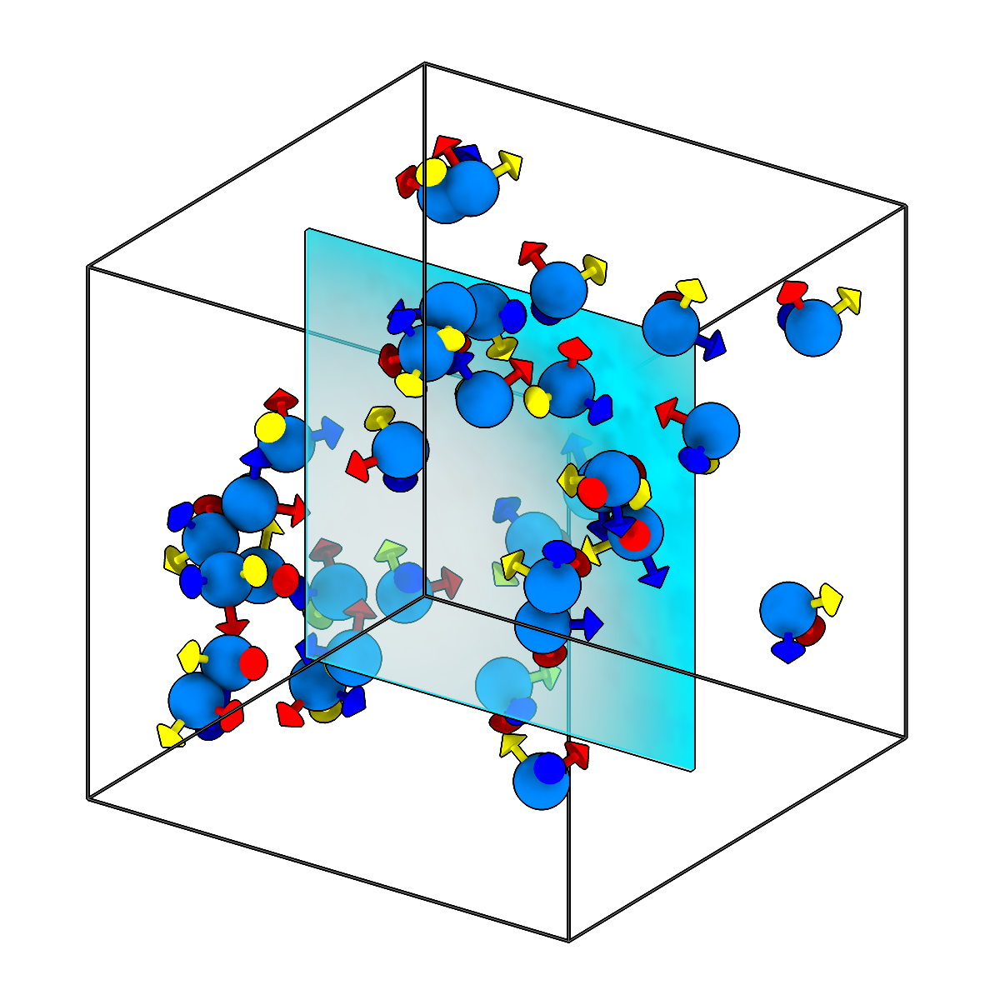

<!-- AUTOGENERATED by `make_cli_docs` (copick.cli.make_cli_docs). Do not edit by hand.
     Editorial additions go in the matching docs/cli_editorial/ partial. -->

# copick logical clippicks

<span class="source-badge source-badge--utils" title="Provided by the copick-utils plugin">utils</span>

*Limit picks to those within distance of a reference surface.*

??? info "Plugin command — copick-utils"
    This command is provided by the **[copick-utils](https://pypi.org/project/copick-utils/)** plugin, not copick core. Install it to make this command available:

    ```bash
    pip install copick-utils
    ```

    See the [plugin system](../index.md#plugin-system) guide for details.

=== "Default"

    <div class="before-after" markdown>

    <figure class="before-after__fig" markdown="span">
    
    <figcaption>Input</figcaption>
    </figure>

    <p class="before-after__arrow" aria-hidden="true">→</p>

    <figure class="before-after__fig" markdown="span">
    
    <figcaption>Output</figcaption>
    </figure>

    </div>

    <p class="before-after__caption">Limit picks to those within distance of a reference surface.</p>


=== "Invert (beyond)"

    <div class="before-after" markdown>

    <figure class="before-after__fig" markdown="span">
    
    <figcaption>Input</figcaption>
    </figure>

    <p class="before-after__arrow" aria-hidden="true">→</p>

    <figure class="before-after__fig" markdown="span">
    
    <figcaption>Output</figcaption>
    </figure>

    </div>

    <p class="before-after__caption">Limit picks to those within distance of a reference surface.</p>


## Usage

```bash
copick logical clippicks [OPTIONS]
```

## Description

The reference surface can be a mesh, segmentation, or tomogram boundary. Each input
pick is kept or dropped based on its distance to the nearest point on that surface.
By default, picks within the specified `--max-distance` are kept; use `--invert` to
keep only the picks that lie beyond that distance instead.

Exactly one reference must be supplied via `--ref-mesh`, `--ref-seg`, or
`--ref-tomogram`. Distances are measured in angstroms.

## URI Format

```text
Picks: object_name:user_id/session_id
Meshes: object_name:user_id/session_id
Segmentations: name:user_id/session_id@voxel_spacing
Tomograms: tomo_type@voxel_spacing
```

## Options

| Option | Type | Default | Description |
|--------|------|---------|-------------|
| `-c, --config` | path | — | Path to the configuration file. |
| `--debug / --no-debug` | boolean flag | `False` | Enable debug logging. |

### Input Options

| Option | Type | Default | Description |
|--------|------|---------|-------------|
| `--run-names, -r` | text · multiple | — | Specific run names to process (default: all runs). |
| `--input, -i` | COPICK_URI | **required** | Input picks URI (format: object_name:user_id/session_id). Supports glob patterns. |

### Reference Options

| Option | Type | Default | Description |
|--------|------|---------|-------------|
| `--ref-mesh, -rm` | COPICK_URI | — | Reference mesh URI (format: object_name:user_id/session_id). Supports glob patterns. |
| `--ref-seg, -rs` | COPICK_URI | — | Reference segmentation URI (format: name:user_id/session_id@voxel_spacing). Supports glob patterns. |
| `--ref-tomogram, -rt` | COPICK_URI | — | Reference tomogram boundary URI (format: tomo_type@voxel_spacing). Uses tomogram volume boundaries as reference surface. Example: 'wbp@10.0' |

### Tool Options

| Option | Type | Default | Description |
|--------|------|---------|-------------|
| `--max-distance, -d` | float | `100.0` | Maximum distance from reference surface (in angstroms). |
| `--mesh-voxel-spacing, -mvs` | float | — | Voxel spacing for mesh voxelization when using mesh reference (defaults to target voxel spacing). |
| `--invert / --no-invert` | boolean flag | `False` | Invert filtering: keep data BEYOND max_distance instead of WITHIN (default: keep within). |
| `--workers, -w` | integer | `8` | Number of worker processes. |

### Output Options

| Option | Type | Default | Description |
|--------|------|---------|-------------|
| `--output, -o` | COPICK_URI | **required** | Output picks URI. Supports smart defaults (e.g., "ribosome", "ribosome/my-session", or "/my-session"). Full format: object_name:user_id/session_id. |

## Examples

```bash
# Keep picks within 50A of a mesh reference
copick logical clippicks -i "ribosome:user1/all-001" -rm "boundary:user1/boundary-001" \
    -o "ribosome:clippicks/near-001" --max-distance 50.0

# Remove picks within 50A of a tomogram boundary (keep interior picks)
copick logical clippicks -i "ribosome:user1/all-001" -rt "wbp@10.0" \
    -o "ribosome:clippicks/interior-001" --max-distance 50.0 --invert

# Keep picks beyond 100A from a segmentation reference
copick logical clippicks -i "ribosome:user1/all-001" -rs "mask:user1/mask-001@10.0" \
    -o "ribosome:clippicks/far-001" --max-distance 100.0 --invert
```

## See also

- [`copick convert mesh2caps`](../convert/mesh2caps.md) — extract slab caps so clipping ignores the side walls
- [`copick logical meshop`](meshop.md) — build the reference mesh used as the clipping surface
