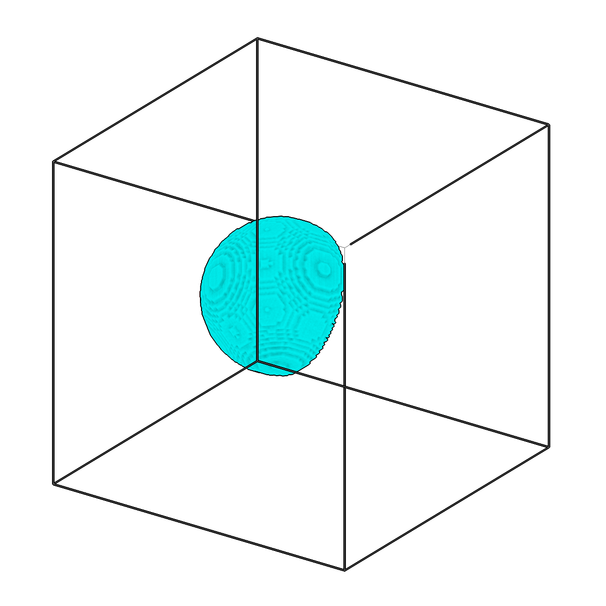
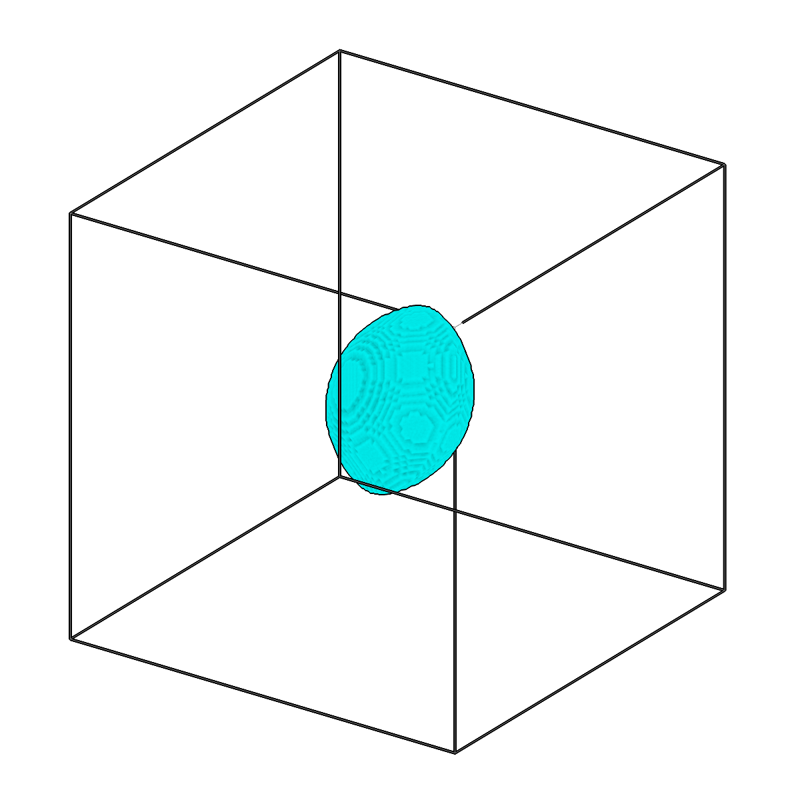
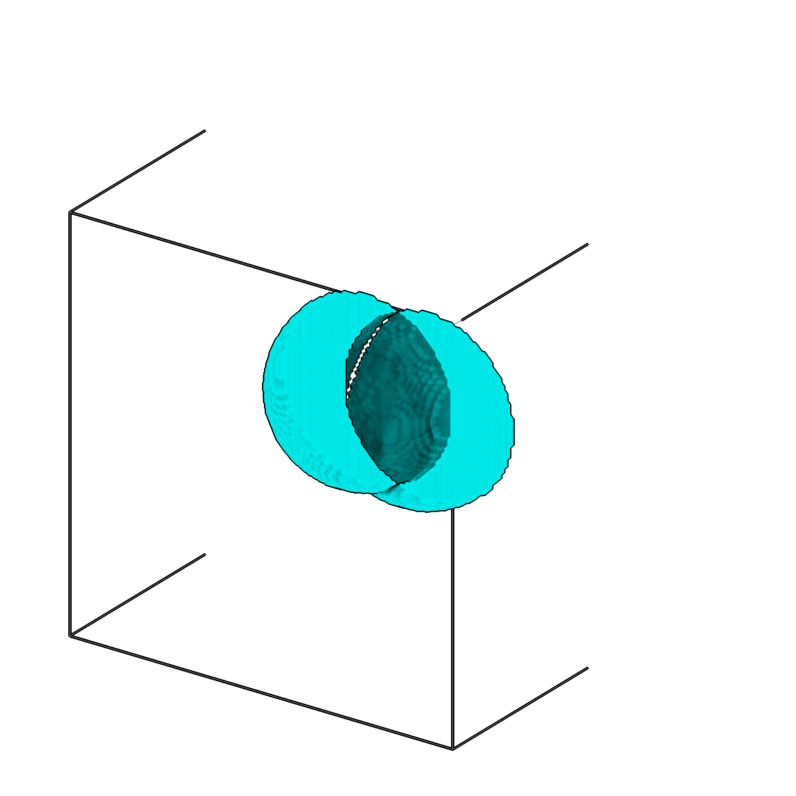

<!-- AUTOGENERATED by `make_cli_docs` (copick.cli.make_cli_docs). Do not edit by hand.
     Editorial additions go in the matching docs/cli_editorial/ partial. -->

# copick logical segop

<span class="source-badge source-badge--utils" title="Provided by the copick-utils plugin">utils</span>

*Perform boolean operations between segmentations.*

??? info "Plugin command — copick-utils"
    This command is provided by the **[copick-utils](https://pypi.org/project/copick-utils/)** plugin, not copick core. Install it to make this command available:

    ```bash
    pip install copick-utils
    ```

    See the [plugin system](../index.md#plugin-system) guide for details.

=== "Default"

    <div class="before-after" markdown>

    <figure class="before-after__fig" markdown="span">
    
    <figcaption>Input</figcaption>
    </figure>

    <p class="before-after__arrow" aria-hidden="true">→</p>

    <figure class="before-after__fig" markdown="span">
    
    <figcaption>Output</figcaption>
    </figure>

    </div>

    <p class="before-after__caption">Perform boolean operations between segmentations.</p>


=== "Difference"

    <div class="before-after" markdown>

    <figure class="before-after__fig" markdown="span">
    
    <figcaption>Input</figcaption>
    </figure>

    <p class="before-after__arrow" aria-hidden="true">→</p>

    <figure class="before-after__fig" markdown="span">
    
    <figcaption>Output</figcaption>
    </figure>

    </div>

    <p class="before-after__caption">Perform boolean operations between segmentations.</p>


=== "Intersection"

    <div class="before-after" markdown>

    <figure class="before-after__fig" markdown="span">
    
    <figcaption>Input</figcaption>
    </figure>

    <p class="before-after__arrow" aria-hidden="true">→</p>

    <figure class="before-after__fig" markdown="span">
    
    <figcaption>Output</figcaption>
    </figure>

    </div>

    <p class="before-after__caption">Perform boolean operations between segmentations.</p>


=== "Exclusion"

    <div class="before-after" markdown>

    <figure class="before-after__fig" markdown="span">
    
    <figcaption>Input</figcaption>
    </figure>

    <p class="before-after__arrow" aria-hidden="true">→</p>

    <figure class="before-after__fig" markdown="span">
    
    <figcaption>Output</figcaption>
    </figure>

    </div>

    <p class="before-after__caption">Perform boolean operations between segmentations.</p>


## Usage

```bash
copick logical segop [OPTIONS]
```

## Description

Combine multiple segmentations using boolean set operations. Every input is first
converted to a binary mask, then combined with the chosen operation. The voxel spacing
given by `--voxel-spacing` applies globally to all inputs and to the output.

Supported operations: `union` combines segmentations (logical OR) and accepts N>=1
inputs; `difference` subtracts the second input from the first and requires exactly 2
inputs; `intersection` keeps voxels common to both inputs (logical AND) and requires
exactly 2 inputs; `exclusion` keeps voxels present in exactly one input (XOR) and
requires exactly 2 inputs.

Input URIs support glob wildcards (`*` and `?`) by default, or regular expressions when
prefixed with `re:` (for example `re:membrane:user\d+/session-\d+`). When a single `-i`
flag is given with a pattern, `union` expands the pattern within each run and merges every
matching segmentation, which is useful for combining multiple versions or annotations
within each run.

## URI Format

```text
Segmentations: name:user_id/session_id (voxel spacing supplied via --voxel-spacing)
```

## Options

| Option | Type | Default | Description |
|--------|------|---------|-------------|
| `-c, --config` | path | — | Path to the configuration file. |
| `--debug / --no-debug` | boolean flag | `False` | Enable debug logging. |

### Input Options

| Option | Type | Default | Description |
|--------|------|---------|-------------|
| `--run-names, -r` | text · multiple | — | Specific run names to process (default: all runs). |
| `--input, -i` | COPICK_URI · multiple | **required** | Input segmentation URI (format: name:user_id/session_id@voxel_spacing). Can be specified multiple times for N-way operations. Supports glob patterns (default) or regex patterns (re: prefix). |

### Tool Options

| Option | Type | Default | Description |
|--------|------|---------|-------------|
| `--operation, -op` | choice (union \| difference \| intersection \| exclusion \| concatenate) | **required** | Boolean operation to perform. |
| `--voxel-spacing, -vs` | float | **required** | Voxel spacing for input and output segmentations. |
| `--workers, -w` | integer | `8` | Number of worker processes. |

### Output Options

| Option | Type | Default | Description |
|--------|------|---------|-------------|
| `--output, -o` | COPICK_URI | **required** | Output segmentation URI. Supports smart defaults (e.g., "membrane", "membrane/my-session", or "/my-session"). Full format: object_name:user_id/session_id@voxel_spacing. |

## Examples

```bash
# Single-input union: merge all matching segmentations within each run
copick logical segop --operation union -vs 10.0 \
    -i "membrane:user*/manual-*" \
    -o "merged"

# N-way union with multiple -i flags (merge across different objects)
copick logical segop --operation union -vs 10.0 \
    -i "membrane:user1/manual-*" \
    -i "vesicle:user2/auto-*" \
    -i "ribosome:user3/pred-*" \
    -o "merged"

# N-way union with regex patterns
copick logical segop --operation union -vs 10.0 \
    -i "re:membrane:user1/manual-\d+" \
    -i "re:vesicle:user2/auto-\d+" \
    -o "merged"

# 2-way difference (exactly 2 inputs required)
copick logical segop --operation difference -vs 10.0 \
    -i "membrane:user1/manual-001" \
    -i "mask:user1/mask-001" \
    -o "membrane:segop/masked"
```

## See also

- [`copick logical meshop`](meshop.md) — the same boolean operations applied to meshes
- [`copick logical clipseg`](clipseg.md) — limit segmentation voxels by distance to a reference
