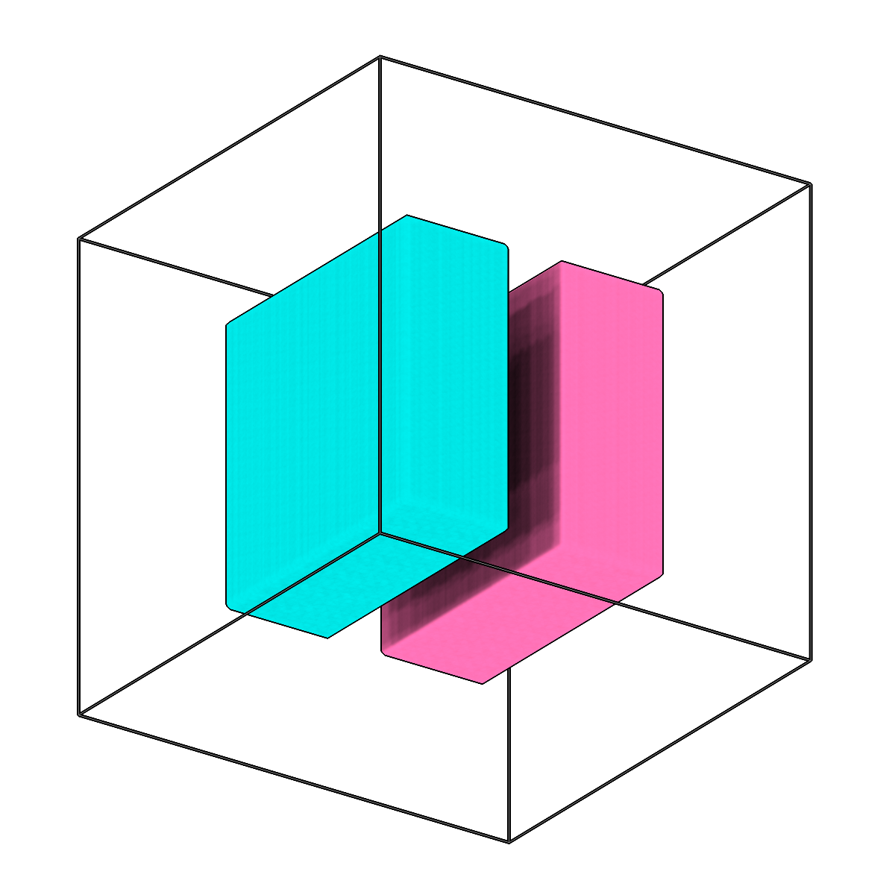

<!-- AUTOGENERATED by `make_cli_docs` (copick.cli.make_cli_docs). Do not edit by hand.
     Editorial additions go in the matching docs/cli_editorial/ partial. -->

# copick process combine

<span class="source-badge source-badge--utils" title="Provided by the copick-utils plugin">utils</span>

*Combine single-label segmentations into a multilabel segmentation.*

??? info "Plugin command — copick-utils"
    This command is provided by the **[copick-utils](https://pypi.org/project/copick-utils/)** plugin, not copick core. Install it to make this command available:

    ```bash
    pip install copick-utils
    ```

    See the [plugin system](../index.md#plugin-system) guide for details.

<div class="before-after" markdown>

<figure class="before-after__fig" markdown="span">

<figcaption>Input</figcaption>
</figure>

<p class="before-after__arrow" aria-hidden="true">→</p>

<figure class="before-after__fig" markdown="span">

<figcaption>Output</figcaption>
</figure>

</div>

<p class="before-after__caption">Combine single-label segmentations into a multilabel segmentation.</p>

## Usage

```bash
copick process combine [OPTIONS]
```

## Description

This is the inverse of `copick process split`. It takes multiple binary/single-label
segmentations (matched by a pattern) and merges them into a single multilabel volume.
Each input segmentation's name is looked up in the copick config to determine its
integer label value.

When multiple inputs overlap, the lowest label value wins. This resolution is
deterministic and reproducible, and overlapping voxels are logged as warnings.

With an output URI ending in `?panoptic=true`, the result is a panoptic segmentation
instead: the inputs fill its label channel (regions without instances, such as
membranes), and the instance segmentations given with `--instances` add their objects'
labels and their instance IDs. An instance ID is kept where its object's label won.

## URI Format

```text
Segmentations: name:user_id/session_id@voxel_spacing
Use glob/regex patterns to match multiple segmentations per run.
Panoptic output: append ?panoptic=true to the output URI
```

## Options

| Option | Type | Default | Description |
|--------|------|---------|-------------|
| `-c, --config` | path | — | Path to the configuration file. |
| `--run-names, -r` | text · multiple | — | Specific run names to process (default: all runs). Repeatable; pass -r once per run. |
| `--debug / --no-debug` | boolean flag | `False` | Enable debug logging. |

### Input Options

| Option | Type | Default | Description |
|--------|------|---------|-------------|
| `--input, -i` | COPICK_URI | **required** | Input segmentation URI (format: name:user_id/session_id@voxel_spacing). Supports glob patterns. Append ?instance=true or ?panoptic=true to read those segmentation types. |
| `--instances` | text | — | Instance segmentations to add to a panoptic output (-o ...?panoptic=true), e.g. "microtubule:trace/1@10.0" (patterns allowed; ?instance=true is implied). Each one adds its object's label and its instance IDs. |
| `--workers, -w` | integer | `8` | Number of worker processes. |

### Output Options

| Option | Type | Default | Description |
|--------|------|---------|-------------|
| `--output, -o` | COPICK_URI | **required** | Output segmentation URI. Supports smart defaults (e.g., "membrane", "membrane/my-session", or "/my-session"). Full format: object_name:user_id/session_id@voxel_spacing. Append ?instance=true or ?panoptic=true to write those segmentation types. |

## Examples

```bash
# Combine all segmentations from a split operation
copick process combine -i "*:split/*@20" -o "multilabel:combine/0"

# Combine a specific user's segmentations using regex
copick process combine -i "re:.*:napari/manual@20" -o "combined:combine/0"

# Combine for specific runs
copick process combine -r run1 -r run2 -i "*:user1/session@10.0" -o "labels:combine/0"

# Membranes as regions plus microtubule instances, as one panoptic segmentation
copick process combine -i "membrane:data-portal/*@10.0" --instances "microtubule:trace/1@10.0" \
    -o "cell:combine/0@10.0?panoptic=true"
```

## See also

- [`copick process split`](split.md) — the inverse operation (split a multilabel segmentation into single labels)
- [`copick process expand-labels`](expand-labels.md) — grow labels to fill holes and gaps in a segmentation
