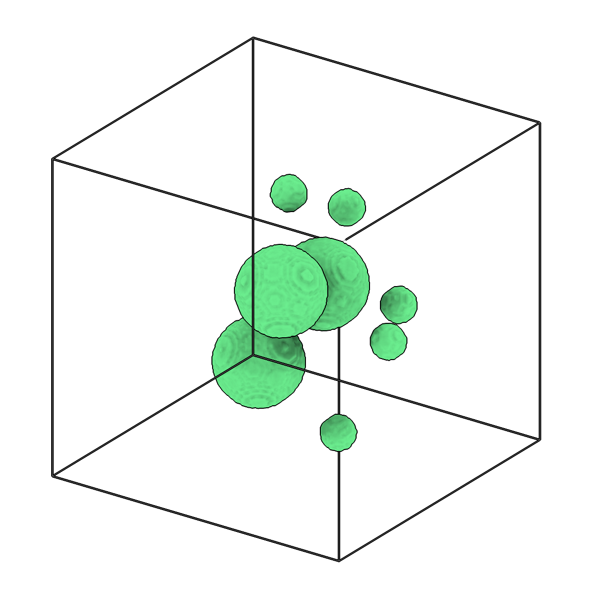
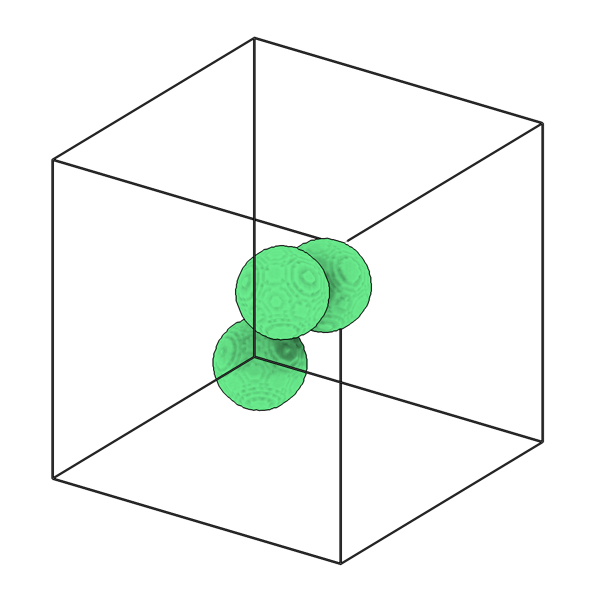

<!-- AUTOGENERATED by `make_cli_docs` (copick.cli.make_cli_docs). Do not edit by hand.
     Editorial additions go in the matching docs/cli_editorial/ partial. -->

# copick process filter-components

<span class="source-badge source-badge--utils" title="Provided by the copick-utils plugin">utils</span>

*Filter connected components in segmentations by size.*

??? info "Plugin command — copick-utils"
    This command is provided by the **[copick-utils](https://pypi.org/project/copick-utils/)** plugin, not copick core. Install it to make this command available:

    ```bash
    pip install copick-utils
    ```

    See the [plugin system](../index.md#plugin-system) guide for details.

<div class="before-after" markdown>

<figure class="before-after__fig" markdown="span">

<figcaption>Input</figcaption>
</figure>

<p class="before-after__arrow" aria-hidden="true">→</p>

<figure class="before-after__fig" markdown="span">

<figcaption>Output</figcaption>
</figure>

</div>

<p class="before-after__caption">Filter connected components in segmentations by size.</p>

## Usage

```bash
copick process filter-components [OPTIONS]
```

## Description

This command identifies connected components in a segmentation and removes those that
fall outside the specified size range. Sizes can be given in cubic angstroms (default)
or cubic voxels via --size-unit, and component adjacency is controlled by --connectivity
(face = 6-connected, face-edge = 18-connected, all = 26-connected).

Pass --keep-largest N to retain only the N largest components by voxel count, applied on
top of any --min-size/--max-size limits. Run `copick process seg-stats` first to inspect
component sizes and choose sensible thresholds.

A multilabel segmentation is filtered label by label and keeps its labels. An instance
segmentation (`?instance=true`) is filtered instance by instance: whole instances are
dropped, and the IDs of the kept ones do not change, so picks and filaments with the same
IDs still match. `--min-skeleton-length` also drops components (or instances) whose
skeleton is shorter than the given length.

## URI Format

```text
Segmentations: name:user_id/session_id@voxel_spacing
Instance segmentations: append ?instance=true
```

## Options

| Option | Type | Default | Description |
|--------|------|---------|-------------|
| `-c, --config` | path | — | Path to the configuration file. |
| `--run-names, -r` | text · multiple | — | Specific run names to process (default: all runs). Repeatable; pass -r once per run. |
| `--debug / --no-debug` | boolean flag | `False` | Enable debug logging. |

### Input Options

| Option | Type | Default | Description |
|--------|------|---------|-------------|
| `--input, -i` | COPICK_URI | **required** | Input segmentation URI (format: name:user_id/session_id@voxel_spacing). Supports glob patterns. Append ?instance=true or ?panoptic=true to read those segmentation types. |

### Tool Options

| Option | Type | Default | Description |
|--------|------|---------|-------------|
| `--connectivity, -cn` | choice (face \| face-edge \| all) | `all` | Connectivity for connected components (face=6-connected, face-edge=18-connected, all=26-connected). |
| `--min-size` | float | — | Minimum component volume to keep (optional). Unit set by --size-unit. |
| `--max-size` | float | — | Maximum component volume to keep (optional). Unit set by --size-unit. |
| `--size-unit` | choice (angstrom \| voxel) | `angstrom` | Unit for --min-size and --max-size: 'angstrom' for ų, 'voxel' for cubic voxels. |
| `--keep-largest` | integer | — | Keep only the N largest connected components by voxel count (e.g. 1 = keep only the single largest). Applied in addition to any --min-size/--max-size filter. |
| `--min-skeleton-length` | float | — | Minimum skeleton length of a component (or instance) to keep, in the unit set by --length-unit (optional). Drops specks and short blobs of filamentous structures; see seg-stats --skeleton. |
| `--length-unit` | choice (angstrom \| voxel) | `angstrom` | Unit for --min-skeleton-length: 'angstrom' for Å, 'voxel' for voxels. |
| `--workers, -w` | integer | `8` | Number of worker processes. |

### Output Options

| Option | Type | Default | Description |
|--------|------|---------|-------------|
| `--output, -o` | COPICK_URI | **required** | Output segmentation URI. Supports smart defaults (e.g., "membrane", "membrane/my-session", or "/my-session"). Full format: object_name:user_id/session_id@voxel_spacing. Append ?instance=true or ?panoptic=true to write those segmentation types. |

## Examples

```bash
# Remove small noise components (keep only larger than 50000 ų)
copick process filter-components -i "membrane:user1/auto-001@10.0" -o "membrane_clean" --min-size 50000

# Filter by cubic voxels instead of angstroms
copick process filter-components -i "membrane:user1/auto-001@10.0" -o "membrane_clean" \
    --min-size 50 --size-unit voxel

# Keep only medium-sized components (between 10000 and 1000000 ų)
copick process filter-components -i "particles:user1/.*@10.0" -o "particles_filtered" \
    --min-size 10000 --max-size 1000000

# Keep only the single largest connected component
copick process filter-components -i "membrane:user1/auto-001@10.0" -o "membrane_main" --keep-largest 1

# Drop microtubule instances shorter than 100 nm, keeping the IDs of the others
copick process filter-components -i "microtubule:trace/1@10.0?instance=true" -o "microtubule:trace/1-long" \
    --min-skeleton-length 1000
```

## See also

- [`copick process seg-stats`](seg-stats.md) — report connected-component size statistics to choose thresholds
- [`copick process separate-components`](separate-components.md) — relabel each connected component as a distinct class
- [`copick logical enclosed`](../logical/enclosed.md) — remove components fully enclosed by another segmentation
