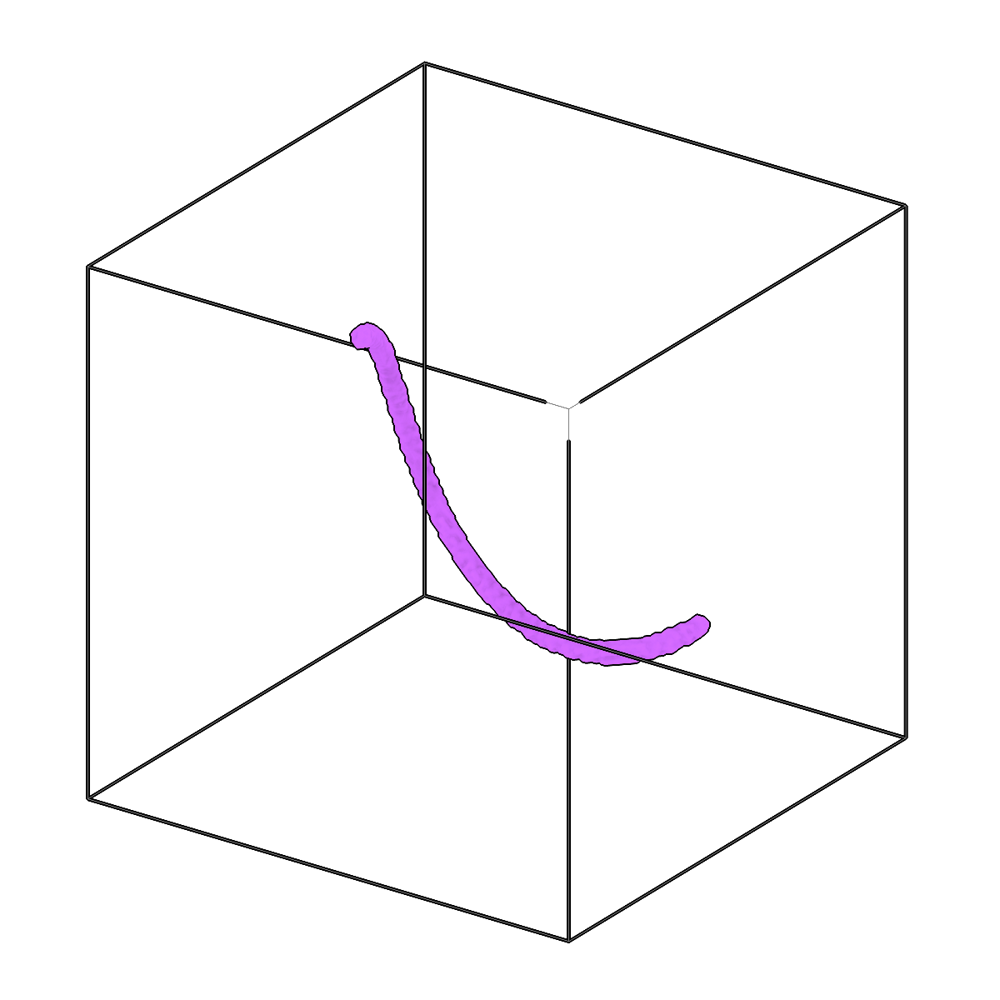
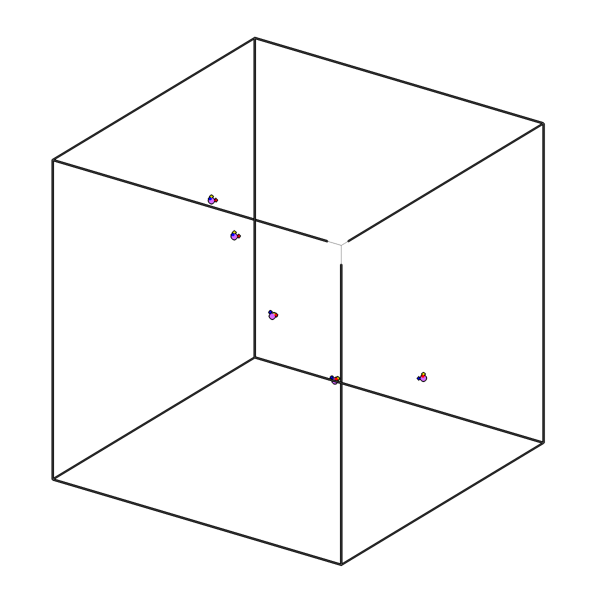

<!-- AUTOGENERATED by `make_cli_docs` (copick.cli.make_cli_docs). Do not edit by hand.
     Editorial additions go in the matching docs/cli_editorial/ partial. -->

# copick process fit-spline

<span class="source-badge source-badge--utils" title="Provided by the copick-utils plugin">utils</span>

*Fit 3D splines to skeletons and generate oriented picks.*

??? info "Plugin command — copick-utils"
    This command is provided by the **[copick-utils](https://pypi.org/project/copick-utils/)** plugin, not copick core. Install it to make this command available:

    ```bash
    pip install copick-utils
    ```

    See the [plugin system](../index.md#plugin-system) guide for details.

<div class="before-after" markdown>

<figure class="before-after__fig" markdown="span">

<figcaption>Input</figcaption>
</figure>

<p class="before-after__arrow" aria-hidden="true">→</p>

<figure class="before-after__fig" markdown="span">

<figcaption>Output</figcaption>
</figure>

</div>

<p class="before-after__caption">Fit 3D splines to skeletons and generate oriented picks.</p>

## Usage

```bash
copick process fit-spline [OPTIONS]
```

## Description

Fits a smoothing 3D spline to every filament of a skeleton (or segmentation) volume and
samples points along each spline exactly `--spacing-distance` voxels apart, producing picks.
The skeleton is split into filaments between ends and junctions, continuing straight
through junctions, so crossing or separate filaments each get their own spline. All picks go
into one pick set: grouped by filament, in order along it, with the filament's number
(1, 2, ... by length) as the pick's instance ID. With `--compute-transforms`, each pick's
+Z axis follows the spline's direction, and the rotation about it changes as little as
possible along the filament.

Where a spline turns more sharply than `--curvature-threshold` between samples, its
smoothing is increased (up to `--max-iterations` times). `--filaments` also stores the
fitted splines as copick Filaments.

For new work, `copick convert seg2fil` (tracing, with an instance segmentation and
thickness-based filters) and `copick convert fil2picks` (sampling in angstroms) separate
tracing from sampling.

## URI Format

```text
Segmentations: name:user_id/session_id@voxel_spacing
Picks: object_name:user_id/session_id
```

## Options

| Option | Type | Default | Description |
|--------|------|---------|-------------|
| `-c, --config` | path | — | Path to the configuration file. |
| `--run-names, -r` | text · multiple | — | Specific run names to process (default: all runs). Repeatable; pass -r once per run. |
| `--debug / --no-debug` | boolean flag | `False` | Enable debug logging. |

### Input Options

| Option | Type | Default | Description |
|--------|------|---------|-------------|
| `--input, -i` | COPICK_URI | **required** | Input segmentation URI (format: name:user_id/session_id@voxel_spacing). Supports glob patterns. Append ?instance=true or ?panoptic=true to read those segmentation types. |

### Tool Options

| Option | Type | Default | Description |
|--------|------|---------|-------------|
| `--spacing-distance` | float | **required** | Distance between consecutive sampled points along each spline, in voxels. |
| `--smoothing-factor` | float | — | Smoothing parameter for spline fitting (scipy's s, in voxels squared; auto if not provided). |
| `--degree` | integer | `3` | Degree of the spline (1-5). |
| `--compute-transforms / --no-compute-transforms` | boolean flag | `True` | Whether to compute orientations for picks. |
| `--curvature-threshold` | float | `0.2` | Largest sine of the turning angle between consecutive sampled points; a spline that turns more sharply is smoothed further. |
| `--max-iterations` | integer | `5` | Maximum number of smoothing increases. |
| `--label` | integer | — | Label to fit in a multilabel segmentation (default: every non-zero voxel). |
| `--workers, -w` | integer | `8` | Number of worker processes. |

### Output Options

| Option | Type | Default | Description |
|--------|------|---------|-------------|
| `--output, -o` | COPICK_URI | **required** | Output picks URI. Supports smart defaults (e.g., "ribosome", "ribosome/my-session", or "/my-session"). Full format: object_name:user_id/session_id. |
| `--filaments, -of` | COPICK_URI | — | Also store the fitted splines as copick Filaments (exact B-spline curves) under this URI. |

## Examples

```bash
# Fit splines to skeletonized components (voxel spacing from the @10.0 in -i)
copick process fit-spline -i "skeleton:skel/inst-.*@10.0" \
    -o "skeleton:spline/spline-{input_session_id}" --spacing-distance 4.4

# Process a single skeleton component
copick process fit-spline -i "skeleton:skel/skel-0@10.0" \
    -o "skeleton:spline/spline-0" --spacing-distance 2.0
```

## See also

- [`copick convert seg2fil`](../convert/seg2fil.md) — trace filaments in a segmentation (Filaments and an instance segmentation)
- [`copick convert fil2picks`](../convert/fil2picks.md) — sample picks along filaments, in angstroms
- [`copick process skeletonize`](skeletonize.md) — produce the skeleton segmentations fed to this command
