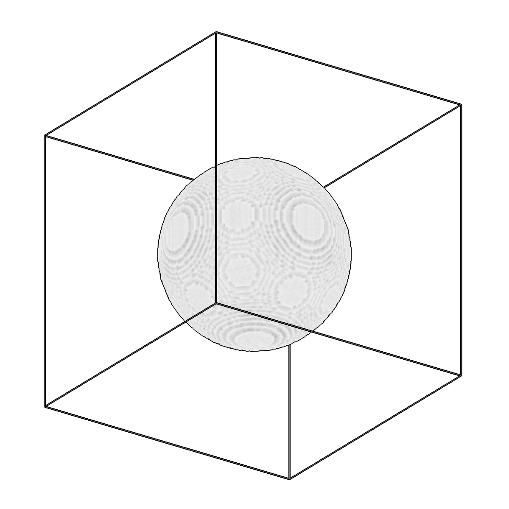
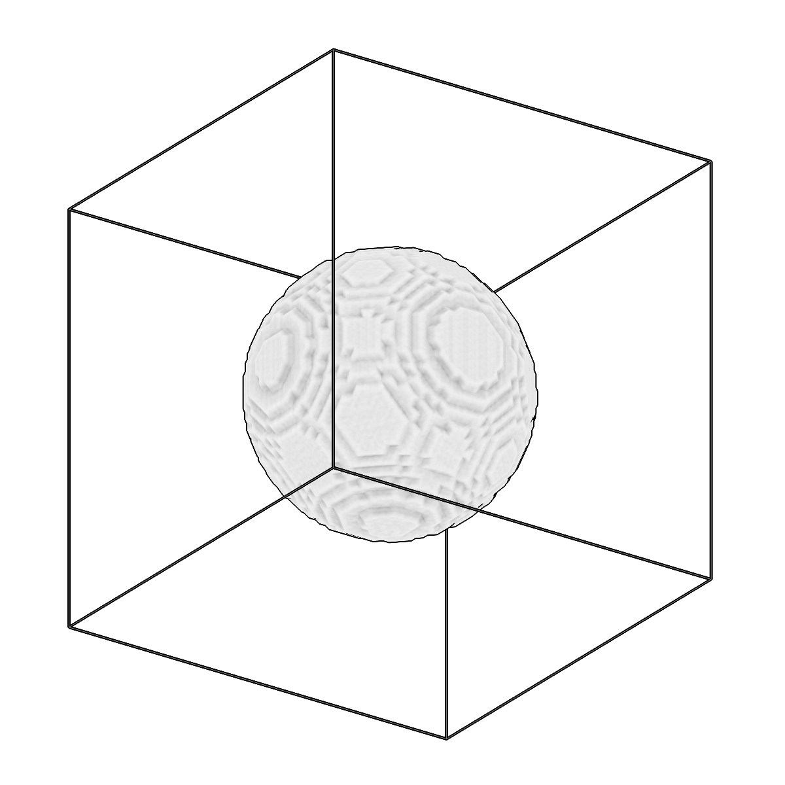

<!-- AUTOGENERATED by `make_cli_docs` (copick.cli.make_cli_docs). Do not edit by hand.
     Editorial additions go in the matching docs/cli_editorial/ partial. -->

# copick process rescale

<span class="source-badge source-badge--utils" title="Provided by the copick-utils plugin">utils</span>

*Rescale segmentations to a different voxel spacing.*

??? info "Plugin command — copick-utils"
    This command is provided by the **[copick-utils](https://pypi.org/project/copick-utils/)** plugin, not copick core. Install it to make this command available:

    ```bash
    pip install copick-utils
    ```

    See the [plugin system](../index.md#plugin-system) guide for details.

<div class="before-after" markdown>

<figure class="before-after__fig" markdown="span">

<figcaption>Input</figcaption>
</figure>

<p class="before-after__arrow" aria-hidden="true">→</p>

<figure class="before-after__fig" markdown="span">

<figcaption>Output</figcaption>
</figure>

</div>

<p class="before-after__caption">Rescale segmentations to a different voxel spacing.</p>

## Usage

```bash
copick process rescale [OPTIONS]
```

## Description

Resamples segmentation data using nearest-neighbor interpolation (default) to
preserve label integrity. Supports both upscaling (finer spacing) and downscaling
(coarser spacing). When `--tomo-type` is provided, the output shape is matched to
an existing tomogram at the target spacing for exact alignment.

## URI Format

```text
Segmentations: name:user_id/session_id@voxel_spacing
```

## Options

| Option | Type | Default | Description |
|--------|------|---------|-------------|
| `-c, --config` | path | — | Path to the configuration file. |
| `--debug / --no-debug` | boolean flag | `False` | Enable debug logging. |

### Input Options

| Option | Type | Default | Description |
|--------|------|---------|-------------|
| `--run-names, -r` | text · multiple | — | Specific run names to process (default: all runs). |
| `--input, -i` | COPICK_URI | **required** | Input segmentation URI (format: name:user_id/session_id@voxel_spacing). Supports glob patterns. |

### Tool Options

| Option | Type | Default | Description |
|--------|------|---------|-------------|
| `--target-voxel-spacing, -tvs` | float | — | Target voxel spacing in angstroms. If omitted, derived from output URI @voxel_spacing. |
| `--tomo-type, -tt` | text | — | Tomogram type to use as shape reference at target spacing (e.g. 'wbp'). When provided, output shape matches the tomogram exactly. |
| `--order` | choice (0 \| 1) | `0` | Interpolation order: 0=nearest-neighbor (labels), 1=linear (float data). |
| `--workers, -w` | integer | `8` | Number of worker processes. |

### Output Options

| Option | Type | Default | Description |
|--------|------|---------|-------------|
| `--output, -o` | COPICK_URI | **required** | Output segmentation URI. Supports smart defaults (e.g., "membrane", "membrane/my-session", or "/my-session"). Full format: object_name:user_id/session_id@voxel_spacing. |

## Examples

```bash
# Upscale: 10 angstrom -> 5 angstrom
copick process rescale -i "membrane:user1/auto@10.0" -o "membrane:rescale/0@5.0"

# Downscale: 5 angstrom -> 20 angstrom
copick process rescale -i "membrane:user1/manual@5.0" -o "membrane:rescale/0@20.0"

# Match tomogram shape exactly
copick process rescale -i "membrane:user1/auto@10.0" -o "membrane:rescale/0@5.0" --tomo-type wbp

# Explicit target spacing (when output URI uses smart defaults)
copick process rescale -i "membrane:user1/auto@10.0" -o "membrane_rescaled" --target-voxel-spacing 5.0

# Rescale specific runs
copick process rescale -i "organelle:pred/auto@10.0" -o "organelle:rescale/0@7.5" -r run1 -r run2

# Linear interpolation (for non-label float data)
copick process rescale -i "density:user1/auto@10.0" -o "density:rescale/0@5.0" --order 1
```

## See also

- `copick process expand_labels` — fill label holes/gaps that nearest-neighbor resampling can introduce
- [`copick convert mesh2seg`](../convert/mesh2seg.md) — rasterize meshes into a segmentation at a target voxel spacing
- [`copick process combine`](combine.md) — merge single-label segmentations into one multilabel volume
