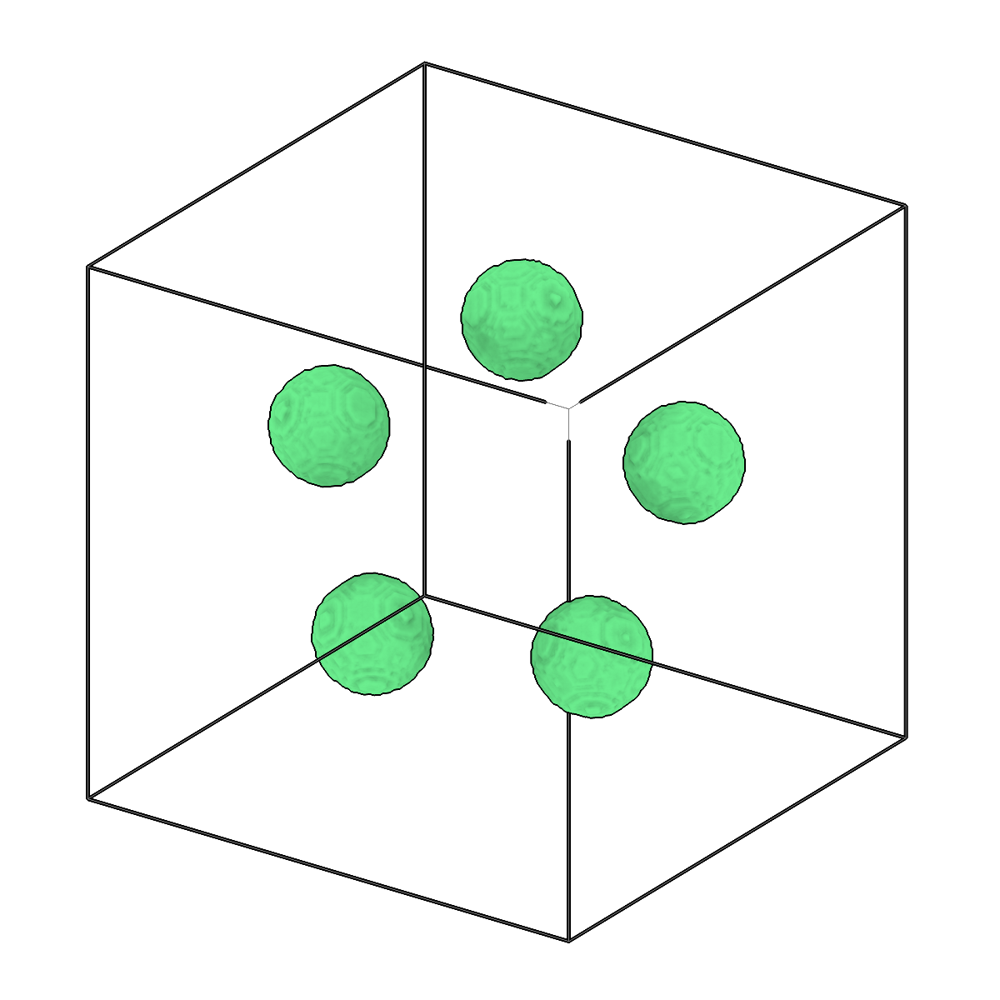
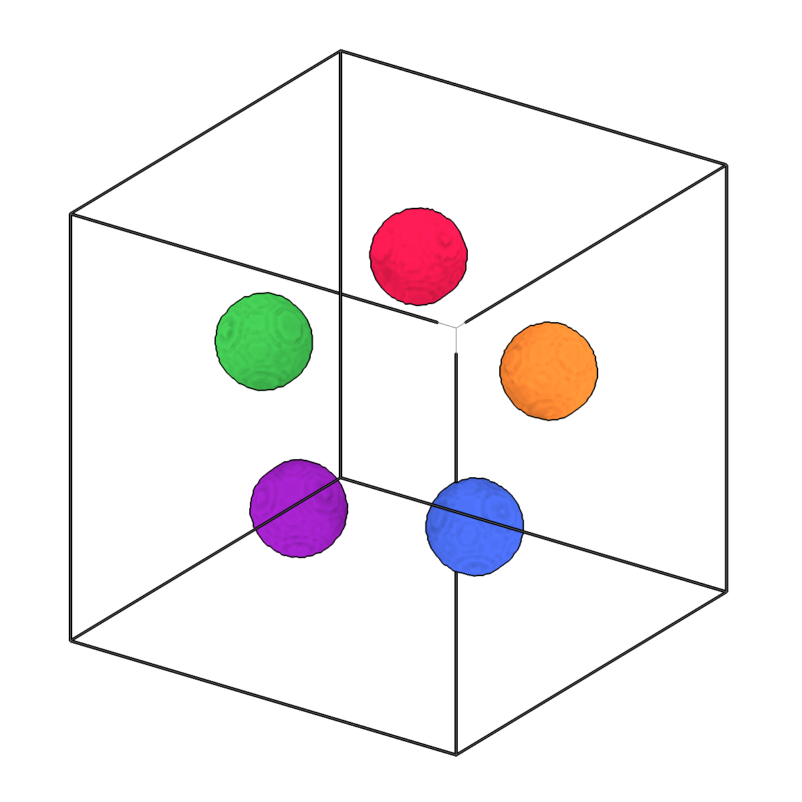

<!-- AUTOGENERATED by `make_cli_docs` (copick.cli.make_cli_docs). Do not edit by hand.
     Editorial additions go in the matching docs/cli_editorial/ partial. -->

# copick process separate-components

<span class="source-badge source-badge--utils" title="Provided by the copick-utils plugin">utils</span>

*Separate connected components in segmentations.*

??? info "Plugin command — copick-utils"
    This command is provided by the **[copick-utils](https://pypi.org/project/copick-utils/)** plugin, not copick core. Install it to make this command available:

    ```bash
    pip install copick-utils
    ```

    See the [plugin system](../index.md#plugin-system) guide for details.

<div class="before-after" markdown>

<figure class="before-after__fig" markdown="span">

<figcaption>Input</figcaption>
</figure>

<p class="before-after__arrow" aria-hidden="true">→</p>

<figure class="before-after__fig" markdown="span">

<figcaption>Output</figcaption>
</figure>

</div>

<p class="before-after__caption">Separate connected components in segmentations.</p>

## Usage

```bash
copick process separate-components [OPTIONS]
```

## Description

Connected-component analysis splits a segmentation into individual segmentations, one per
connected region. Connectivity can be `face` (6-connected), `face-edge` (18-connected), or
`all` (26-connected), and components smaller than `--min-size` (in cubic angstroms) are dropped.

For multilabel segmentations the analysis is performed on each label separately. Output
segmentations use the `{instance_id}` placeholder for auto-numbering (e.g. `inst-0`, `inst-1`).

Alternatively, write all components into one segmentation: an output URI with
`?instance=true` writes an instance segmentation of a binary input (each component is an
instance, numbered 1, 2, ... by size, largest first), and `?panoptic=true` writes a
panoptic segmentation that keeps every label of a multilabel input and numbers the
components of each label. These outputs need no `{instance_id}` placeholder.

## URI Format

```text
Segmentations: name:user_id/session_id@voxel_spacing
Instance or panoptic output: append ?instance=true or ?panoptic=true
```

## Options

| Option | Type | Default | Description |
|--------|------|---------|-------------|
| `-c, --config` | path | — | Path to the configuration file. |
| `--run-names, -r` | text · multiple | — | Specific run names to process (default: all runs). Repeatable; pass -r once per run. |
| `--debug / --no-debug` | boolean flag | `False` | Enable debug logging. |

### Input Options

| Option | Type | Default | Description |
|--------|------|---------|-------------|
| `--input, -i` | COPICK_URI | **required** | Input segmentation URI (format: name:user_id/session_id@voxel_spacing). Supports glob patterns. Append ?instance=true or ?panoptic=true to read those segmentation types. |

### Tool Options

| Option | Type | Default | Description |
|--------|------|---------|-------------|
| `--connectivity, -cn` | choice (face \| face-edge \| all) | `all` | Connectivity for connected components (face=6-connected, face-edge=18-connected, all=26-connected). |
| `--min-size` | float | — | Minimum component volume in cubic angstroms (ų) to keep (optional). |
| `--multilabel / --binary` | boolean flag | `True` | Process as multilabel segmentation (analyze each label separately). |
| `--workers, -w` | integer | `8` | Number of worker processes. |

### Output Options

| Option | Type | Default | Description |
|--------|------|---------|-------------|
| `--output, -o` | COPICK_URI | **required** | Output segmentation URI. Supports smart defaults (e.g., "membrane", "membrane/my-session", or "/my-session"). Full format: object_name:user_id/session_id@voxel_spacing. Append ?instance=true or ?panoptic=true to write those segmentation types. |

## Examples

```bash
# Separate components with smart defaults (auto user_id and session template)
copick process separate-components -i "membrane:user1/manual-001@10.0" -o "{instance_id}"

# Custom session prefix
copick process separate-components -i "membrane:user1/manual-001@10.0" \
    -o "membrane:components/inst-{instance_id}"

# Full URI specification
copick process separate-components -i "membrane:user1/manual-001@10.0" \
    -o "membrane:components/comp-{instance_id}@10.0"

# All components as one instance segmentation (IDs 1..K by size)
copick process separate-components -i "microtubule:easymode/job006@10.0" --binary \
    -o "microtubule:components/job006@10.0?instance=true"

# Components of every label of a multilabel segmentation as one panoptic segmentation
copick process separate-components -i "labels:user1/auto@10.0?multilabel=true" \
    -o "cell:components/auto@10.0?panoptic=true"
```

## See also

- [`copick process filter-components`](filter-components.md) — drop or keep components by size instead of splitting them
- [`copick process seg-stats`](seg-stats.md) — report connected-component size statistics before separating
- [`copick process split`](split.md) — split a multilabel segmentation into single-class segmentations
