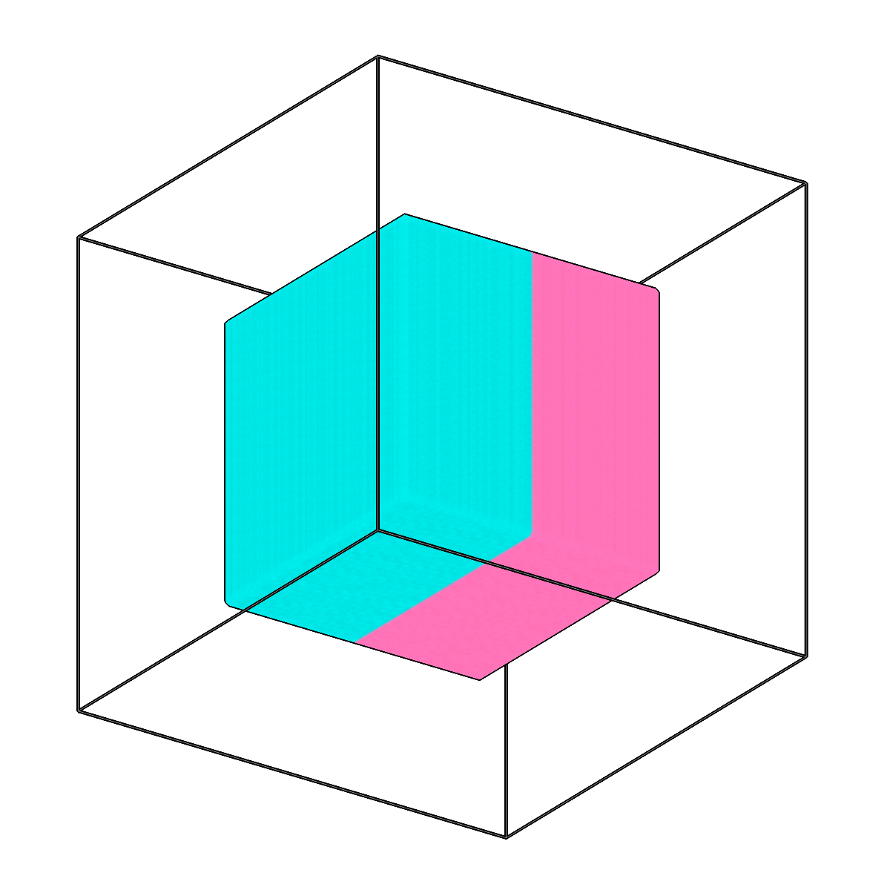
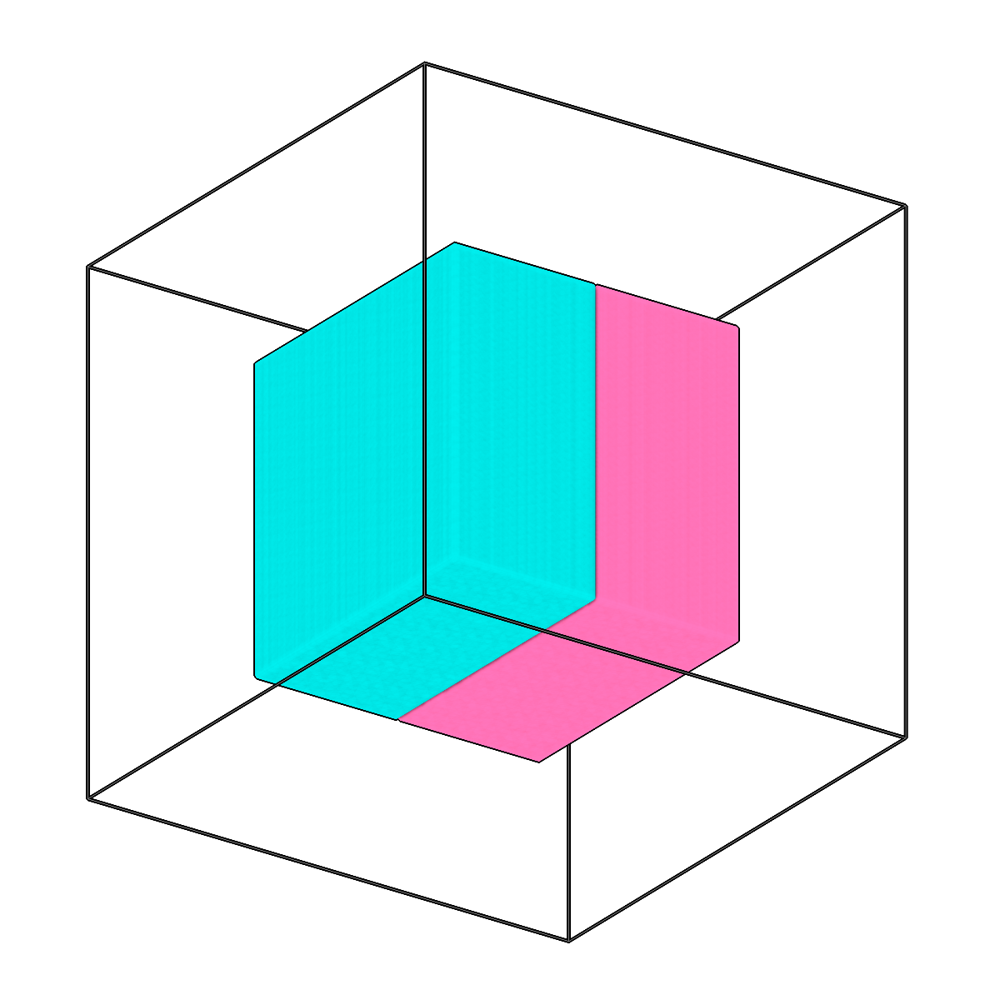

<!-- AUTOGENERATED by `make_cli_docs` (copick.cli.make_cli_docs). Do not edit by hand.
     Editorial additions go in the matching docs/cli_editorial/ partial. -->

# copick process split

<span class="source-badge source-badge--utils" title="Provided by the copick-utils plugin">utils</span>

*Split multilabel segmentations into single-class masks.*

??? info "Plugin command — copick-utils"
    This command is provided by the **[copick-utils](https://pypi.org/project/copick-utils/)** plugin, not copick core. Install it to make this command available:

    ```bash
    pip install copick-utils
    ```

    See the [plugin system](../index.md#plugin-system) guide for details.

<div class="before-after" markdown>

<figure class="before-after__fig" markdown="span">

<figcaption>Input</figcaption>
</figure>

<p class="before-after__arrow" aria-hidden="true">→</p>

<figure class="before-after__fig" markdown="span">

<figcaption>Output</figcaption>
</figure>

</div>

<p class="before-after__caption">Split multilabel segmentations into single-class masks.</p>

## Usage

```bash
copick process split [OPTIONS]
```

## Description

This command takes a multilabel segmentation and creates separate binary segmentations
for each label value. Each output segmentation is named after the corresponding
PickableObject (as defined in the copick config) and uses the same session ID as the
input.

By default the object name for each label value is resolved from the pickable-objects
config. Pass --labels with an explicit 'name:value,...' map when the segmentation's label
values do not match the config object labels; only the listed values are then split. The
input URI must name an exact segmentation (no wildcards) and include a voxel spacing.

## URI Format

```text
    Segmentations: name:user_id/session_id@voxel_spacing

Label-to-Object Mapping:

    The tool looks up each label value in the pickable_objects configuration
    and uses the object name for the output segmentation:
    - Label 1 (ribosome) → ribosome:split/session-001@10.0
    - Label 2 (membrane) → membrane:split/session-001@10.0
    - Label 3 (proteasome) → proteasome:split/session-001@10.0
```

## Options

| Option | Type | Default | Description |
|--------|------|---------|-------------|
| `-c, --config` | path | — | Path to the configuration file. |
| `--debug / --no-debug` | boolean flag | `False` | Enable debug logging. |

### Input Options

| Option | Type | Default | Description |
|--------|------|---------|-------------|
| `--run-names, -r` | text · multiple | — | Specific run names to process (default: all runs). |
| `--input, -i` | COPICK_URI | **required** | Input segmentation URI (format: name:user_id/session_id@voxel_spacing). Supports glob patterns. |

### Tool Options

| Option | Type | Default | Description |
|--------|------|---------|-------------|
| `--labels` | text | — | Explicit label map 'name:value,...' (e.g. 'sample:1,vacuum:2'). When set, outputs are named by this map and only the listed label values are split. Use when the segmentation's label values do not match the config object labels. Default: resolve names from the pickable-objects config. |
| `--workers, -w` | integer | `8` | Number of worker processes. |

### Output Options

| Option | Type | Default | Description |
|--------|------|---------|-------------|
| `--output-user-id` | text | `split` | User ID for output segmentations. |

## Examples

```bash
# Split multilabel segmentation (outputs named by pickable objects)
copick process split -i "predictions:model/run-001@10.0"

# Split with custom output user ID
copick process split -i "classes:annotator/manual@10.0" --output-user-id "per-class"

# Process specific runs only
copick process split -i "labels:curator/manual@10.0" --run-names TS_001 --run-names TS_002

# Split only specific label values with an explicit name:value map
copick process split -i "predictions:model/run-001@10.0" --labels "sample:1,vacuum:2"
```

## See also

- [`copick process combine`](combine.md) — the inverse operation (merge single-label segmentations into a multilabel volume)
- [`copick convert seg2picks`](../convert/seg2picks.md) — extract picks from each resulting single-class segmentation
