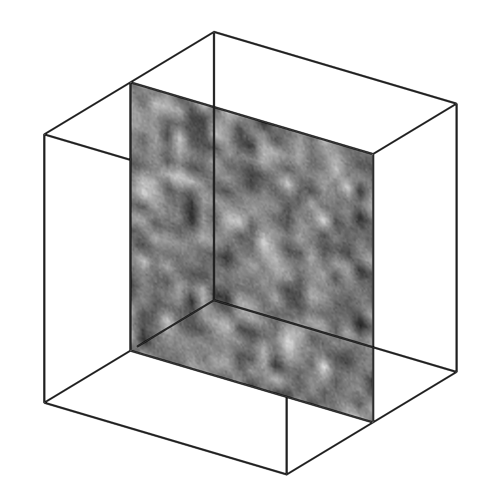
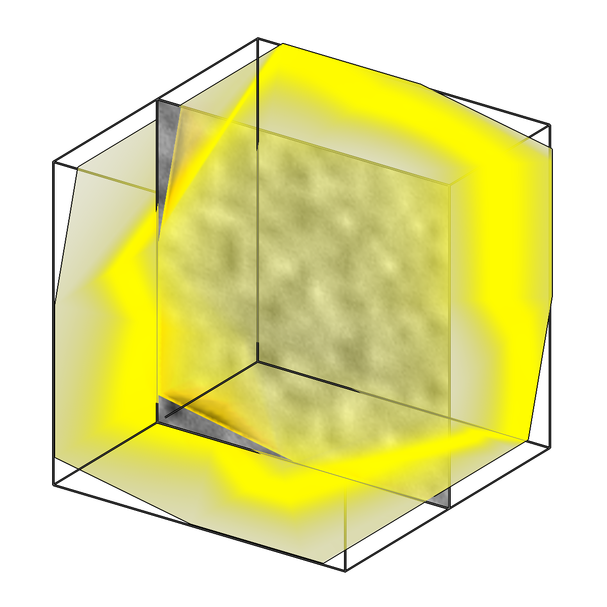

<!-- AUTOGENERATED by `make_cli_docs` (copick.cli.make_cli_docs). Do not edit by hand.
     Editorial additions go in the matching docs/cli_editorial/ partial. -->

# copick process validbox

<span class="source-badge source-badge--utils" title="Provided by the copick-utils plugin">utils</span>

*Generate valid area box meshes for tomographic reconstructions.*

??? info "Plugin command — copick-utils"
    This command is provided by the **[copick-utils](https://pypi.org/project/copick-utils/)** plugin, not copick core. Install it to make this command available:

    ```bash
    pip install copick-utils
    ```

    See the [plugin system](../index.md#plugin-system) guide for details.

<div class="before-after" markdown>

<figure class="before-after__fig" markdown="span">

<figcaption>Input</figcaption>
</figure>

<p class="before-after__arrow" aria-hidden="true">→</p>

<figure class="before-after__fig" markdown="span">

<figcaption>Output</figcaption>
</figure>

</div>

<p class="before-after__caption">Generate valid area box meshes for tomographic reconstructions.</p>

## Usage

```bash
copick process validbox [OPTIONS]
```

## Description

Creates box meshes representing the valid imaging area of tomographic
reconstructions. The box dimensions are derived from the tomogram voxel
dimensions and can be optionally rotated around the Z-axis, which is useful
when the specimen was imaged at an in-plane tilt.

The resulting slab mesh can be passed downstream to `copick convert mesh2caps`
(to keep only the top/bottom caps) and to `copick logical clippicks` (to
select particles inside the valid imaging volume).

## URI Format

```text
Meshes: object_name:user_id/session_id
Tomograms: tomo_type@voxel_spacing
```

## Options

| Option | Type | Default | Description |
|--------|------|---------|-------------|
| `-c, --config` | path | — | Path to the configuration file. |
| `--debug / --no-debug` | boolean flag | `False` | Enable debug logging. |

### Input Options

| Option | Type | Default | Description |
|--------|------|---------|-------------|
| `--run-names, -r` | text · multiple | — | Specific run names to process (default: all runs). |
| `--tomogram, -t` | COPICK_URI | **required** | Tomogram URI (format: tomo_type@voxel_spacing). Example: 'wbp@10.0' |

### Tool Options

| Option | Type | Default | Description |
|--------|------|---------|-------------|
| `--angle` | float | `0.0` | Rotation angle around Z-axis in degrees. |
| `--workers` | integer | `8` | Number of worker processes. |

### Output Options

| Option | Type | Default | Description |
|--------|------|---------|-------------|
| `--output, -o` | COPICK_URI | **required** | Output mesh URI. Supports smart defaults (e.g., "membrane", "membrane/my-session", or "/my-session"). Full format: object_name:user_id/session_id. |

## Examples

```bash
# Generate validbox meshes for all runs
copick process validbox --tomogram wbp@10.0 -o "validbox"

# Generate with rotation and a specific tomogram type
copick process validbox -t imod@10.0 --angle 45.0 -o "validbox/rotated"
```

## See also

- [`copick convert mesh2caps`](../convert/mesh2caps.md) — extract the top/bottom caps of the validbox slab
- [`copick logical clippicks`](../logical/clippicks.md) — select picks inside the valid imaging volume
