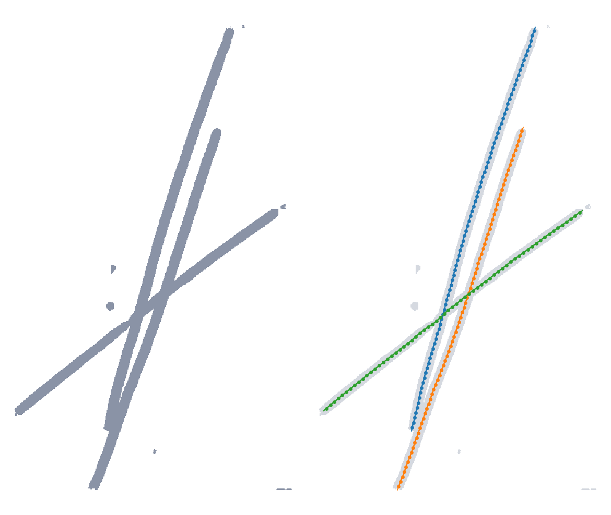

## Filament workflow

Filaments are traced once and sampled as often as needed. Three commands share one set of IDs:

- `copick convert seg2fil` traces a segmentation into a **Filaments** entry: one editable Catmull-Rom curve per filament,
  through its fitted spline and within half a voxel of it (`--curve bspline` stores the fit itself), and the
  centreline copick evaluates from it. With `--instances` it also writes the
  instance segmentation of the traced filaments, whose voxel values are the filament IDs.
- `copick convert fil2picks --spacing` samples picks along each curve, ordered along the filament and grouped by its
  ID, with each pick's +Z along the filament. Sampling at another spacing needs no new trace.
- `copick convert fil2seg` paints a tube around each filament into an instance segmentation, for filaments traced or
  edited by hand.

Picks of an object declared a filament carry RELION's filament columns (`rlnHelicalTubeID`, track length, priors)
through `copick export picks --filament-columns`.

*Microtubules in a tomogram of CZ cryoET Data Portal dataset 10521: the segmentation (left), and the filaments traced
from it with picks every 82 Å, coloured by ID (right). Three microtubules cross near one point; each keeps its own ID.*

## Choosing thresholds

- Thin slivers of segmentation noise are removed by `--min-radius`, which defaults to a third of the object's radius.
  `copick process seg-stats --skeleton` reports each component's skeleton length and label radius, to check where a
  dataset's filaments and its noise fall.
- A label that covers only a tube's wall is filled before tracing (`--fill-lumen`, the object's radius by default), so
  it traces as one filament rather than as fragments of the wall.
- Short pieces that pass every other filter can be removed with `--min-length`, which has no default.
