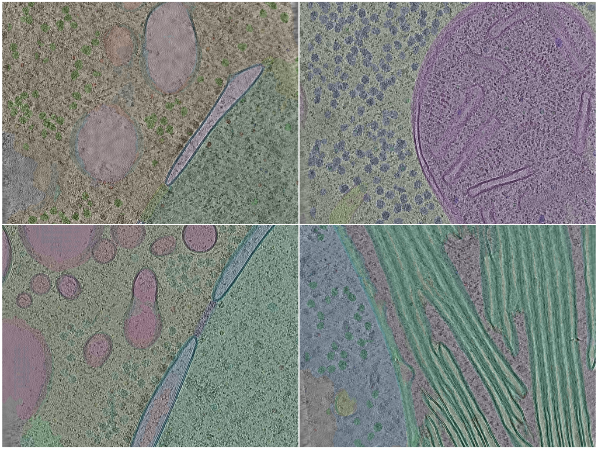
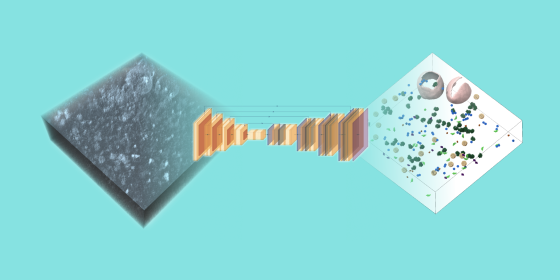

---
hide:
  - navigation
  - toc
---

# Tutorials

*Step-by-step guides for common copick curation and analysis tasks. Looking for installation and
project setup instead? Head to [Get Started](../get-started/index.md).*

[{ .cmd-card__thumb }](tutorials/data_portal.md)

**[CZ cryoET Data Portal](tutorials/data_portal.md)**

Access data from the CZ cryoET Data Portal and create new annotations for portal tomograms.

[{ .cmd-card__thumb }](tutorials/kaggle_czii_sync.md)

**[Syncing the CZII Kaggle Dataset](tutorials/kaggle_czii_sync.md)**

Synchronize the CZII Kaggle challenge dataset into a copick project.

[{ .cmd-card__thumb }](tutorials/hpc.md)

**[Copick and HPC](tutorials/hpc.md)**

Run copick workflows at scale on HPC clusters.

[{ .cmd-card__thumb }](tutorials/chimerax.md)

**[ChimeraX-copick](tutorials/chimerax.md)**

Visualize and curate data from a copick project in UCSF ChimeraX.

[{ .cmd-card__thumb }](tutorials/album.md)

**[Copick and Album](tutorials/album.md)**

Create album-based solutions to process copick data.

[{ .cmd-card__thumb }{ .cmd-card__thumb }](tutorials/sample_boundaries.md)

**[Detecting Sample Boundaries](tutorials/sample_boundaries.md)**

An end-to-end tutorial on training a neural network to predict sample boundaries.

[{ .cmd-card__thumb }](tutorials/sample_boundaries_filtering.md)

**[Filtering by Sample Boundaries](tutorials/sample_boundaries_filtering.md)**

Filter particle picks by their position relative to the detected sample boundaries.

[{ .cmd-card__thumb }](tutorials/membrain.md)

**[Copick and membrain-seg](tutorials/membrain.md)**

Run the membrain-seg segmentation pipeline on a copick project.

[{ .cmd-card__thumb }](tutorials/copick_mcp.md)

**[Copick-MCP](tutorials/copick_mcp.md)**

Drive copick from an MCP-enabled assistant.

[{ .cmd-card__thumb }](tutorials/croissant.md)

**[mlcroissant](tutorials/croissant.md)**

Work with copick projects described by an ML Commons Croissant manifest.

## Snippets

**[Snippets](snippets.md)**

Short, copy-pasteable Python examples for common copick API operations — reading runs, objects,
tomograms, picks, segmentations, and meshes.

