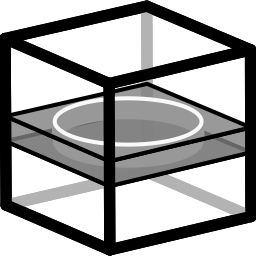
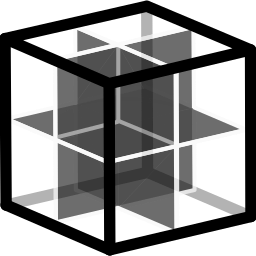
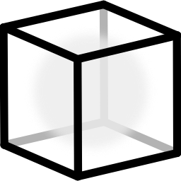
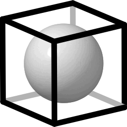
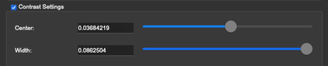

# ChimeraX-Copick Plugin Tutorial

!!! warning "Mouse Required"
    We strongly recommend using a mouse for this workflow, as **right-clicking** is essential for placing and manipulating picks.

---

## Installation

### 1. Download ChimeraX

Download and install ChimeraX from the [official website](https://www.cgl.ucsf.edu/chimerax/){ target="_blank" }

### 2. Install the Copick Plugin

1. Open ChimeraX
2. Go to [**Tools > More Tools...**](javascript:void(0); "") to open the toolshed
3. Search for `copick` in the search bar
4. Download and install the copick plugin by clicking on **Install**

<figure markdown="span">
  { width="100%" }
  <figcaption>copick on the ChimeraX toolshed.</figcaption>
</figure>

---

## Setup Remote Data Access

!!! info "Optional Step"
    Skip this section if your data is already available on your local machine.

=== "SSH Tunnel Configuration"

    If your data is stored on a remote server (available via ssh), you'll need to establish an SSH tunnel:

    ```bash
    ssh -L 2222:localhost:22 username@your-remote-server
    ```

    This command creates a local port forwarding from port 2222 to the remote server's port 22, allowing secure access to remote data.

=== "AWS S3 Configuration"

    If your data is stored in an S3 bucket, ensure you have the necessary [credentials configured](https://docs.aws.amazon.com/cli/latest/topic/s3-config.html)
    using the AWS CLI. S3 credentials need to be set in the environment where ChimeraX is launched, or specified in the
    [copick configuration file](https://copick.github.io/copick/examples/setup/aws_s3/).

=== "cryoET data portal"

    If you are using a copick configuration based on the cryoET data portal no additional setup is required. The plugin
    will automatically connect to the portal and retrieve available datasets.


---

## 1. Opening a Copick Project

To load a copick project into ChimeraX:

1. Open ChimeraX
2. In the command line at the bottom, enter:
   ```
   copick start /path/to/your/config.json
   ```

    ??? example "Example Config - Used in this tutorial."
        ```json
        {
          "name": "CZ cryoET Data Portal Dataset",
          "description": "This copick project contains data from datasets (10426,).",
          "version": "1.18.0",
          "pickable_objects": [
          ],
          "user_id": null,
          "session_id": null,
          "config_type": "cryoet_data_portal",
          "overlay_root": "local:///tmp/project/",
          "dataset_ids": [
              10426
          ],
          "overlay_fs_args": {
              "auto_mkdir": true
          }
        }
        ```

        Results will be stored in `/tmp/project/` Refer to the [Examples](examples/overview.md) for more information on
        creating config files.

3. Press ++enter++

The plugin will launch and display the **Annotation Panel** on the left side of the window along with a **Run Gallery**
showing thumbnail previews of all available tomograms.

<figure markdown="span">
  { width="100%" }
  <figcaption>Run Gallery showing thumbnail previews of all available tomograms. Each thumbnail displays a central
              slice preview with the run name.</figcaption>
</figure>

### Understanding the Main Interface

The **Annotation Panel** contains three main tabs (one for each annotation type). The **Tomogram Panel** contains a
hierarchical view of the image data (Run -> VoxelSpacing -> Tomogram).

<div class="side-by-side" markdown>

<div markdown>
**Annotation Panel**
<div markdown>

</div>

<div markdown>
|                   Icon                    |   Button   | Description                       |
|:-----------------------------------------:|:----------:|-----------------------------------|
| <span style="font-size: 2.5em;">📄</span> |  **New**   | New annotation set                |
| <span style="font-size: 2.5em;">📋</span> |  **Copy**  | Copy annotation set               |
| <span style="font-size: 2.5em;">❌</span>  | **Delete** | Delete annotation                 |
| <span style="font-size: 2.5em;">🔍</span> | **Search** | Search/filter annotations by name |

</div>
</div>

<div markdown>
**Tomogram Panel**
<div markdown>

</div>
<div markdown>

|                    Icon                     | Button  | Description                   |
|:-------------------------------------------:|:-------:|-------------------------------|
|  <span style="font-size: 2.5em;">🧊</span>  | **3D View** | Switch to 3D tomogram view    |
|  <span style="font-size: 2.5em;">ℹ️</span>  |  **Info**   | Show detailed run information |
|  <span style="font-size: 2.5em;">📸</span>  | **Gallery** | Return to gallery view        |
|  <span style="font-size: 2.5em;">🔍</span>  | **Search**  | Search/filter runs by name    |

</div>
</div>
</div>

---

## 2. Adding an Object Type

Before you can pick particles of a specific type, you need to define **Pickable Object Types** in your configuration.

### Opening the Edit Object Types Dialog

In the Copick Annotation Panel, click the [✏️ Edit Object Types](javascript:void(0); "") button (pencil icon) at the top.

### The Edit Object Types Dialog

The dialog has two main sections: A table showing all currently defined pickable objects and a configuration form
for new objects.

<figure markdown="span">
  { width="100%" }
  <figcaption>Empty "Edit Objects" dialog with sections highlighted.</figcaption>
</figure>

#### Table Management Buttons

<div class="center-table" markdown>

| Icon |     Button      | Action                     |
|:----:|:---------------:|----------------------------|
|  ✏️  |  **Edit Selected**  | Modify the selected object |
|  ❌   | **Delete Selected** | Remove the selected object |
|  📄  |     **Add New**     | Create a new object type   |

</div>

### Creating a New Object Type

1. Click the [📄 Add New](javascript:void(0); "") button

2. Fill in the **Object Configuration** form:

=== "Basic Properties (Required)"

    <div class="center-table" markdown>

    | Field | Description | Example
    |-------|-------------|------|
    | Name| Unique identifier (e.g., "ribosome", "atp-synthase") | `cytosolic-ribosome |
    | Is Particle | :material-checkbox-marked: for point picks, :material-checkbox-blank-outline: for segmentation masks |  :material-checkbox-marked: |
    | Label | Unique numeric identifier (auto-increments) | 1 |
    | Color | Click the color box to choose visualization color | #155728 |

    </div>

=== "Optional Properties"

    <div class="center-table" markdown>

    | Field | Description | Example |
    |-------|-------------|------|
    | **EMDB ID** | Link to EMDB entry (e.g., EMD-1234) | N/A |
    | **PDB ID** | Link to PDB structure (e.g., 1ABC) | N/A |
    | **Identifier** | GO term or UniProt ID | GO:0022626 |
    | **Map Threshold** | Isosurface threshold for visualization | N/A |
    | **Radius (Å)** | Particle display radius in Angstroms | 150 |

    </div>

<figure markdown="span">
  { width="100%" }
  <figcaption>Edit Objects Dialog form with metadata fields filled in.</figcaption>
</figure>

3. Click the [✅ Save Object](javascript:void(0); "") button to add the new object type

4. The status will show a success message

5. Click [**Save & Close**](javascript:void(0); "") to apply changes to your configuration

<figure markdown="span">
  { width="100%" }
  <figcaption>Edit Objects Dialog with a new object added.</figcaption>
</figure>

!!! success "Changes Saved"
    Changes to object types are saved to your configuration file and persist across sessions.

---

## 3. Opening a Tomogram

=== "From the Gallery View"

    1. In the **Run Gallery**, browse available tomograms as thumbnails
    2. Click on any thumbnail to select that tomogram/run
    3. The tomogram will load into the 3D viewer

=== "From the Tree View"

    1. Expand a **Run** in the tree view by clicking the arrow :material-chevron-right:
    2. Expand a **Voxel Spacing** (e.g., "10.0")
    3. **Double-click** on a tomogram type (e.g., "wbp" or "denoised")


### The 3D Visualization Interface

Once a tomogram is loaded, ChimeraX displays:

<figure markdown="span">
  { width="100%" }
  <figcaption>ChimeraX picking interface: Copick Control Panel (left), tomogram visualization (center), toolbar (top),
              and navigation panels (right).</figcaption>
</figure>

### Visualization Modes

Use keyboard shortcuts to switch display modes:

<div class="center-table" markdown>

|                                     Icon                                     |     Shortcut      | Mode             | Description                      |
|:----------------------------------------------------------------------------:|:-----------------:|------------------|----------------------------------|
|        { width="30" }        |    ++q+q++    |    Tilted Slab    | Single plane view (default)      |
| { width="30" } |    ++e+e++    |    Orthoplanes    | XY, XZ, YZ planes simultaneously |
|    { width="30" }    |    ++e+e++    | Volume Rendering  | Density-based olume rendering    |
|  { width="30" }   |    ++e+e++    |    Isosurface     | Threshold and compute isosurface |
|      { width="30" }      |    ++x+x++    |      XY View      | View from Z axis                 |
|      { width="30" }      |    ++y+y++    |      YZ View      | View from X axis                 |
|      { width="30" }      |    ++z+z++    |      XZ View      | View from Y axis                 |

</div>

### Adjusting Contrast

Use the [Contrast](javascript:void(0); "") panel (right side) to adjust visualization:

- **Center**: Midpoint of the grayscale range
- **Width**: Contrast range

!!! tip "Invert Contrast"
    Press ++period+period++ (two periods) to quickly invert contrast for better particle visibility.

---

## 4. Creating a New Particle List

A **Particle List** (Pick Set) is a collection of particle locations for a specific object type.

### Steps to Create a New Pick Set

1. Ensure you have a tomogram open

2. In the **Picks** tab of the Copick Annotation Panel, click the
   [📄 New](javascript:void(0); "") button
   (document icon) in the bottom-right corner

3. The **Create New Pick** dialog appears:

<div class="side-by-side" markdown>

<div markdown>

</div>

<div markdown>
| Field | Description | Default |
|-------|-------------|---------|
| **Object** | Select the particle type to pick | First in list |
| **User ID** | Your identifier | From config or "ArtiaX" |
| **Session ID** | Unique session identifier | "manual-1", "manual-2", etc. |

</div>
</div>


4. Select your desired **Object** from the dropdown (objects are color-coded)

5. Optionally modify the **User ID** and **Session ID**

6. Click **Create**

### What Happens Next

After creating the pick set:

- [x] A new entry appears in the **Picks** table
- [x] The mouse mode automatically switches to **"mark plane"** for picking
- [x] You can now start placing particles!

<div class="side-by-side" markdown>
<div markdown>

</div>

<div markdown>
The Picks table displays:

| Column | Description |
|--------|-------------|
| **User/Tool** | Who created the picks |
| **Object** | Particle type (color-coded) |
| **Session** | Session identifier |
</div>
</div>


!!! info
    Apart from the picks we just created for manual picking you can now also see two (read-only) sets of ribosome
    coordinates from the cryoET data portal! Objects are found/matched via the Gene Ontology identifier.

---

## 5. Picking Particles

### Placing Particles

With a pick set selected and mouse mode set to "mark plane":

1. **Navigate** to the region of interest using:
    - ++shift++ + Mouse wheel to scroll through Z-planes
    - ++f+f++ shortcut for "move planes" mode (need to switch back to "mark plane" after use!)

2. **Right-click** on the tomogram where you see a particle

3. The particle marker appears at the clicked location

<figure markdown="span">
  { width="100%" }
  <figcaption>A tomogram with selected particles. </figcaption>
</figure>

### Mouse Modes for Picking

<div class="center-table" markdown>

| Shortcut | Mode | Description |
|:--------:|------|-------------|
| ++a+p++ | Mark Plane | **Add** particles on current plane (default for new picks) |
| ++d+p++ | Delete Picked | **Remove** particle under cursor |
| ++s+s++ | Select | **Select** particles for batch operations |

</div>

!!! info
    The active mouse mode is always displayed at the top of the canvas!

### Navigating Between Particles

Use the [Stepper Widget](javascript:void(0); "") below the Picks table:

<div class="side-by-side" markdown>
<div markdown>
| Control | Action |
|:-------:|--------|
| `<<` | Jump to previous particle |
| `>>` | Jump to next particle |
| Index | Shows current particle number |
</div>

<div markdown>
**Keyboard shortcuts:**

- ++a+a++ - Previous particle
- ++d+d++ - Next particle
</div>
</div>

### Editing Particles

=== "Moving Particles"

    1. Press ++s+s++ or select "Select" mode
    2. Click on a particle to select it
    3. Use toolbar buttons:
        - [Translate Selected Particles](javascript:void(0); "")
        - [Rotate Selected Particles](javascript:void(0); "")

=== "Deleting Single Particle"

    - Press ++minus+minus++ to remove the currently active particle
    - Or press ++d+p++ for "delete picked" mode, then right-click on particles

=== "Deleting Multiple Particles"

    1. Press ++s+s++ for select mode
    2. Click particles to select them (or ++s+a++ to select all)
    3. Press ++d+s++ to delete selected particles

### Controlling Particle Display

<div class="center-table" markdown>

| Shortcut | Effect |
|:--------:|--------|
| ++w+w++ | Toggle particle list visibility (show/hide all) |
| ++0+0++ | Set 0% transparency (fully opaque) |
| ++5+5++ | Set 50% transparency |
| ++8+8++ | Set 80% transparency |

</div>

---

## Saving Your Work

!!! success "Automatic Saving"
    **Picks are automatically saved** when you:

    - Switch to a different tomogram
    - Close the Copick tool
    - Exit ChimeraX

The picks are stored in the overlay directory specified in your copick configuration.

---

## Quick Reference: Keyboard Shortcuts

!!! tip "Show All Shortcuts"
    Press ++question++ to display all shortcuts in the ChimeraX log window.

### Particles

<div class="center-table" markdown>

| Shortcut | Action |
|:--------:|--------|
| ++w+w++ | Toggle particle display |
| ++a+a++ | Previous particle |
| ++d+d++ | Next particle |
| ++s+a++ | Select all particles |
| ++minus+minus++ | Remove active particle |

</div>

### Picking

<div class="center-table" markdown>

| Shortcut | Action |
|:--------:|--------|
| ++a+p++ | Add on plane mode |
| ++d+p++ | Delete picked mode |
| ++s+s++ | Select mode |
| ++d+s++ | Delete selected particles |

</div>

### Visualization

<div class="center-table" markdown>

| Shortcut | Action |
|:--------:|--------|
| ++q+q++ | Single plane (slab) |
| ++e+e++ | Orthoplanes |
| ++x+x++ | XY view |
| ++y+y++ | YZ view |
| ++z+z++ | XZ view |
| ++c+c++ | Toggle clipping |
| ++f+f++ | Move planes mode |
| ++r+r++ | Rotate slab mode |
| ++period+period++ | Invert contrast |

</div>

### Transparency

<div class="center-table" markdown>

| Shortcut | Action |
|:--------:|--------|
| ++0+0++ | 0% transparency (opaque) |
| ++5+5++ | 50% transparency |
| ++8+8++ | 80% transparency |

</div>

### Info

<div class="center-table" markdown>

| Shortcut | Action |
|:--------:|--------|
| ++i+l++ | Toggle info label |
| ++question++ | Show all shortcuts |

</div>

---

## Troubleshooting

??? question "Picks aren't appearing"
    - Ensure a pick set is selected in the Picks table
    - Check that mouse mode is set to "mark plane" (++a+p++)
    - Verify you're **right-clicking**, not left-clicking

??? question "Can't see particles"
    - Press ++w+w++ to toggle visibility
    - Adjust transparency with ++0+0++, ++5+5++, or ++8+8++

??? question "Keyboard shortcuts not working"
    Run `cks` in the ChimeraX command line to enable Copick keyboard shortcuts:
    ```
    cks
    ```

??? question "Tomogram not loading"
    - Check that your config file path is correct
    - Verify the data files exist at the paths specified in the config
    - For remote data, ensure your SSH tunnel is active

---
