## Tracing filaments in ChimeraX

<figure markdown="span">
  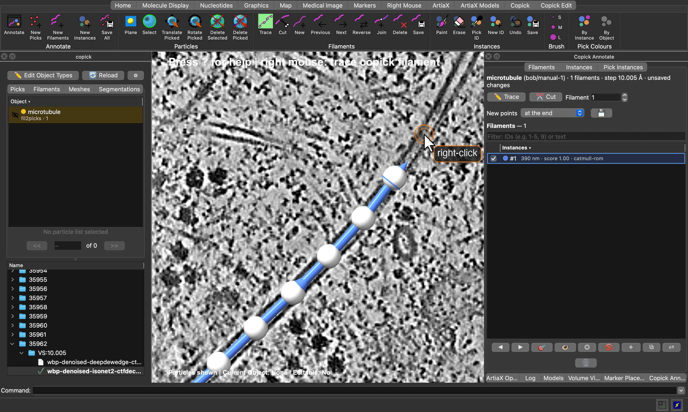{ width="100%" }
  <figcaption>Tracing a microtubule in ChimeraX-copick: each right-click on the tomogram plane adds a control point,
and the tube through them is the filament's centreline. Shown on
<a href="https://cryoetdataportal.czscience.com/runs/35962">run 35962</a> of
<a href="https://cryoetdataportal.czscience.com/datasets/10521">dataset 10521</a>.</figcaption>
</figure>

Filaments such as microtubules or actin are annotated by their centreline: an ordered curve through the middle of the
filament, one per filament, each with its own ID. ChimeraX-copick traces them directly on the tomogram: you click
control points along a filament and copick draws a smooth curve through them. The same tools cut, join, reverse and
delete filaments, which makes them just as useful for curating automatic traces, for example those of
[`copick convert seg2fil`](microtubule_tracing.md).

This tutorial uses the microtubule project from
[Tracing microtubules with easymode and copick-utils](microtubule_tracing.md), but any copick project with a tomogram
works. It assumes you know how to open a project and a tomogram in ChimeraX-copick; if not, start with the
[ChimeraX-copick tutorial](chimerax.md).

!!! warning "Mouse Required"
    Control points are placed with the **right mouse button**. A two-button mouse is strongly recommended.

### Step 0: Prerequisites

Filament tracing needs ChimeraX-copick 1.15 or later, which brings copick ≥ 1.28. Install or update it from the
ChimeraX command line:

```
toolshed install copick
```

### Step 1: Declare a filament object

Only objects declared as **filaments** can be traced. A filament object is a particle object with a filament
specification: its radius is the tube radius, and its polarity says whether the filament has a direction. If your
project does not have one yet, click **✏️ Edit Object Types** in the copick panel, select the object (or **Add New**),
tick **Is Particle** and **Is Filament**, and set the radius and polarity under **Filament Properties**:

<figure markdown="span">
  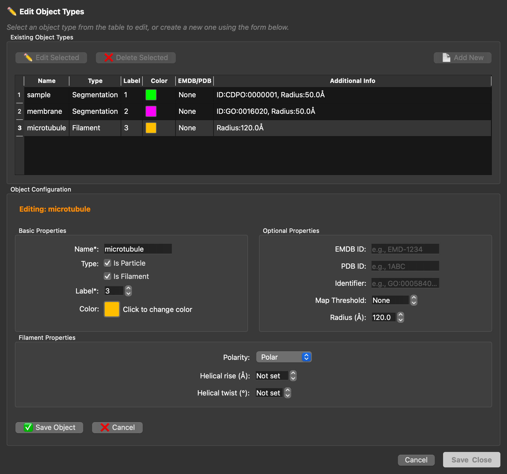{ width="600" }
  <figcaption>The <code>microtubule</code> object declared as a polar filament with a tube radius of 120 Å.</figcaption>
</figure>

From the command line, the same object is created with:

```bash
copick add object -c config.json \
  --name microtubule --object-type filament --radius 120 --polar
```

### Step 2: Open a tomogram and the Copick Edit toolbar

Start copick with `copick start config.json` and open a tomogram, for example run `35962`. All filament tools live on
the **Copick Edit** tab of the toolbar:

<figure markdown="span">
  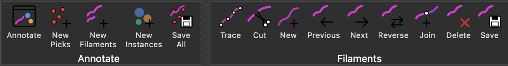{ width="700" }
  <figcaption>The <b>Annotate</b> and <b>Filaments</b> groups of the Copick Edit tab.</figcaption>
</figure>

<div class="center-table" markdown>

| Button | Action |
|---|---|
| **New Filaments** | Start a new set of traced filaments |
| **Trace** | Trace mode: right-click the tomogram plane to add control points, drag them to move, Shift + right-click to remove |
| **Cut** | Cut mode: right-click a filament to split it in two there |
| **New** | Start a new filament in the active set |
| **Previous** / **Next** | Step through the filaments |
| **Reverse** | Reverse the active filament |
| **Join** | Join the selected filaments end to end |
| **Delete** | Delete the active filament |
| **Save** | Save the active filament set |
| **Annotate** | Show or hide the Copick Annotate window |

</div>

### Step 3: Start a new filament set

Click **New Filaments** (or 📄 in the **Filaments** tab of the copick panel). The dialog lists only filament objects;
choose a user and a session for the new set:

<figure markdown="span">
  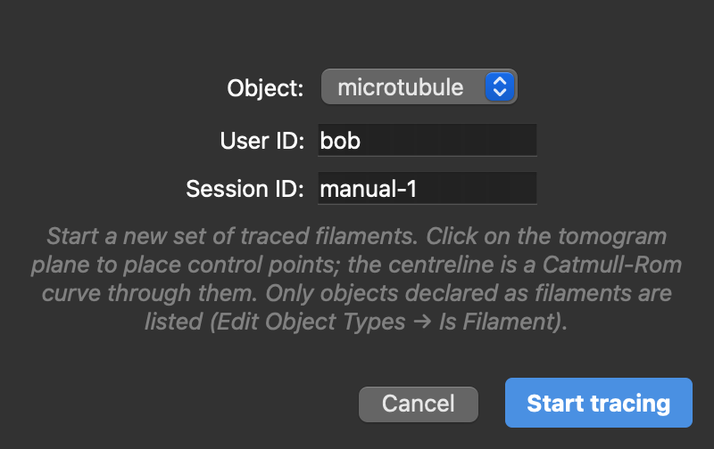{ width="400" }
  <figcaption>Starting the set <code>microtubule:bob/manual-1</code>.</figcaption>
</figure>

**Start tracing** creates the set, switches the right mouse button to trace mode and opens the **Copick Annotate**
window next to the ArtiaX options. The label at the top of the view always shows what the right mouse button does.

### Step 4: Trace

Find a filament on the tomogram plane and **right-click** along it to place control points; the centreline is a
smooth (Catmull-Rom) curve through them. Move through the tomogram with ++shift++ + mouse wheel to follow a filament
that leaves the plane: new points are placed on whatever plane is shown, including orthoplanes and tilted slabs.

- **Move a point:** right-click a control point and drag it. The whole drag is one step to undo.
- **Remove a point:** ++shift++ + right-click it.
- **Where new points go:** the **New points** menu in the Copick Annotate window adds them *at the end* (default),
  *at the start*, or *between nearest*, which inserts a point into the closest segment, for example to refine a curve.
- **Start the next filament:** **New** in the toolbar, ＋ in the Annotate window, or ++n+f++.

While you trace, the control points of the active filament are white, and those of the other filaments take their
filament's colour. Arrowheads on each tube show the filament's direction, from its first to its last point. For a
polar filament such as a microtubule, use **Reverse** (++r+v++) if it points the wrong way.

!!! tip "Undo"
    Every edit is one step on ChimeraX's undo stack: adding, moving and removing points, new filaments, cuts, joins,
    reversals and deletions. Undo with ++cmd+z++ (macOS) or ++ctrl+z++ and redo with the platform's redo key
    (++shift+cmd+z++ on macOS), or use the **Edit** menu or the `undo` and `redo` commands.

### Step 5: Join, cut and reverse

**Join** connects filaments end to end, for example two pieces of one microtubule that you traced separately or that
a segmentation broke apart. Select the filaments, either as rows in the Annotate window (++ctrl++ / ++shift++ +
click) or by ++ctrl++ + clicking their tubes in the view (++shift++ + ++ctrl++ + click adds to the selection); the
two stay in sync. Then click ⧉ in the Annotate window, **Join** in the toolbar, or press ++j+f++. Copick connects the
nearest ends, reversing a piece if needed, and the joined filament keeps the ID and direction of the current one.

<figure markdown="span">
  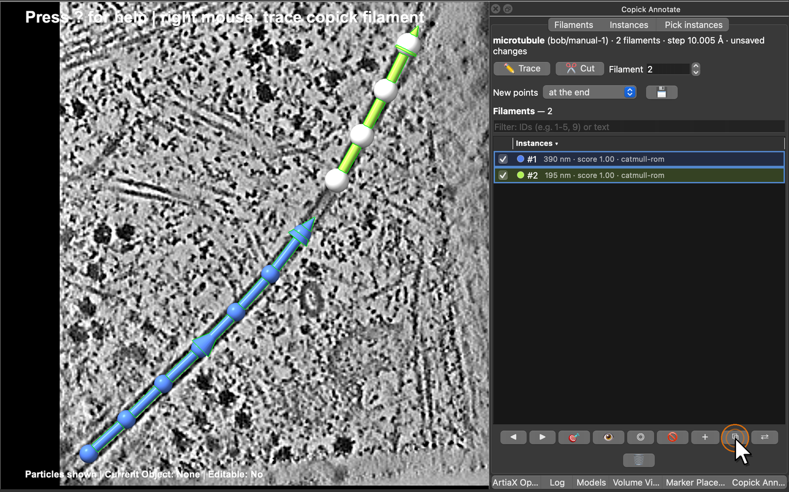{ width="100%" }
  <figcaption>Two pieces of one microtubule, selected in the view and in the list; ⧉ joins them.</figcaption>
</figure>

<figure markdown="span">
  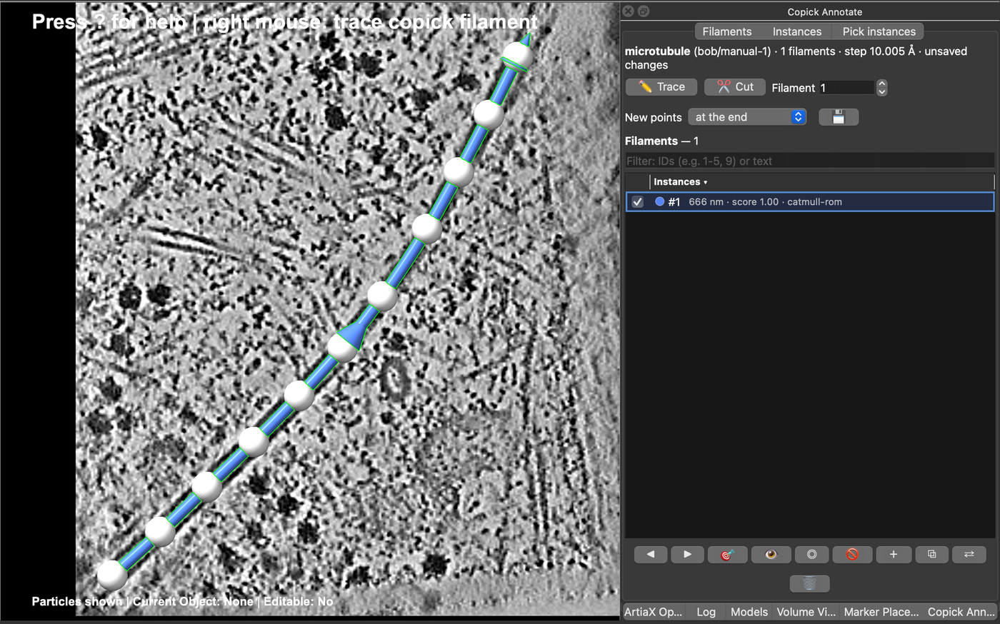{ width="100%" }
  <figcaption>After joining: one filament (#1, 666 nm) through all control points.</figcaption>
</figure>

**Cut** does the opposite. Switch to cut mode with **Cut** (toolbar or Annotate window) or ++c+f++, and right-click a
filament where it should be split. The first piece keeps the filament's ID, the second gets the next free ID, and
both keep its direction. Switch back to trace mode with **Trace** or ++t+f++.

<figure markdown="span">
  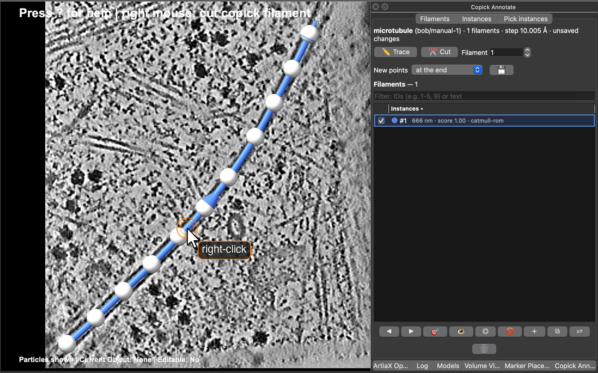{ width="100%" }
  <figcaption>Cut mode: right-click the filament where it should be split.</figcaption>
</figure>

<figure markdown="span">
  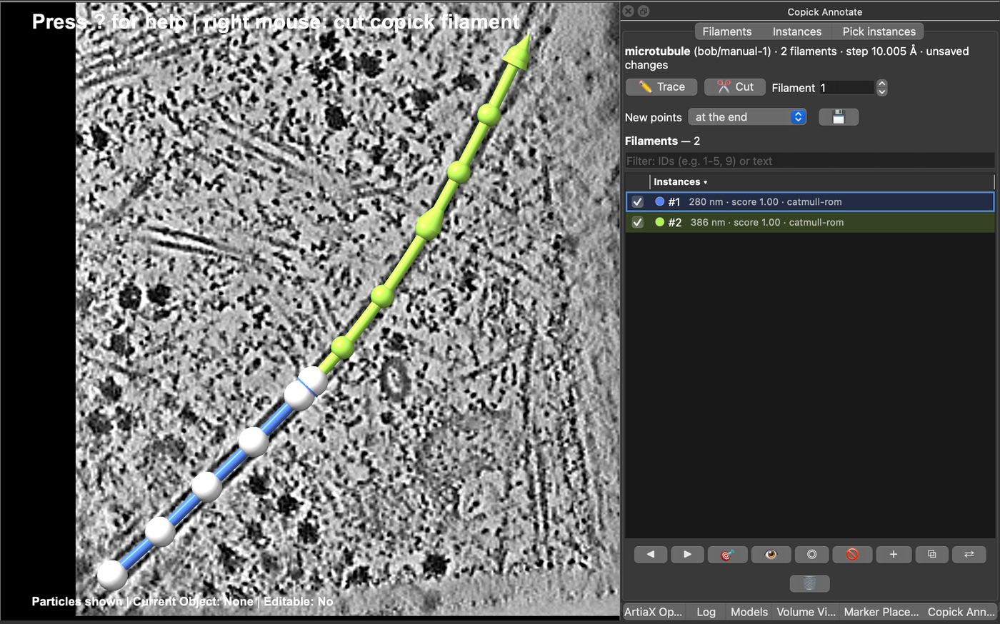{ width="100%" }
  <figcaption>After the cut: filaments #1 (blue) and #2 (green).</figcaption>
</figure>

### Step 6: Browse the filaments

The **Filaments** page of the Copick Annotate window lists the filaments of the active set with their length and
score. Click the list header to sort by ID, length or score; the filter box takes IDs (`1-5, 9`) or text. ◀ ▶ step
through the filaments, 🎯 (or a double-click) centres the view on one, and the checkboxes show or hide them. ⇄
reverses the current filament and 🗑 deletes the selected ones.

<div class="side-by-side" markdown>
<div markdown>
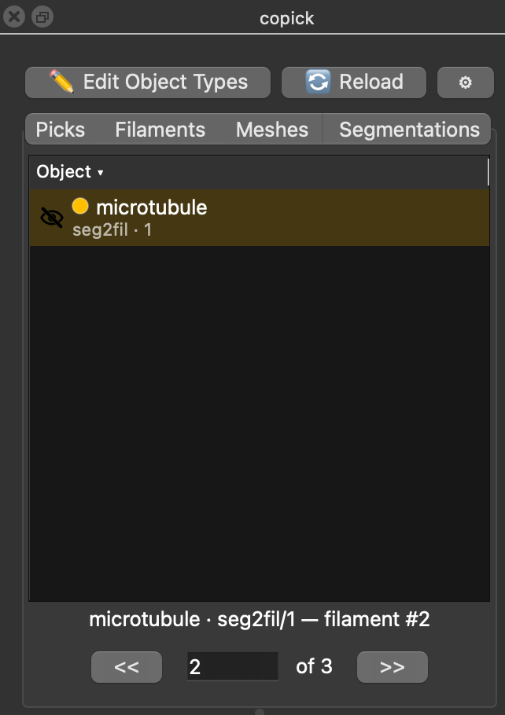{ width="300" }
</div>
<div markdown>
The copick panel has a **Filaments** tab with all filament sets of the run. Double-click a set to show or hide it,
and click a shown set to make it the active one. The stepper below the table walks through the filaments of the
active set (++f+p++ / ++f+n++), and typing a number jumps to that filament.
</div>
</div>

### Step 7: Save

Click 💾 in the Annotate window (or **Save** in the Filaments group of the toolbar) to save the active set. Optionally,
copick also writes picks sampled along the filaments at a fixed spacing, oriented along each filament and carrying
its ID, for example every 82 Å (one tubulin dimer) for subtomogram averaging:

<figure markdown="span">
  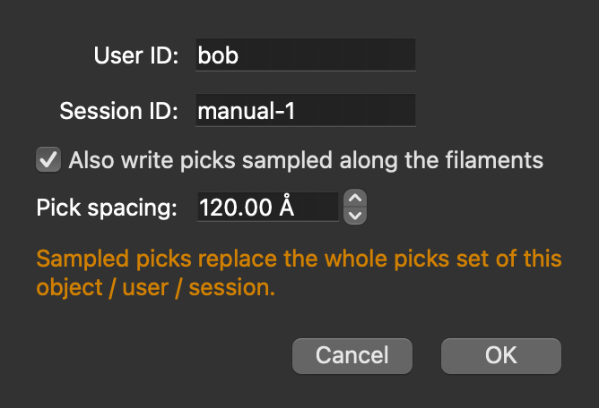{ width="400" }
  <figcaption>Saving the set, with picks every 120 Å (the object's radius, the default spacing).</figcaption>
</figure>

!!! warning "The first save of a new set"
    **Save All** in the toolbar (`copick save`) saves sets that already exist in the project. A new set, or a set
    from a read-only tool session (session `0`), must be saved once with 💾 or `copick filament save`, which also lets
    you choose the user and session.

### Step 8: Curate automatic traces

Filament sets from `copick convert seg2fil` open like any other: double-click `microtubule:seg2fil/1` in the
**Filaments** tab and click it to make it active. Traced filaments are B-splines with many control points, which can
be moved but not added or removed. To edit them freely, convert a filament with **→ Catmull-Rom** in the Annotate
window. Cut and join work on B-splines directly and turn the pieces they produce into Catmull-Rom curves. Save the result under a new session so the automatic traces stay
as they are.

<figure markdown="span">
  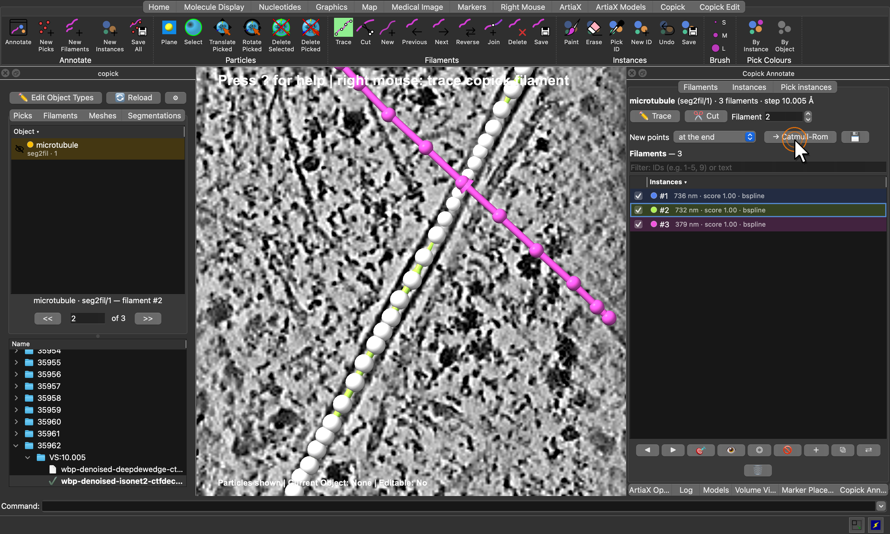{ width="100%" }
  <figcaption>The three filaments traced by <code>seg2fil</code> in run 35962, with filament #2 active.</figcaption>
</figure>

### Quick reference

??? note "Keyboard shortcuts"
    Two-letter shortcuts are typed in the graphics window; press ++question++ to list them all in the log.

    - ++t+f++ Trace mode on/off.
    - ++c+f++ Cut mode on/off.
    - ++n+f++ Start a new filament.
    - ++f+n++ / ++f+p++ Next / previous filament.
    - ++r+v++ Reverse the active filament.
    - ++j+f++ Join the selected filaments.
    - ++x+f++ Delete the active filament.
    - ++cmd+z++ / ++ctrl+z++ Undo, ++shift+cmd+z++ (macOS) Redo.

??? note "Commands"
    <div class="center-table" markdown>

    | Command | Description |
    |---|---|
    | `copick new filaments microtubule userId bob sessionId manual-1` | Start a new filament set |
    | `copick open filaments microtubule:seg2fil/1` | Show a filament set |
    | `copick filament trace on` | Trace mode (`off`, `toggle`) |
    | `copick filament cut on` | Cut mode (`off`, `toggle`) |
    | `copick filament cut at x,y,z` | Cut the nearest filament at a point (Å) |
    | `copick filament new` | Start a new filament |
    | `copick filament next` / `previous` | Step through the filaments |
    | `copick filament go 3` | Make filament 3 active and centre it |
    | `copick filament join 1,2 target 1` | Join filaments 1 and 2 into 1 |
    | `copick filament reverse` | Reverse the active filament |
    | `copick filament delete` | Delete the active filament |
    | `copick filament convert` | Convert the active filament to Catmull-Rom |
    | `copick filament save sessionId manual-2 pickSpacing 82` | Save the set, with picks every 82 Å |
    | `copick annotate show page filaments` | Show the Copick Annotate window |

    </div>
