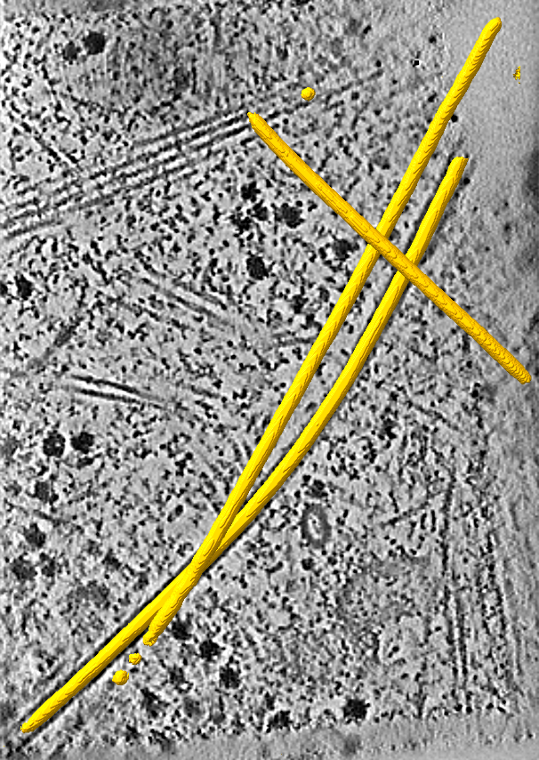
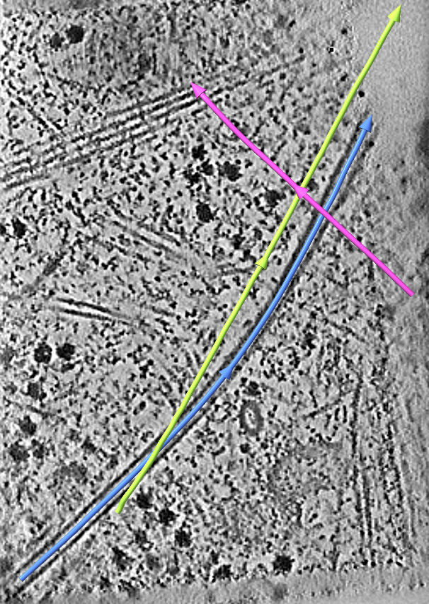
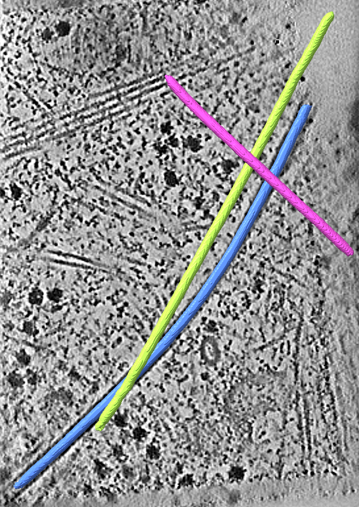
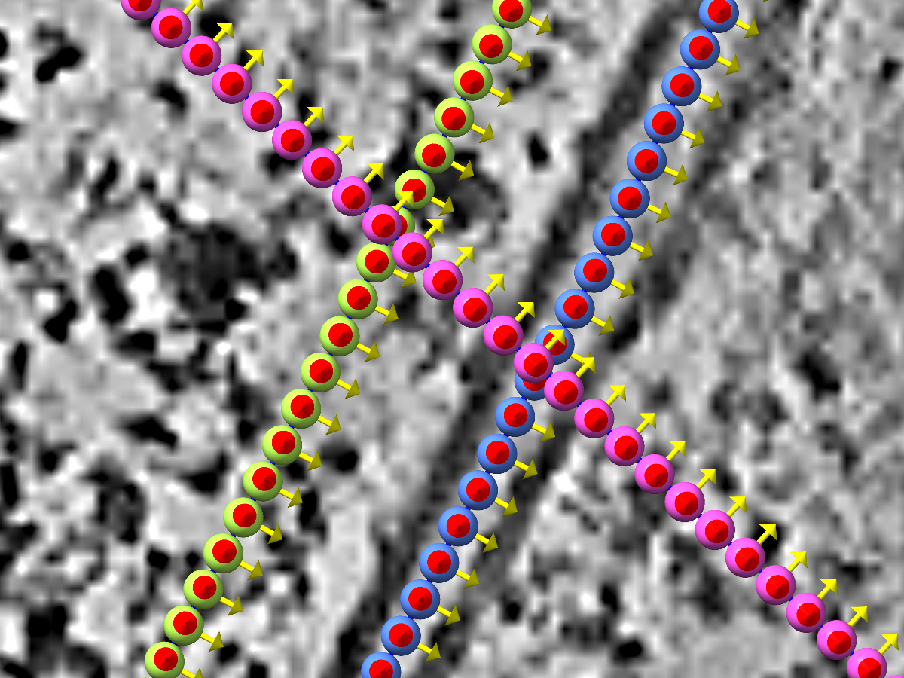

## Tracing microtubules with easymode and copick-utils

!!! quote "Citation"
    easymode's models are described in So-Last *et al.* (2026),
    [*Easymode: general pretrained networks for cellular cryo-ET enable flexible approaches to
    subtomogram averaging*](https://www.biorxiv.org/content/10.64898/2026.05.19.726344v1), bioRxiv.
    If you use these segmentations in your research, please cite it.

<figure markdown="span">
  
  
  <figcaption>The goal: turn easymode's microtubule segmentation (left, yellow) into one traced filament per
microtubule (right, coloured by filament ID; arrowheads show each filament's direction, a first guess, see Step 3). Shown on
<a href="https://cryoetdataportal.czscience.com/runs/35962">run 35962</a> of
<a href="https://cryoetdataportal.czscience.com/datasets/10521">dataset 10521</a>
(<em>Mus musculus</em>, cryo-FIB-milled NIH/3T3 fibroblasts).</figcaption>
</figure>

A segmentation tells you *which voxels* belong to microtubules, but most downstream work needs to know *which
microtubule* each voxel belongs to and where its axis runs: subtomogram averaging of filaments, measuring lengths and
curvature, or counting filaments per cell. In copick, that information lives in a **Filaments** entry: one ordered,
editable centreline per filament, each with its own ID.

In this tutorial we segment microtubules with [easymode](https://github.com/mgflast/easymode) through the
**copick-easymode** plugin, trace them into filaments with `copick convert seg2fil` from **copick-utils**, sample
picks along each filament for subtomogram averaging, and export them to RELION with the filament columns filled in.
We use the in-situ fibroblast tomograms of CZ cryoET Data Portal
[dataset 10521](https://cryoetdataportal.czscience.com/datasets/10521) (58 tomograms at **10.005 Å**, right at
easymode's 10 Å working resolution).

!!! note "What you get"
    - `microtubule:easymode/1@10.005`: easymode's binary microtubule segmentation.
    - `microtubule:seg2fil/1`: the traced filaments, one per microtubule, numbered by length.
    - `microtubule:seg2fil/1@10.005?instance=true`: an instance segmentation of the traced microtubules, whose voxel
      values are the filament IDs.
    - `microtubule:fil2picks/1`: picks every 82 Å along each filament, oriented along it and grouped by filament ID.
    - A RELION STAR file with `rlnHelicalTubeID` and the other filament columns.

### Step 0: Prerequisites

You need copick ≥ 1.28 (filament objects and the Filaments entity), copick-utils ≥ 1.10 (the tracing commands) and
copick-easymode. easymode itself is installed from GitHub with `--no-deps`; see the
[easymode tutorial](easymode.md#step-0-prerequisites) for why.

```bash
pip install "copick[all]>=1.28" "copick-utils>=1.10"
pip install git+https://github.com/copick/copick-easymode.git
pip install --no-deps git+https://github.com/mgflast/easymode.git
```

!!! tip "Bring a GPU for Step 2"
    easymode downloads its pretrained networks on first use and runs a tiled 3D U-Net with test-time augmentation,
    so a CUDA GPU is strongly recommended for segmentation. Tracing (Step 3) and everything after it run on a CPU in
    seconds per tomogram.

To look at the results, install [ChimeraX-copick](chimerax.md) (`toolshed install copick` in ChimeraX) or
[napari-copick](../../tools.md#napari-copick).

### Step 1: Set up the project

Create a copick project backed by the Data Portal tomograms, storing new annotations in a local **overlay**
directory:

```bash
copick config dataportal \
  --dataset-id 10521 \
  --overlay /home/bob/copick_microtubules/ \
  --output config.json
```

Next, declare `microtubule` as a **filament object**. A filament object is a particle object with a filament
specification: its `radius` is the tube radius, and `--polar` records that microtubules have a direction (a plus and
a minus end). Tracing uses the radius to tell real microtubules from thin segmentation noise and to fill a hollow
label, so set it to the microtubule's outer radius, about 120 Å:

```bash
copick add object -c config.json \
  --name microtubule \
  --object-type filament \
  --radius 120 \
  --polar \
  --label 3 \
  --color "255,190,0,255"
```

!!! tip "Declare the object before running easymode"
    `copick inference easymode` adds any feature it segments to the config as a *segmentation* object unless the
    object already exists (its `--add-objects` option, on by default). Declaring `microtubule` first keeps it a
    filament object. You can also turn an existing object into a filament object in the **Edit Object Types**
    dialog of [ChimeraX-copick or napari-copick](chimerax_filaments.md#step-1-declare-a-filament-object), or with
    `copick add object ... --object-type filament --exist-ok`.

### Step 2: Segment microtubules with easymode

Run easymode's `microtubule` network on the denoised portal tomograms. Start with a single run while you check the
result, then drop `--run` to segment the whole dataset:

```bash
copick inference easymode \
  --config config.json \
  -m microtubule \
  -t wbp-denoised-isonet2-ctfdeconv@10.005 \
  --run 35962 \
  --user-id easymode \
  --session-id 1 \
  --tta 4 \
  --no-add-objects
```

This writes `microtubule:easymode/1@10.005`, a binary mask aligned to the input tomogram. The mask outlines each
microtubule well, but it does not separate them: crossing microtubules merge into one connected region, and small
specks of noise sit next to them.

<figure markdown="span">
  { width="400" }
  <figcaption>easymode's <code>microtubule</code> segmentation over a slice of
<a href="https://cryoetdataportal.czscience.com/runs/35962">run 35962</a>. Two microtubules cross near the
top, and a third runs alongside one of them.</figcaption>
</figure>

### Step 3: Trace the microtubules

`copick convert seg2fil` turns the mask into filaments:

```bash
copick convert seg2fil -c config.json \
  -i "microtubule:easymode/1@10.005" \
  -o "microtubule:seg2fil/1" \
  --instances "microtubule:seg2fil/1@10.005" \
  --min-length 1000
```

For each run, this writes the filament set `microtubule:seg2fil/1` and, through `--instances`, an instance
segmentation of the traced microtubules whose voxel values are the filament IDs. `--min-length 1000` rejects pieces
shorter than 100 nm (lengths are in Å by default). Filaments are numbered 1, 2, … by length, longest first. Each is
stored as an editable Catmull-Rom curve through its fitted spline, within half a voxel of the fit.

??? note "How tracing works"
    Each connected component of the mask is skeletonized and split into branches between ends and junctions. Before
    that, holes up to the object's radius are filled slice by slice (`--fill-lumen`), so a microtubule whose wall
    alone is labelled still traces as one filament. Side branches shorter than one label diameter are pruned
    (`--prune-length`), and at each junction the branches that continue most nearly straight (within `--max-bend`,
    45° by default) are joined, so two crossing microtubules stay two filaments. Free ends are extended to the edge of
    the segmentation, since thinning shortens each end by about one radius. Finally, filaments that are shorter than
    `--min-length`, shorter than `--min-aspect` label diameters (blobs) or thinner than `--min-radius` (slivers of
    noise, a third of the object's radius by default) are rejected, and a smoothing B-spline is fitted to the rest and stored as a Catmull-Rom curve through it.

<div class="side-by-side" markdown>
<div markdown>
<figure markdown="span">

<figcaption>Filaments <code>microtubule:seg2fil/1</code>, coloured by ID</figcaption>
</figure>
</div>
<div markdown>
<figure markdown="span">

<figcaption>Instance segmentation <code>microtubule:seg2fil/1@10.005?instance=true</code></figcaption>
</figure>
</div>
</div>

The crossing near the top of run 35962 is resolved into two filaments, and the microtubule running alongside keeps
its own ID along its whole length. Run without `-r`, the same command traces all 58 tomograms of the dataset in a few
minutes on a laptop: 83 microtubules with a total length of 33 µm, after rejecting 786 short pieces.

!!! warning "Filament directions are a first guess"
    `seg2fil` cannot tell a microtubule's plus end from its minus end. It orders each filament's points from one end
    to the other, and the arrowheads (and the orientation of the picks sampled in Step 5) follow that order, so the
    direction is a first guess and is likely wrong for many filaments (on average half of them). The filaments are
    stored with `polarity_known` set to false, and the STAR export in Step 6 marks their direction as unknown
    (`rlnAnglePsiFlipRatio` 0.5), so that RELION can determine it during refinement. Where you know a filament's
    polarity, reverse it in [ChimeraX](chimerax_filaments.md#step-5-join-cut-and-reverse) or
    [napari](napari_filaments.md#step-4-trace).

!!! note "Useful options"
    - `--min-length` has no default: set it to the shortest microtubule you want to keep.
    - `--min-radius`, `--fill-lumen`, `--prune-length` and `--junction-merge` default to values derived from the
      object's radius or the label's own thickness. `copick process seg-stats --skeleton` reports each component's
      skeleton length and label radius, which helps to choose them for a new dataset.
    - `--length-unit voxel` switches all lengths to voxels.
    - `--curve bspline` stores the exact B-spline fit instead of a Catmull-Rom curve through it. Editors can move a
      B-spline's control points but not add or remove them until it is converted.
    - An instance segmentation can be traced too (append `?instance=true` to `-i`); each instance is traced on its
      own and keeps its ID. Use this to re-trace a segmentation you have corrected by hand.

    See the [seg2fil reference](../../cli/convert/seg2fil.md) for all options.

### Step 4: Inspect and curate the filaments

Open the project in ChimeraX-copick or napari-copick to check the traces against the tomogram. Filaments appear in
their own **Filaments** tab (ChimeraX) or tree node (napari), drawn as tubes with arrowheads that show each
filament's direction. Both tools let you fix what the tracer got wrong: join pieces of one microtubule that the
segmentation broke apart, cut a filament that wrongly continues into another one, reverse a filament so that it
points towards the plus end, or trace microtubules the network missed:

- [Tracing filaments in ChimeraX](chimerax_filaments.md)
- [Tracing filaments in napari](napari_filaments.md)

The traced filaments are Catmull-Rom curves, so you can add, move and remove their control points right away, just as
for a filament traced by hand. Save the curated set under a new session, for example `microtubule:bob/curated`, so
the automatic result stays untouched.

### Step 5: Sample picks along the filaments

For subtomogram averaging, sample picks at a regular spacing along each filament. 82 Å is one αβ-tubulin dimer:

```bash
copick convert fil2picks -c config.json \
  -i "microtubule:seg2fil/1" \
  -o "microtubule:fil2picks/1" \
  --spacing 82
```

Each pick carries its filament's ID as `instance_id`, picks are ordered along the filament, and each pick's +Z axis
points along it. Sampling at another spacing does not need a new trace. On dataset 10521 this gives 4,109 picks.

<figure markdown="span">
  { width="800" }
  <figcaption>Picks every 82 Å along three crossing filaments, coloured by filament ID, with each pick's
orientation shown as an arrow.</figcaption>
</figure>

!!! tip "Other outputs"
    `copick convert fil2seg` paints a tube around each filament into an instance segmentation, for example to turn
    hand-traced or curated filaments into training labels for a segmentation network.

### Step 6: Export to RELION

Because `microtubule` is declared a filament object, `copick export picks` adds RELION's filament columns to STAR
files: `rlnHelicalTubeID` (the filament ID), `rlnHelicalTrackLengthAngst`, and the tilt and psi priors that keep
each particle's orientation along its filament.

```bash
copick export picks -c config.json \
  --picks-uri "microtubule:fil2picks/1" \
  --output-format star \
  --voxel-size 10.005 \
  --output-file microtubules.star
```

Use `--filament-columns off` to leave them out, or `on` to add them for any object.

??? example "Full pipeline (copy/paste)"
    ```bash
    # 1. install
    pip install "copick[all]>=1.28" "copick-utils>=1.10"
    pip install git+https://github.com/copick/copick-easymode.git
    pip install --no-deps git+https://github.com/mgflast/easymode.git

    # 2. create a project from Data Portal dataset 10521 and declare microtubules a filament object
    copick config dataportal \
      --dataset-id 10521 \
      --overlay /home/bob/copick_microtubules/ \
      --output config.json
    copick add object -c config.json \
      --name microtubule --object-type filament --radius 120 --polar \
      --label 3 --color "255,190,0,255"

    # 3. segment microtubules (GPU)
    copick inference easymode \
      --config config.json \
      -m microtubule \
      -t wbp-denoised-isonet2-ctfdeconv@10.005 \
      --user-id easymode --session-id 1 --tta 4 --no-add-objects

    # 4. trace them into filaments (and an instance segmentation)
    copick convert seg2fil -c config.json \
      -i "microtubule:easymode/1@10.005" \
      -o "microtubule:seg2fil/1" \
      --instances "microtubule:seg2fil/1@10.005" \
      --min-length 1000

    # 5. sample picks every 82 Å and export them to RELION
    copick convert fil2picks -c config.json \
      -i "microtubule:seg2fil/1" -o "microtubule:fil2picks/1" --spacing 82
    copick export picks -c config.json \
      --picks-uri "microtubule:fil2picks/1" \
      --output-format star --voxel-size 10.005 \
      --output-file microtubules.star
    ```
