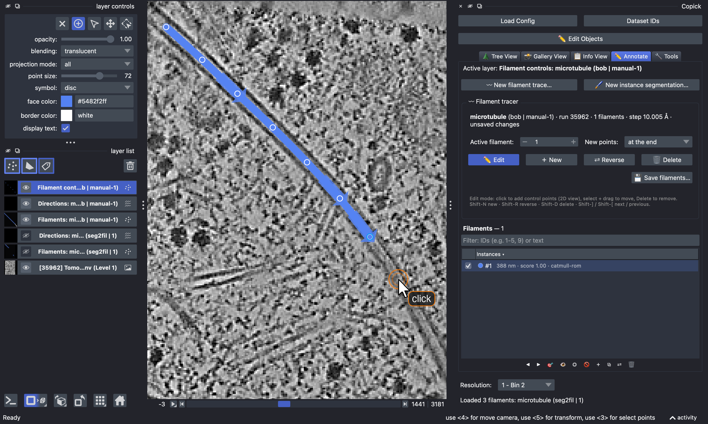
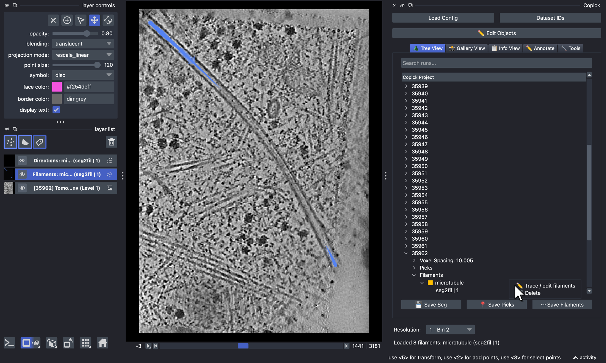
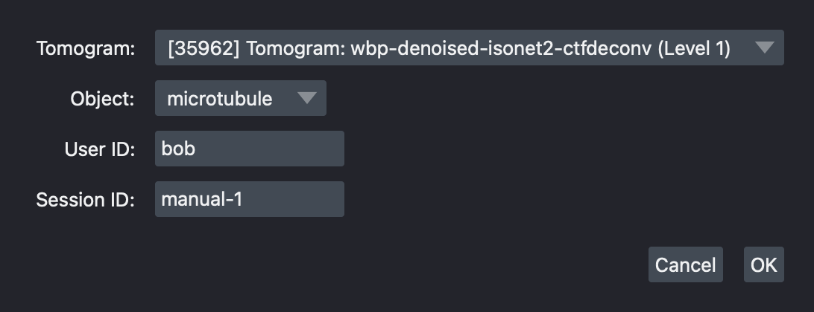
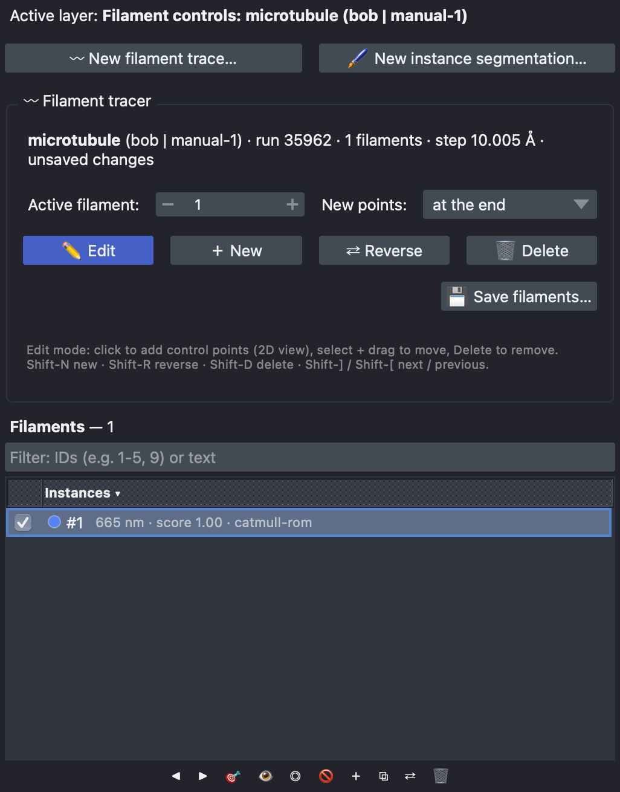
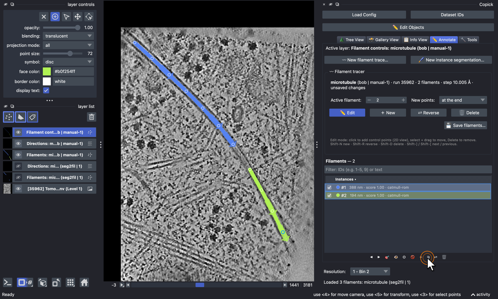
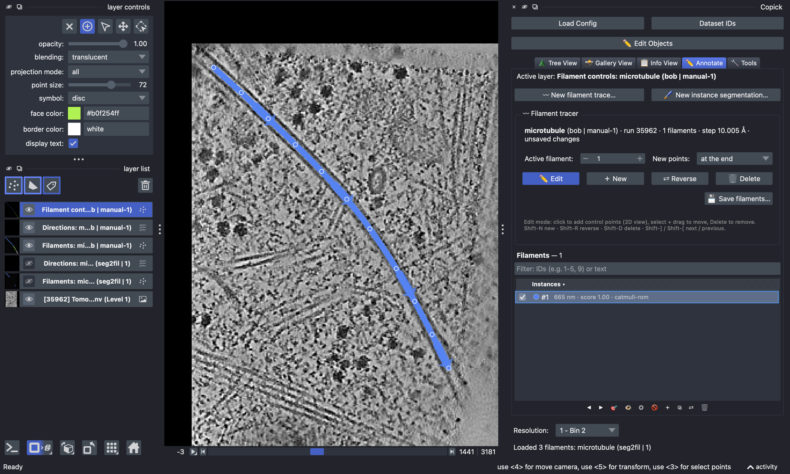
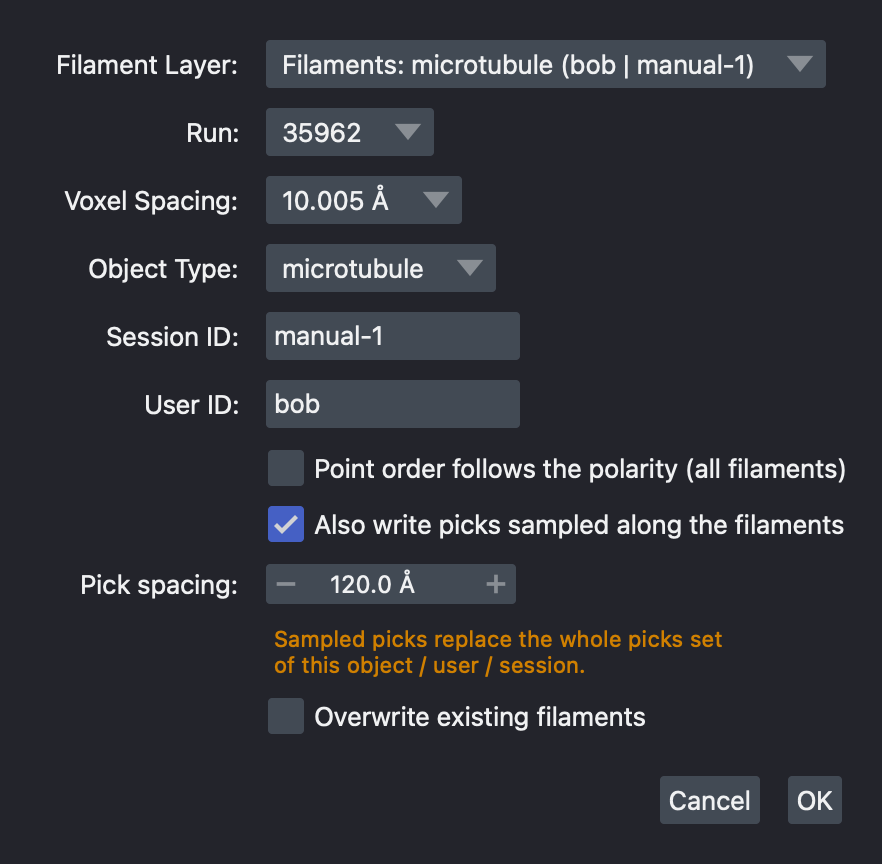

## Tracing filaments in napari

<figure markdown="span">
  { width="100%" }
  <figcaption>Tracing a microtubule in napari-copick: in edit mode, each click on the 2D view adds a control point,
and the band through them is the filament's centreline, with arrows for its direction. Shown on
<a href="https://cryoetdataportal.czscience.com/runs/35962">run 35962</a> of
<a href="https://cryoetdataportal.czscience.com/datasets/10521">dataset 10521</a>.</figcaption>
</figure>

Filaments such as microtubules or actin are annotated by their centreline: an ordered curve through the middle of the
filament, one per filament, each with its own ID. napari-copick traces them on the 2D view of a tomogram: you click
control points along a filament and copick draws a smooth curve through them. The same panel joins, reverses and
deletes filaments, so it is also the place to curate automatic traces, for example those of
[`copick convert seg2fil`](microtubule_tracing.md).

This tutorial uses the microtubule project from
[Tracing microtubules with easymode and copick-utils](microtubule_tracing.md), but any copick project with a tomogram
works.

### Step 0: Prerequisites

Filament tracing needs napari-copick 1.10 or later, which brings copick ≥ 1.28:

```bash
pip install "napari-copick>=1.10" "napari[pyqt6]"
```

Start napari with the copick plugin and your project:

```bash
napari-copick run -c config.json
```

!!! warning "napari 0.9: set a slice thickness"
    Since napari 0.9, points (and therefore filaments and picks) are drawn only within the *thickness* of the current
    slice, and the default thickness is zero, so traces may look like isolated dots. Until napari-copick sets it for
    you, open napari's console (the `>_` button at the bottom left) and run

    ```python
    viewer.dims.thickness = (120, 0, 0)
    ```

    to show everything within 60 Å of the slice. With a thickness, the tomogram is shown as the mean over that slab,
    which also makes filaments easier to see.

### Step 1: Declare a filament object

Only objects declared as **filaments** can be traced. A filament object is a particle object with a filament
specification: its radius is the tube radius, and its polarity says whether the filament has a direction. If your
project does not have one yet, click **✏️ Edit Objects** in the copick panel, select the object (or add a new one),
tick **Is Particle** and **Is Filament**, and set the radius and polarity under **Filament Properties**. The dialog is
the same as in [ChimeraX-copick](chimerax_filaments.md#step-1-declare-a-filament-object). From the command line:

```bash
copick add object -c config.json \
  --name microtubule --object-type filament --radius 120 --polar
```

### Step 2: Open a tomogram and existing filaments

In the **🌲 Tree View**, expand a run and its voxel spacing and click a tomogram to open it. Filament sets are listed
under **Filaments** › object › `user | session`; click one to show it. Right-click a filament set and choose
**✏️ Trace / edit filaments** to open it for editing in the **✏️ Annotate** tab:

<figure markdown="span">
  { width="100%" }
  <figcaption>Opening the <code>seg2fil</code> traces of run 35962 for editing.</figcaption>
</figure>

### Step 3: Start a new trace

To trace new filaments, switch to the **✏️ Annotate** tab and click **〰 New filament trace…**. Choose the tomogram
(its run and voxel spacing are used for the new set), a filament object, a user and a session:

<figure markdown="span">
  { width="500" }
  <figcaption>Starting the set <code>microtubule:bob/manual-1</code>.</figcaption>
</figure>

The Annotate tab now shows the **〰 Filament tracer** panel, and three layers are added for the set: the centreline
(**Filaments: …**), its direction arrows (**Directions: …**) and the editable control points
(**Filament controls: …**).

### Step 4: Trace

With **✏️ Edit** on, the control-point layer is active in napari's *add points* mode. **Click** along a filament in the
2D view to place control points; the centreline is a smooth (Catmull-Rom) curve through them. Move through the
tomogram with the slider below the view to follow a filament that leaves the slice.

- **Move a point:** switch the layer to *select* mode, then drag the point.
- **Remove a point:** select it and press ++delete++ or ++backspace++.
- **Where new points go:** the **New points** menu adds them *at the end* (default), *at the start*, or *between
  nearest*, which inserts a point into the closest segment, for example to refine a curve.
- **Start the next filament:** **＋ New**, or ++shift+n++ while the control-point layer is active.

The arrows on the centreline show each filament's direction, from its first to its last point. For a polar filament
such as a microtubule, use **⇄ Reverse** (++shift+r++) if it points the wrong way. **🗑 Delete** (++shift+d++)
removes the active filament, and ++shift+bracket-right++ / ++shift+bracket-left++ step to the next or previous one.

<figure markdown="span">
  { width="450" }
  <figcaption>The Annotate tab with the Filament tracer panel and the list of filaments in the set.</figcaption>
</figure>

### Step 5: Browse and join filaments

The list below the tracer shows the filaments of the set with their length and score. Click the list header to sort
by ID, length or score; the filter box takes IDs (`1-5, 9`) or text. ◀ ▶ step through the filaments, 🎯 (or a
double-click) moves the view to one, and the checkboxes show or hide them.

**Join** connects filaments end to end, for example two pieces of one microtubule that you traced separately or that a
segmentation broke apart. Select the filaments in the list (++ctrl++ / ++shift++ + click) and click ⧉. Copick
connects the nearest ends, reversing a piece if needed, and the joined filament keeps the ID and direction of the
current one.

<figure markdown="span">
  { width="100%" }
  <figcaption>Two pieces of one microtubule selected in the list; ⧉ joins them.</figcaption>
</figure>

<figure markdown="span">
  { width="100%" }
  <figcaption>After joining: one filament (#1, 665 nm) through all control points.</figcaption>
</figure>

!!! note "Cutting and undo"
    Cutting a filament in two and undoing filament edits are currently available in
    [ChimeraX-copick](chimerax_filaments.md#step-5-join-cut-and-reverse) only. In napari, remove control points
    instead and start a new filament for the second piece.

### Step 6: Save

Click **💾 Save filaments…** in the tracer panel (or **〰 Save Filaments** in the Tree View tab). Besides the user and
session, the dialog records whether the point order follows the filament's polarity, and can also write picks
sampled along the filaments at a fixed spacing, oriented along each filament and carrying its ID, for example every
82 Å (one tubulin dimer) for subtomogram averaging:

<figure markdown="span">
  { width="450" }
  <figcaption>Saving the set, with picks sampled every 120 Å (the object's radius, the default spacing).</figcaption>
</figure>

Session `0` is reserved for tool output, so traces from tools are saved under a new session. **Overwrite existing
filaments** is ticked for sets opened from an editable file; untick it to keep an existing set of the same name.

### Curating automatic traces

Filaments from `copick convert seg2fil` are B-splines with many control points, which can be moved but not added or
removed. To edit one freely, click **Convert to Catmull-Rom** in the tracer panel; join works on B-splines directly.
Save the curated set under a new session so the automatic traces stay as they are.
