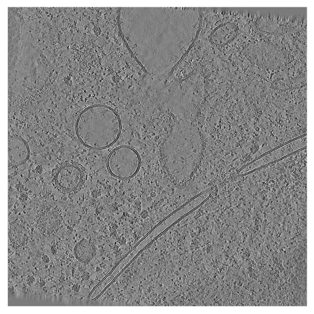
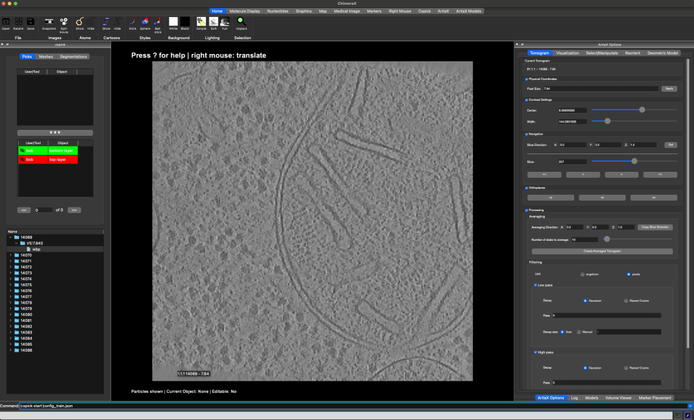
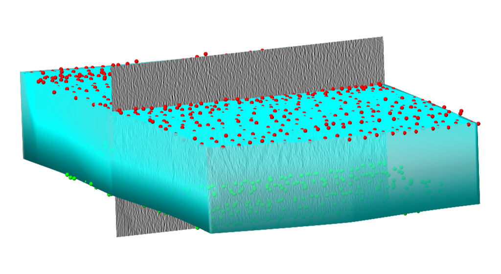
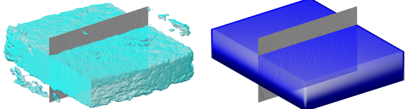
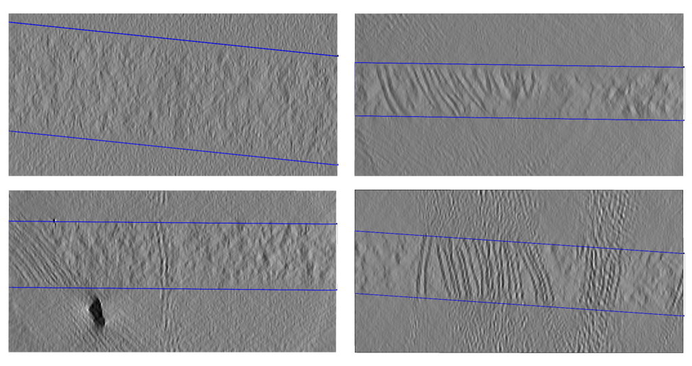

## Predicting sample boundaries

<figure markdown="span">
  
  
  <figcaption>Side view onto a cryo-electron tomogram (<a href="https://cryoetdataportal.czscience.com/runs/15094">run 15094</a>)
without (left) and with (right) sample boundary annotation</figcaption>
</figure>

Biological samples acquired in a cryoET experiment are usually thin slabs of vitrified ice containing the biological
specimen of interest. Unfortunately, it is difficult to determine orientation and thickness of the samples ahead of
reconstruction. For this reason, volumes reconstructed from cryoET tilt series are often larger than the actual sample
and contain a significant amount of empty space (i.e. the vacuum inside the TEM column).

There are several reasons for why it can be useful to determine more accurate sample boundaries, e.g.

- statistical analysis of the sample preparation process
- masking out the vacuum region to reduce the size of the volume
- masking out the vacuum region during the training of a neural network
- capping of membrane segmentations to define topological boundaries

Below, we will show how to use the **copick CLI**, **copick-torch** and
**octopi** to predict sample boundaries for datasets [10301](https://cryoetdataportal.czscience.com/datasets/10301)
and [10302](https://cryoetdataportal.czscience.com/datasets/10302) from the
[CZ cryoET Data Portal](https://cryoetdataportal.czscience.com).

<figure markdown="span">
  {width="400"}
  <figcaption>Top view onto the same tomogram (<a href="https://cryoetdataportal.czscience.com/runs/15094">run 15094</a>)
from dataset <a href="https://cryoetdataportal.czscience.com/datasets/10302">10302</a>.</figcaption>
</figure>

### Step 0: Environment and Pre-requisites

For the purpose of this tutorial we will assume that we are working on a machine with access to an NVIDIA GPU and a
working CUDA installation. Before we can start, we need to install the necessary software. We will
use the following tools:

#### 1. ChimeraX and ChimeraX-copick (for visualization and annotation)

Download and install ChimeraX from [here](https://www.cgl.ucsf.edu/chimerax/download.html). After installing ChimeraX,
install the ChimeraX-copick extension by running the following command in ChimeraX:

```
toolshed install copick
```

Alternatively, you can use [napari-copick](https://github.com/copick/napari-copick) for annotation in napari.

#### 2. Copick CLI, copick-utils, and copick-torch (for processing steps)

```bash
pip install "copick[all]" copick-utils copick-torch
```

#### 3. Octopi (for training and inference)

```bash
pip install octopi
```

### Step 1: Setup your copick projects

We will create two copick projects that use datasets 10301 and 10302 from the CZ cryoET Data Portal. Both datasets stem
from the same experiments and have the same characteristics, but the tomograms in dataset 10301 have protein annotations.
We will use dataset 10301 as a training set and evaluate on dataset 10302.

We will store new annotations in a local directory, called the "overlay", while the tomogram image data is obtained
from the CZ cryoET Data Portal.

First, create the configuration file for the training set:

```bash
copick config dataportal \
  -ds 10301 \
  --overlay /home/bob/copick_project_train/ \
  --output config_train.json
```

Next, add the pickable objects that we will use throughout the tutorial:

- **top-layer** -- the top layer of the sample (particle, for point annotations)
- **bottom-layer** -- the bottom layer of the sample (particle, for point annotations)
- **sample** -- the sample itself (segmentation object)
- **valid-area** -- the valid area of the reconstructed tomogram (segmentation object)
- **valid-sample** -- the sample excluding the invalid reconstruction area (segmentation object)

```bash
copick add object -c config_train.json \
  --name top-layer --object-type particle --label 100 \
  --color "255,0,0,255" --radius 150

copick add object -c config_train.json \
  --name bottom-layer --object-type particle --label 101 \
  --color "0,255,0,255" --radius 150

copick add object -c config_train.json \
  --name sample --object-type segmentation --label 102 \
  --color "0,0,255,128" --radius 150

copick add object -c config_train.json \
  --name valid-area --object-type segmentation --label 103 \
  --color "255,255,0,128" --radius 150

copick add object -c config_train.json \
  --name valid-sample --object-type segmentation --label 2 \
  --color "0,255,255,128" --radius 150
```

Now repeat this process for the evaluation set, which includes both datasets 10301 and 10302:

```bash
copick config dataportal \
  -ds 10301 -ds 10302 \
  --overlay /home/bob/copick_project_evaluate/ \
  --output config_evaluate.json

copick add object -c config_evaluate.json \
  --name top-layer --object-type particle --label 100 \
  --color "255,0,0,255" --radius 150

copick add object -c config_evaluate.json \
  --name bottom-layer --object-type particle --label 101 \
  --color "0,255,0,255" --radius 150

copick add object -c config_evaluate.json \
  --name sample --object-type segmentation --label 102 \
  --color "0,0,255,128" --radius 150

copick add object -c config_evaluate.json \
  --name valid-area --object-type segmentation --label 103 \
  --color "255,255,0,128" --radius 150

copick add object -c config_evaluate.json \
  --name valid-sample --object-type segmentation --label 2 \
  --color "0,255,255,128" --radius 150
```

### Step 2: Annotate the training set

Open ChimeraX and start the copick extension by running the following command in the ChimeraX command line:

```
copick start config_train.json
```

<figure markdown="span">
  {width="800"}
  <figcaption>The ChimeraX-copick interface after loading run 14069.</figcaption>
</figure>


This will open a new window with the copick interface. On the top left side you will see the available objects, on the
bottom left you can find a list of runs in the dataset. On the right side you can find the interface of ArtiaX (the
plugin that allows you to annotate objects in ChimeraX).


Double-click a run's directory (e.g. `14069`) in the run list to show the available resolutions, double-click the
resolution's directory (`VS:7.840`) to display the available tomograms. In order to load a tomogram, double-click the
tomogram.

The tomogram will be displayed in the main viewport in the center. Available pickable objects are displayed in the
list on the left side. Select a pickable object (e.g. top-layer) by double-clicking it and start annotating the top-border
of the sample by placing points on the top-border of the sample.

You can switch the slicing direction in the `Tomogram`-tab on the right. You can move through the 2D slices of the
tomogram using the slider on the right or `Shift + Mouse Wheel`. For more information on how to use the copick interface,
see the info box below and refer to the [ChimeraX documentation](https://www.cgl.ucsf.edu/chimerax/docs/user/index.html).

??? note "Keyboard Shortcuts"
    **Particles**

    - `--` Remove Particle.
    - `00` Set 0% transparency for active particle list.
    - `55` Set 50% transparency for active particle list.
    - `88` Set 80% transparency for active particle list.
    - `aa` Previous Particle.
    - `dd` Next Particle.
    - `sa` Select all particles for active particle list.
    - `ss` Select particles mode
    - `ww` Hide/Show ArtiaX particle lists.

    **Picking**

    - `ap` Add on plane mode
    - `dp` Delete picked mode
    - `ds` Delete selected particles

    **Visualization**

    - `cc` Turn Clipping On/Off
    - `ee` Switch to orthoplanes.
    - `ff` Move planes mouse mode.
    - `qq` Switch to single plane.
    - `rr` Rotate slab mouse mode.
    - `xx` View XY orientation.
    - `yy` View YZ orientation.
    - `zz` View XZ orientation.

    **Info**

    - `?` Show Shortcuts in Log.
    - `il` Toggle Info Label.

At the end of this step, you should have annotated the top- and bottom-layer of the all 18 tomograms in the training set.

<figure markdown="span">
  
  
  <figcaption>Points clicked along the top and bottom boundary of the sample of a tomogram.</figcaption>
</figure>

### Step 3: Create the training data

#### Valid reconstruction area

Next, we will create the training data for the sample boundary prediction. First, we will create bounding boxes that
describe the valid reconstruction area in each tomogram. In most TEMs, the tilt axis is not exactly parallel to
either of the detector axes, causing tomograms to have small regions of invalid reconstruction at the corners. Using
`copick process validbox`, we can compute 3D meshes that describe the valid reconstruction area in each tomogram.

In this case, we will assume an in-plane rotation of -6 degrees.

```bash
copick process validbox -c config_train.json \
  -t "wbp@7.84" \
  --angle -6 \
  -o "valid-area:bob/0"
```

You can now visualize the created bounding boxes in ChimeraX by restarting the copick interface and selecting the
`valid-area` object in the Mesh-tab on the left side.

<figure markdown="span">
  
  
  <figcaption>Top view onto a tomogram (<a href="https://cryoetdataportal.czscience.com/runs/14069">run 15094</a>) without (left)
and with (right) valid reconstruction area mesh overlayed.</figcaption>
</figure>

#### Sample

Now, we will use the points created in [Step 2](#step-2-annotate-the-training-set) to create a second 3D mesh that
describes the sample boundaries. We do this by fitting cubic B-spline surfaces to the top and bottom boundary points
using `copick convert picks2slab`. This command fits independent spline surfaces to each set of picks, then connects
them with side walls to form a closed slab mesh.

```bash
copick convert picks2slab -c config_train.json \
  -i1 "top-layer:bob/1" -i2 "bottom-layer:bob/1" \
  -t "wbp@7.84" \
  -o "sample:picks2slab/0"
```

#### Intersection

Next, we will intersect the valid reconstruction area with the sample to create a new object that describes the valid
sample area. We do this using `copick logical meshop`:

```bash
copick logical meshop -c config_train.json \
  --operation intersection \
  -i "valid-area:bob/0" \
  -i "sample:picks2slab/0" \
  -o "valid-sample:meshop/0"
```

You can now visualize the final 3D mesh for training in ChimeraX by restarting the copick interface and selecting the
`valid-sample` object in the Mesh-tab on the left side.

<figure markdown="span">
  {width="400"}
  <figcaption>Side view of the tomogram with points and intersected, valid sample area.</figcaption>
</figure>


#### Training segmentation

Finally, we will create a dense segmentation of the same size as the tomogram from the 3D mesh using
`copick convert mesh2seg`:

```bash
copick convert mesh2seg -c config_train.json \
  -i "valid-sample:meshop/0" \
  --tomo-type wbp \
  -o "valid-sample:mesh2seg/0@7.84"
```

The resulting segmentations will have the same name as the input object. You can now visualize the
segmentations in ChimeraX by restarting the copick interface and selecting the `valid-sample` object in the
`Segmentation`-tab on the top left part of the interface.


### Step 4: Train the model

#### Create training targets

We will use [octopi](https://github.com/copick/octopi) to train a 3D U-Net model for sample boundary prediction. First,
we need to create training target segmentations that octopi can use. We pass the segmentation from the previous step
as a segmentation target:

```bash
octopi create-targets -c config_train.json \
  --seg-target "valid-sample,mesh2seg,0" \
  -alg wbp -vs 7.84 \
  -name sampletargets -uid train-octopi -sid 0
```

This will create a new segmentation volume with name `sampletargets`, user `train-octopi` and session `0`.

#### Train the model

Next, we will train the octopi model using the training targets. Octopi uses a SmartCache data loading strategy that
efficiently samples training patches from the segmentation volumes:

```bash
octopi train -c config_train.json \
  -tinfo "sampletargets,train-octopi,0" \
  -alg wbp -vs 7.84 \
  -o outputs/ \
  -vruns 14069,14070,14071 \
  -truns 14072,14073,14074,14075,14076,14077,14078,14079,14080,14081,14082,14083,14084,14085,14086 \
  -nepochs 100
```

In this case, runs `14069`, `14070`, and `14071` will be used for validation, while the remaining runs will be used for
training. The model will be saved in the `outputs/`-directory.

### Step 5: Segment the evaluation set

Now, we will run inference on the evaluation set. For demonstration purposes we will only evaluate on four
tomograms:

```bash
octopi segment -c config_evaluate.json \
  -mc outputs/model_config.yaml \
  -mw outputs/best_model_weights.pth \
  -alg wbp -vs 7.84 \
  -seginfo "segmentation,output,0" \
  -runs 14114,14132,14137,14163
```

This will create a new segmentation volume with name `segmentation`, user `output` and session `0` for the tomograms
`14114`, `14132`, `14137`, and `14163`. You can now visualize the segmentations in ChimeraX by restarting the copick interface
and selecting the `segmentation` object in the `Segmentation`-tab on the top left part of the interface.

<figure markdown="span">
  {width="800"}
  <figcaption>Segmentation generated by the model and box fit to the segmentation.</figcaption>
</figure>

### Step 6: Post-processing

Finally, we will post-process the segmentations to create the final sample boundaries. The segmentations can contain
small isolated regions that are not part of the sample. We use `copick convert seg2slab` to fit a box with
parallel sides to the segmentation. This extracts the largest connected component and fits two parallel planes via
differentiable IoU optimization:

```bash
copick convert seg2slab -c config_evaluate.json \
  -r 14114 -r 14132 -r 14137 -r 14163 \
  -i "segmentation:output/0@7.84" \
  --label 2 \
  -o "valid-sample:seg2slab/0"
```

You can now visualize the final 3D mesh for evaluation in ChimeraX by restarting the copick interface and selecting the
`valid-sample` object in the `Mesh`-tab on the left side. Below you can see the final result for the four tomograms
`14114`, `14132`, `14137`, and `14163`.


<figure markdown="span">
  {width="800"}
  <figcaption> Clipped boundaries predicted for <a href="https://cryoetdataportal.czscience.com/runs/14114">run 14114</a>,
  <a href="https://cryoetdataportal.czscience.com/runs/14132">run 14132</a>,
  <a href="https://cryoetdataportal.czscience.com/runs/14137">run 14137</a>, and
  <a href="https://cryoetdataportal.czscience.com/runs/14163">run 14163</a> (left to right, top to bottom).</figcaption>
</figure>
