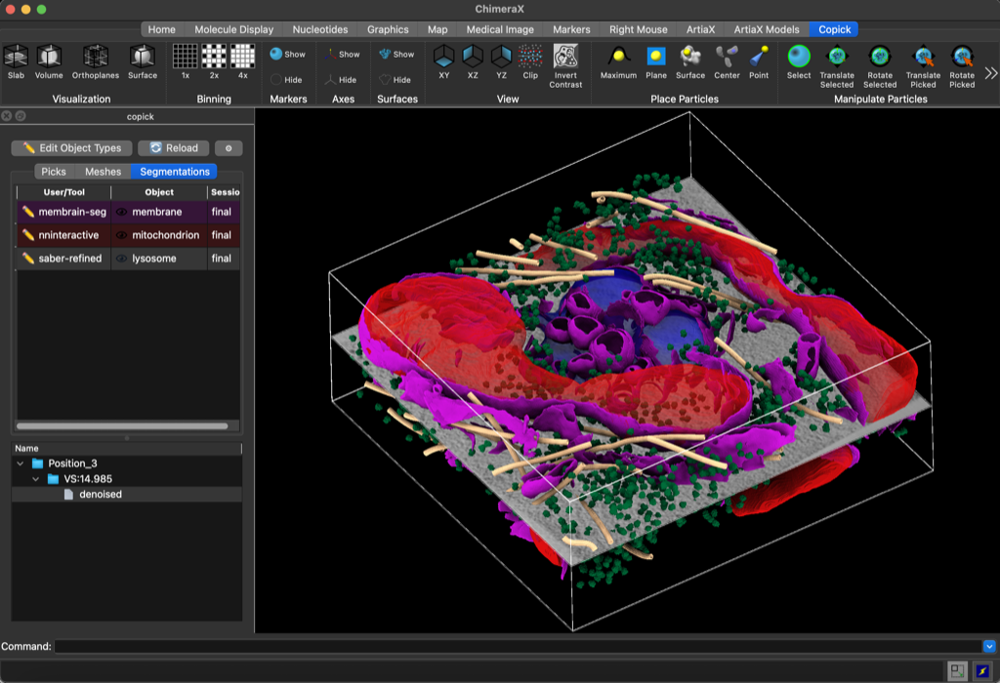
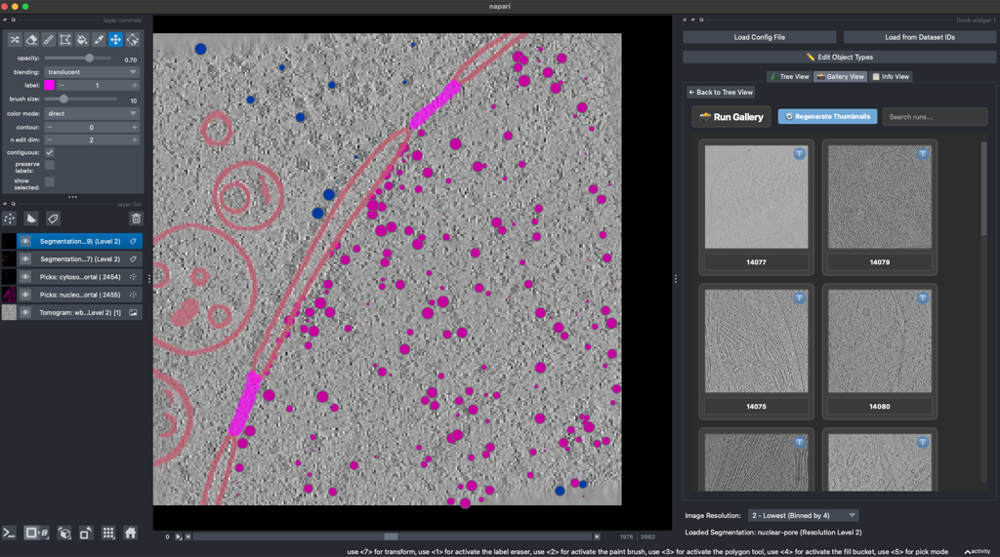
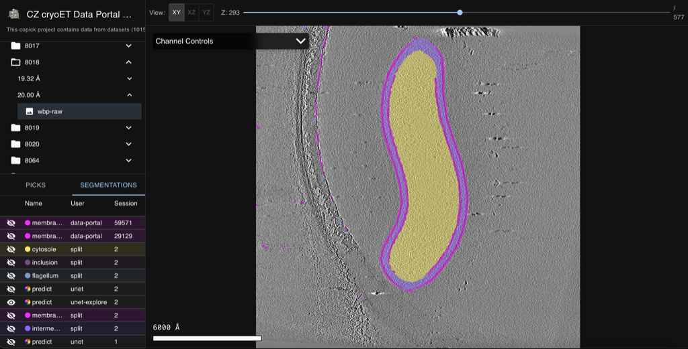
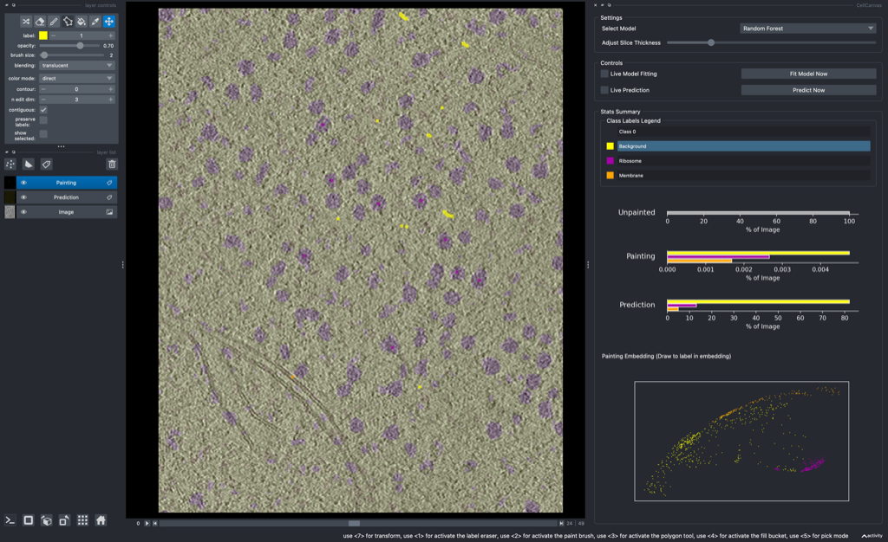
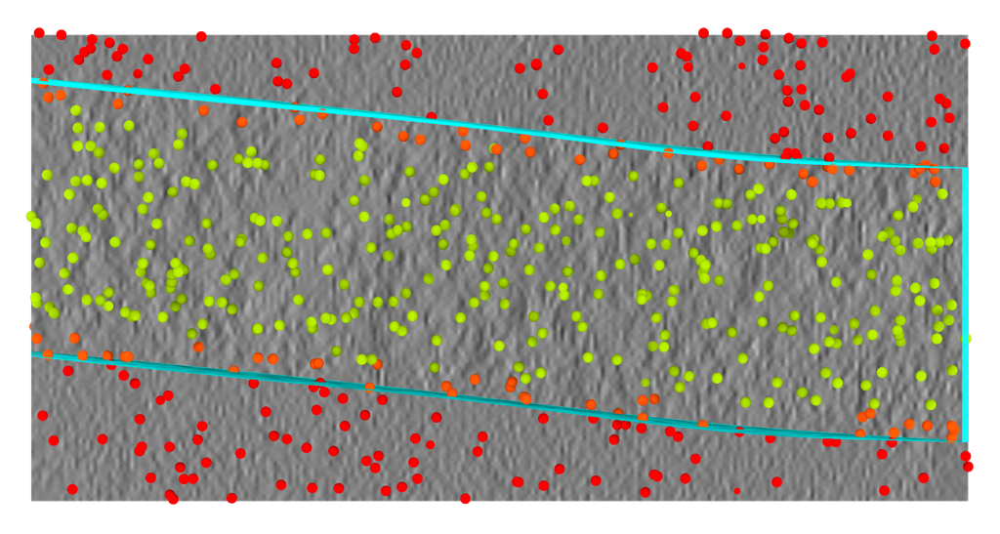
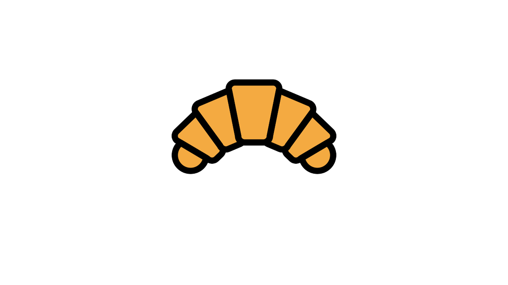
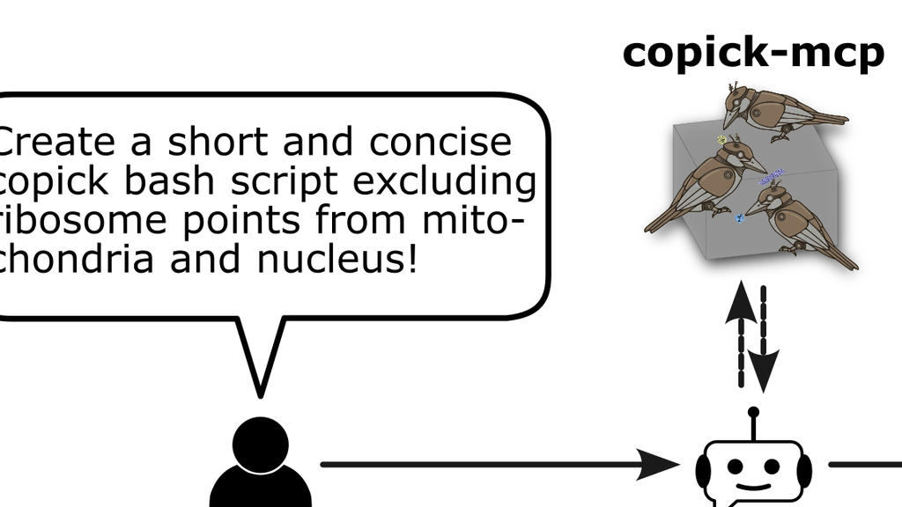

---
hide:
  - navigation
---

<div class="cp-hero" markdown>
<div class="cp-hero__text" markdown>

# copick

**A storage-agnostic, server-less dataset API for cryo-electron tomography.**
Access tomograms, segmentations, meshes, and point annotations through one object-oriented
Python API — backed by [fsspec](https://filesystem-spec.readthedocs.io/en/latest/) and multiscale
OME-Zarr, from a laptop to the cloud.

```bash
pip install copick
```

<div class="cp-hero__actions" markdown>

[Get Started](get-started/index.md){ .md-button .md-button--primary }
[Tutorials](examples/overview.md){ .md-button }
[GitHub](https://github.com/copick/copick){ .md-button }

</div>

</div>
<div class="cp-hero__figure" markdown>


</div>
</div>

<div class="cp-carousel" data-autoplay="7000" markdown>

<section class="cp-carousel__slide" markdown>
<p class="cp-carousel__title">Visualization &amp; curation</p>

<div class="grid cards" markdown>

-   [{ .tool-thumb }](tools.md#chimerax-copick)

    **[ChimeraX-copick](tools.md#chimerax-copick)**

    Visualize and curate copick datasets in UCSF ChimeraX.

-   [{ .tool-thumb }](tools.md#napari-copick)

    **[napari-copick](tools.md#napari-copick)**

    Browse and curate copick datasets in napari.

-   [{ .tool-thumb }](tools.md#copick-web)

    **[copick-web](tools.md#copick-web)**

    View copick datasets in the browser — tomograms, picks, and segmentations.

-   [{ .tool-thumb }](tools.md#cellcanvas)

    **[CellCanvas](tools.md#cellcanvas)**

    Interactive 3D segmentation in napari, backed by copick.

</div>

[:octicons-arrow-right-24: Explore the ecosystem](tools.md)

</section>

<section class="cp-carousel__slide" markdown>
<p class="cp-carousel__title">Processing &amp; conversion</p>

<div class="grid cards" markdown>

-   [{ .tool-thumb }](cli/convert/index.md)

    **[Convert](cli/convert/index.md)**

    Convert between picks, segmentations, and meshes.

-   [{ .tool-thumb }](cli/logical/index.md)

    **[Logical](cli/logical/index.md)**

    Combine and clip annotations with boolean & spatial operations.

-   [{ .tool-thumb }](cli/process/index.md)

    **[Process](cli/process/index.md)**

    Transform segmentations and meshes — skeletonize, expand, fit, filter.

-   [{ .tool-thumb }](cli/inference/index.md)

    **[Inference](cli/inference/index.md)**

    Run model inference to generate new annotations.

</div>

[:octicons-arrow-right-24: Browse all processing tools](processing_tools.md)

</section>

<section class="cp-carousel__slide" markdown>
<p class="cp-carousel__title">Workflows &amp; tutorials</p>

<div class="grid cards" markdown>

-   [{ .tool-thumb }](examples/tutorials/chimerax.md)

    **[ChimeraX-copick](examples/tutorials/chimerax.md)**

    Visualize and curate a copick project in ChimeraX.

-   [{ .tool-thumb }](examples/tutorials/sample_boundaries_filtering.md)

    **[Filtering by Sample Boundaries](examples/tutorials/sample_boundaries_filtering.md)**

    Filter particle picks by their position relative to the sample boundaries.

-   [{ .tool-thumb }](examples/tutorials/croissant.md)

    **[mlcroissant](examples/tutorials/croissant.md)**

    Work with copick projects described by an ML Commons Croissant manifest.

-   [{ .tool-thumb }](examples/tutorials/copick_mcp.md)

    **[Copick-MCP](examples/tutorials/copick_mcp.md)**

    Drive copick from an MCP-enabled assistant.

</div>

[:octicons-arrow-right-24: Browse all tutorials](examples/overview.md)

</section>

</div>

## Supported data types

copick represents the data types frequently encountered in cryoET datasets through a single object-oriented
API.

<div class="grid cards" markdown>

-   :fontawesome-solid-cube:{ .lg .middle } __Tomograms__

    ---

    Multiscale 3D reconstructions stored as OME-Zarr.

    [:octicons-arrow-right-24: Data model](datamodel.md)

-   :fontawesome-solid-wave-square:{ .lg .middle } __Feature maps__

    ---

    Derived voxel-wise feature volumes computed from tomograms.

    [:octicons-arrow-right-24: Data model](datamodel.md)

-   :fontawesome-solid-fill-drip:{ .lg .middle } __Segmentations__

    ---

    Dense, multiscale volumetric labels.

    [:octicons-arrow-right-24: Data model](datamodel.md)

-   :fontawesome-solid-draw-polygon:{ .lg .middle } __Meshes__

    ---

    Surface annotations stored as GLB.

    [:octicons-arrow-right-24: Data model](datamodel.md)

-   :fontawesome-solid-location-dot:{ .lg .middle } __Picks__

    ---

    Point annotations with per-particle position and orientation.

    [:octicons-arrow-right-24: Data model](datamodel.md)

</div>

## Why copick?

<div class="grid cards" markdown>

-   :fontawesome-solid-hard-drive:{ .lg .middle }   __storage-agnostic__

    ---

    Access data on [local](examples/setup/local.md) or [shared](examples/setup/shared.md) storage, via
    [SSH](examples/setup/ssh.md) or on the [cloud](examples/setup/aws_s3.md) with the same API. No
    need for your own boilerplate!

    [:octicons-arrow-right-24: Get started now ](quickstart.md)

-   :fontawesome-solid-cloud:{ .lg .middle }   __cloud-ready__

    ---

    Access image data quickly and in parallel thanks to multiscale OME-Zarr. Easily load data from the [CZ cryoET Data
    Portal](https://cryoetdataportal.czscience.com/)!

    [:octicons-arrow-right-24: Learn more](examples/tutorials/data_portal.md)

-   :fontawesome-solid-server:{ .lg .middle } __server-less__

    ---

    No need for a dedicated server or database to access your data, just point **copick** to your data
    and go!

    [:octicons-arrow-right-24: Deploy copick using album](examples/tutorials/album.md)

-   :fontawesome-solid-layer-group:{ .lg .middle } __cross-platform__

    ---

    **copick** works on any platform that supports Python. Compute on Linux, visualize on Windows or
    Mac!

    [:octicons-arrow-right-24: Learn about copick and HPC](examples/tutorials/hpc.md)

-   :fontawesome-solid-circle-nodes:{ .lg .middle } __ecosystem__

    ---

    Using the copick API allows visualizing and curating data in ChimeraX and Napari right away!

    [:octicons-arrow-right-24: Explore the ecosystem](tools.md)

-   :material-scale-balance:{ .lg .middle } __open source__

    ---

    Copick is released under the open source MIT license.

    [:octicons-arrow-right-24: License](https://github.com/copick/copick/blob/main/LICENSE)

</div>
