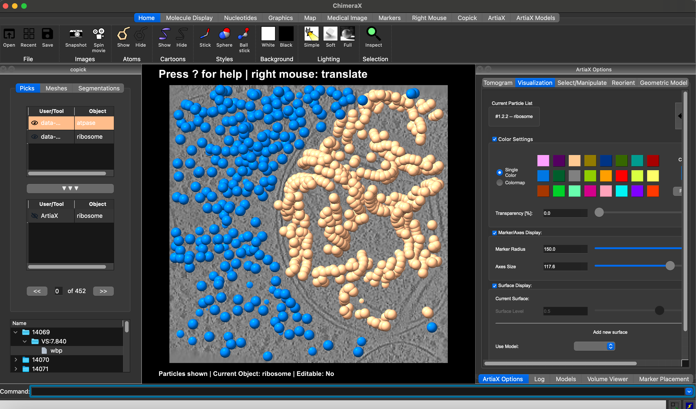

There is a growing list of tools that support the copick dataset API, some of them are listed below:

---

## **Visualization**
### ChimeraX-copick

<figure markdown="span">
  { width="500" }
  <figcaption>ChimeraX-copick interface with <a href="https://cryoetdataportal.czscience.com/datasets/10301">dataset 10301</a>, <a href="https://cryoetdataportal.czscience.com/runs/14069">Run 14069</a></figcaption>
</figure>

A [UCSF ChimeraX](https://preview.cgl.ucsf.edu/chimerax/) plugin for visualizing **copick** datasets and particle
curation. The plugin is available in the ChimeraX Toolshed and can be installed from within ChimeraX.

- :fontawesome-solid-code: [__Repository__](https://github.com/copick/chimerax-copick)
- :fontawesome-solid-circle-info: [__Tutorial__](examples/tutorials/chimerax.md)
- :fontawesome-solid-globe: __Website__
- :fontawesome-solid-question: __Docs__

---

### CellCanvas

A [Napari](https://napari.org/) plugin for interactive segmentation and visualization of 3D images, supporting the copick
dataset API.

- :fontawesome-solid-code: [__Repository__](https://github.com/cellcanvas/cellcanvas)
- :fontawesome-solid-circle-info: [__Tutorial__](https://album.cellcanvas.org/tutorial)
- :fontawesome-solid-globe: [__Website__](https://cellcanvas.org/)
- :fontawesome-solid-question: __Docs__

---

### napari-copick

A [Napari](https://napari.org/) plugin for visualizing **copick** datasets and particle curation.

- :fontawesome-solid-code: [__Repository__](https://github.com/kephale/napari-copick)
- :fontawesome-solid-circle-info: __Tutorial__
- :fontawesome-solid-globe: __Website__
- :fontawesome-solid-question: __Docs__

---

### copick-live

CopickLive is a Dash Plotly web server for tracking progress of collaborative particle picking and curation projects
using **copick.**

- :fontawesome-solid-code: [__Repository__](https://github.com/zhuowenzhao/copick_live)
- :fontawesome-solid-circle-info: __Tutorial__
- :fontawesome-solid-globe: __Website__
- :fontawesome-solid-question: __Docs__

---

## **Analysis**

### deepfinder

A deep learning-based tool for particle picking in cryo-EM data. It uses a U-Net architecture to detect particles in
tomograms. Images can be loaded from the copick dataset API, and results can be saved back to the copick project.

- :fontawesome-solid-code: [__Repository__](https://github.com/jtschwar/cryoet-deepfinder/tree/master)
- :fontawesome-solid-circle-info: __Tutorial__
- :fontawesome-solid-globe: __Website__
- :fontawesome-solid-question: __Docs__

---

### copick-catalog

An [album](https://album.solutions)-catalog for manipulating copick data entities. Includes solutions to fit planes to
points, manipulate meshes and more.

- :fontawesome-solid-code: [__Repository__](https://github.com/copick/copick-catalog)
- :fontawesome-solid-circle-info: __Tutorial__
- :fontawesome-solid-globe: __Website__
- :fontawesome-solid-question: __Docs__

---

### cellcanvas-catalog

An [album](https://album.solutions)-catalog for CellCanvas, including solutions creating and manipulating copick data.

- :fontawesome-solid-code: [__Repository__](https://github.com/cellcanvas/album-catalog)
- :fontawesome-solid-circle-info: __Tutorial__
- :fontawesome-solid-globe: __Website__
- :fontawesome-solid-question: __Docs__

