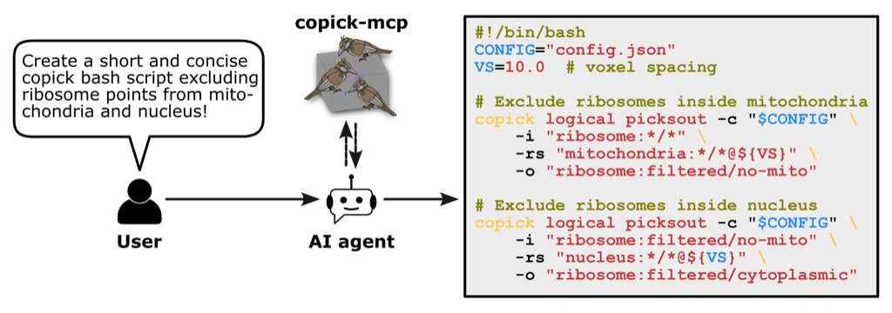

---
hide:
  - navigation
---

# Software built on the copick API

A growing ecosystem of applications builds on the copick dataset API — desktop and web **viewers**, interactive segmentation and picking tools, and AI integrations. Scroll the highlights below, or jump to a category.

--8<-- "ecosystem_carousel.snippet"

---

## **AI Integration**

### copick-mcp

<figure markdown="span">
  { width="600" }
  <figcaption>An AI agent translating a natural-language request into copick CLI commands via copick-mcp.</figcaption>
</figure>

A [Model Context Protocol](https://modelcontextprotocol.io) server that enables Claude AI (Claude Desktop and Claude Code)
to explore copick projects and discover CLI commands for building processing pipelines.

- :fontawesome-solid-code: [__Repository__](https://github.com/copick/copick-mcp)
- :fontawesome-solid-circle-info: [__Tutorial__](examples/tutorials/copick_mcp.md)
- :fontawesome-solid-globe: __Website__
- :fontawesome-solid-question: __Docs__

---

## **Analysis**

### octopi

<figure markdown="span">
  { width="280" }
</figure>

A deep-learning toolkit for training and running particle-picking models on cryoET tomograms, reading and writing
annotations through the **copick** dataset API.

- :fontawesome-solid-code: [__Repository__](https://github.com/chanzuckerberg/octopi)
- :fontawesome-solid-question: [__Docs__](https://chanzuckerberg.github.io/octopi/)

---

### TopCUP

TopCUP (Top CryoET U-Net Picker) is a 3D U-Net ensemble model for particle picking in cryoET volumes using a
segmentation-heatmap approach. It won first place in the CryoET Object Identification Kaggle competition and is
distributed through CZI Virtual Cell Models.

- :fontawesome-solid-globe: [__Model__](https://virtualcellmodels.cziscience.com/model/topcup)
- :fontawesome-solid-code: [__Repository__](https://github.com/czimaginginstitute/czii_cryoet_mlchallenge_winning_models)
- :fontawesome-solid-circle-info: [__Quickstart__](https://virtualcells.platform.czscience.com/quickstart/topcup-quickstart)
- :fontawesome-solid-book: [__Paper__](https://www.nature.com/articles/s41592-025-02800-5)

---

### copick-catalog

An [album](https://album.solutions)-catalog for manipulating copick data entities. Includes solutions to fit planes to
points, manipulate meshes and more.

- :fontawesome-solid-code: [__Repository__](https://github.com/copick/copick-catalog)
- :fontawesome-solid-circle-info: __Tutorial__
- :fontawesome-solid-globe: __Website__
- :fontawesome-solid-question: __Docs__

---

### cellcanvas-catalog

An [album](https://album.solutions)-catalog for CellCanvas, including solutions creating and manipulating copick data.

- :fontawesome-solid-code: [__Repository__](https://github.com/cellcanvas/album-catalog)
- :fontawesome-solid-circle-info: __Tutorial__
- :fontawesome-solid-globe: __Website__
- :fontawesome-solid-question: __Docs__

---

## **Visualization**

### ChimeraX-copick

<figure markdown="span">
  { width="500" }
  <figcaption>ChimeraX-copick interface with <a href="https://cryoetdataportal.czscience.com/datasets/10301">dataset 10301</a>, <a href="https://cryoetdataportal.czscience.com/runs/14069">Run 14069</a></figcaption>
</figure>

A [UCSF ChimeraX](https://preview.cgl.ucsf.edu/chimerax/) plugin for visualizing **copick** datasets and particle
curation. The plugin is available in the ChimeraX Toolshed and can be installed from within ChimeraX.

- :fontawesome-solid-code: [__Repository__](https://github.com/copick/chimerax-copick)
- :fontawesome-solid-circle-info: [__Tutorial__](examples/tutorials/chimerax.md)
- :fontawesome-solid-globe: __Website__
- :fontawesome-solid-question: __Docs__

---

### napari-copick

<figure markdown="span">
  { width="500" }
  <figcaption>Browsing and curating a copick project in napari-copick.</figcaption>
</figure>

A [Napari](https://napari.org/) plugin for visualizing **copick** datasets and particle curation.

- :fontawesome-solid-code: [__Repository__](https://github.com/kephale/napari-copick)
- :fontawesome-solid-circle-info: __Tutorial__
- :fontawesome-solid-globe: __Website__
- :fontawesome-solid-question: __Docs__

---

### copick-web

<figure markdown="span">
  { width="500" }
  <figcaption>Browsing tomograms, picks, and segmentations in the copick-web viewer.</figcaption>
</figure>

copick-web is the official browser-based viewer for **copick** datasets, built directly on the copick data model.
Browse runs, voxel spacings, and tomograms; view tomogram slices with channel controls and a scale bar; and overlay
particle picks and multilabel segmentations.

- :fontawesome-solid-code: [__Repository__](https://github.com/copick/copick-web)

---

### CellCanvas

<figure markdown="span">
  { width="500" }
  <figcaption>Interactive 3D segmentation in CellCanvas.</figcaption>
</figure>

A [Napari](https://napari.org/) plugin for interactive segmentation and visualization of 3D images, supporting the copick
dataset API.

- :fontawesome-solid-code: [__Repository__](https://github.com/cellcanvas/cellcanvas)
- :fontawesome-solid-circle-info: [__Tutorial__](https://album.cellcanvas.org/tutorial)
- :fontawesome-solid-globe: [__Website__](https://cellcanvas.org/)
- :fontawesome-solid-question: __Docs__

---

### copick-live

CopickLive is a Dash Plotly web server for tracking progress of collaborative particle picking and curation projects
using **copick.**

- :fontawesome-solid-code: [__Repository__](https://github.com/zhuowenzhao/copick_live)
- :fontawesome-solid-circle-info: __Tutorial__
- :fontawesome-solid-globe: __Website__
- :fontawesome-solid-question: __Docs__

